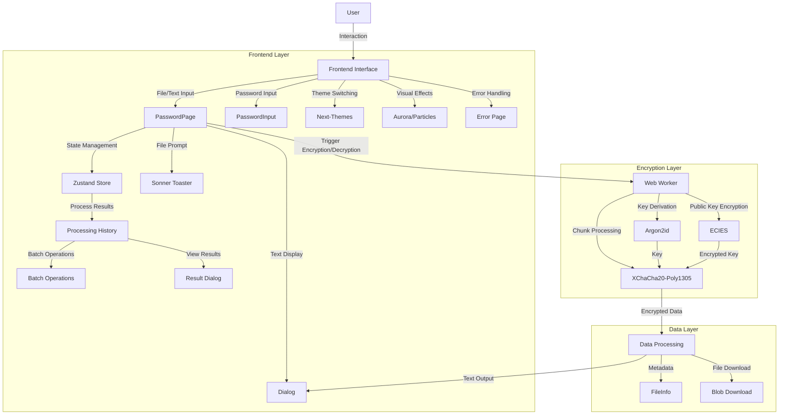

# SecureC

SecureC is a Next.js-based client-side encryption tool designed to securely encrypt and decrypt files and text messages using XChaCha20-Poly1305 symmetric encryption. It leverages the `@noble/ciphers` library for encryption and Argon2id for secure password-based key derivation, supports chunked processing for large files, and ensures smooth performance with Web Workers.

  
Preview

  

## Features

- **File and Text Encryption**: Encrypt and decrypt any file type or text messages using XChaCha20-Poly1305.
- **Password-Based Security**: Securely derive encryption keys from passwords using Argon2id with random salts.
- **Public Key Encryption**: Support ECIES (Elliptic Curve Integrated Encryption Scheme) for public key encryption with optional digital signatures.
- **Large File Chunking**: Process large files in 10MB chunks to optimize memory usage and performance.
- **Web Worker Performance**: Run encryption and decryption in a Web Worker to keep the UI responsive.
- **Processing History**: Track and manage all encryption/decryption operations with a comprehensive history table.
- **Batch Operations**: Download or delete multiple results at once from the processing history.
- **Manual Download**: Download encrypted (`.enc`) or decrypted files with one click, with timestamped filenames.
- **Progress Feedback**: Real-time progress updates during encryption/decryption for a better user experience.
- **Client-Side Privacy**: All operations are performed locally, ensuring data never leaves your device.

## Architecture

## Instructions

### Encrypting Files or Text

1. **Select Mode**:
   - Choose **File** mode to upload a file or **Messages** mode to input text.
   - For files, click the upload area or drag and drop a file (any type supported). File details (name, size, type) will be displayed.
   - For text, enter the message in the provided textarea.
2. **Enter Password**:
   - Input a secure password in the password field (required).
3. **Click Encrypt**:
   - Click the "Encrypt" button to process the file or text using XChaCha20-Poly1305 encryption.
   - Files are processed in 10MB chunks; text is encrypted as a single block and output as Base64.
   - After processing, the result appears in the processing history table below.
   - For files, click the "Download" button in the history to save the encrypted file (`.enc` suffix).
   - For text, click the "View" button to see the encrypted text in a dialog (with copy/download options).

### Decrypting Files or Text

1. **Select Mode**:
   - Choose **File** mode for encrypted files (`.enc`) or **Messages** mode for encrypted text (Base64).
   - For files, upload the `.enc` file. For text, paste the Base64-encoded encrypted text.
2. **Enter Password**:
   - Input the same password used for encryption.
3. **Click Decrypt**:
   - Click the "Decrypt" button to decrypt the file or text.
   - If the password is correct, the result appears in the processing history.
   - For files, the decrypted file is available for download (with original extension if available).
   - For text, the decrypted message is shown in a dialog.
   - If the password is incorrect, a "Decryption failed" error is displayed.

### Managing Processing History

1. **View Results**:
   - All encryption/decryption operations are tracked in the processing history table.
   - Each entry shows: file/text name, action (encrypt/decrypt), status, progress, size, and timestamp.
2. **Download Results**:
   - Click the download icon for individual results.
   - Select multiple results using checkboxes and click "Download" for batch downloads.
3. **Delete Results**:
   - Click the delete icon to remove individual results.
   - Select multiple results and click "Delete" for batch deletion.
4. **Reset All**:
   - Click "Reset All" to clear the entire processing history.

## Security Considerations

- **Client-Side Encryption**: All operations are performed locally using Web Workers, ensuring sensitive data (e.g., passwords, files) never leaves your device.
- **Strong Encryption**: Uses XChaCha20-Poly1305 authenticated encryption with 256-bit keys for maximum security.
- **Password Security**: Use strong, unique passwords and store them securely. A lost password will prevent decryption of files or text.
- **Key Derivation**: Argon2id is used for password-based key derivation with configurable parameters (time cost: 3, memory cost: 1280 KiB, parallelism: 4).
- **Large File Handling**: Chunked processing (10MB chunks) ensures efficient handling of large files without excessive memory usage.
- **Random Salts and Nonces**: Each encryption uses a random salt (for Argon2id) and nonce (for XChaCha20-Poly1305) to enhance security.
- **Public Key Encryption**: Optional ECIES support allows encryption to a recipient's public key with optional digital signatures for authentication.
- **HTTPS**: Deploy SecureC over HTTPS in production to secure file uploads and downloads.
- **Client-Side Risks**: Ensure your browser is free from malware or extensions that could access sensitive data like passwords or files.
- **No Server Storage**: Since all processing is client-side, no data is stored on servers, but users must manage their own backups of encrypted files.

## Thanks

The encryption algorithm is sourced from: https://github.com/nsiod/share

<!-- - https://pastebin.com/
- https://defuse.ca/pastebin.htm
- https://cowtransfer.com/
- https://www.transfernow.net/en
- https://about.encl.io/ -->

## 📜 License

[MIT](./LICENSE) License © 2025-PRESENT [wudi](https://github.com/WuChenDi)
