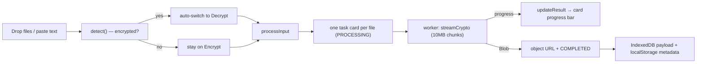

# SecureC

Zero-knowledge file and text encryption that runs **entirely in your browser** —
XChaCha20-Poly1305 + Argon2id inside a Web Worker, so nothing you encrypt ever
leaves the tab and the UI never freezes on a large file.

```diff
- upload file → server encrypts → server holds the key → trust the server
+ pick file  → browser encrypts in a Web Worker → you keep the password   # nothing leaves the tab
```

Preview: <https://securec.pages.dev/>


Every byte of crypto happens client-side on top of [`@cdlab/cipher`](../../packages/cipher).
There is **no backend** — SecureC is a statically-exported Next.js SPA
(`output: 'export'`) served from Cloudflare Pages. The only network traffic is
loading the app itself and one Google Analytics tag.

## Why

Most "encrypt a file" tools ask you to upload the plaintext and trust a server
with both the data and the key. That defeats the point: the operator can read
everything. SecureC removes the server from the trust boundary entirely.

- **The server never sees plaintext or keys** — all encryption/decryption runs in
  the browser, in a Web Worker. There is nothing to upload and nothing to leak.
- **Password mode, done right** — a per-operation random salt feeds Argon2id (a
  memory-hard KDF) to derive the XChaCha20-Poly1305 key. No weak PBKDF, no reused
  salt, no key transmitted anywhere.
- **Large files don't blow up memory** — files stream through the cipher in 10 MB
  chunks, so a multi-GB file uses a flat, small amount of RAM and never blocks the
  main thread.
- **Decryption just works** — the app reads the cipher's stream header to detect
  an encrypted file (or pasted ciphertext) and flips the UI to decrypt mode
  automatically; on decrypt it recovers the original file extension from the same
  header.
- **History without a database** — completed operations persist locally
  (metadata in `localStorage`, binary payloads in IndexedDB) so you can re-download
  a result after a reload, with graceful degradation if the payload was evicted.

## Quick start

SecureC is part of the [`@cdlab/projects-monorepo`](../../README.md); run
everything from the repo root.

```bash
pnpm install                          # builds workspace packages too
pnpm --filter @cdlab/securec dev      # -> http://securec.localhost:3355
```

The dev URL is fixed by [`@dotns/nsl`](https://github.com/dotns/nsl) — no port
hunting. The app is a single screen: pick **Encrypt** or **Decrypt**, choose
**File** or **Message**, enter a password, and process. Results appear as cards on
the right with per-file progress and a download button.

## How it works

SecureC is a three-layer client pipeline. The React UI only orchestrates; all
crypto is delegated to one shared Web Worker.

```
React UI  ──►  useCryptoProcessor  ──►  cryptoWorker (Web Worker)  ──►  @cdlab/cipher
(SC panels)    (hook: state, batch,      (postMessage boundary)        (XChaCha20 +
               detect, download,                                        Argon2id, ECIES)
               store wiring)
```

Encrypting a batch of files, end to end:

1. Files are dropped → `handleFileSelect` runs `detect()` on each; if any is
   already encrypted, the UI auto-switches to **Decrypt**.
2. On **Process**, `processInput` snapshots the file list and creates **one task
   card per file upfront** (status `PROCESSING`) so every card renders
   immediately. Task IDs come from a snowflake generator (`@cdlab/driftflake`).
3. Files are processed **sequentially through the single shared worker** — one
   `postMessage({ mode, file, password, isTextMode: false })` per file.
4. The worker calls `streamCrypto.encrypt.withPassword({ file, password, … })`,
   rescales the cipher's raw 0–100 progress into a 10–95 % band, posts progress
   back, then posts the resulting `Blob` + output filename (`<name>_<ts>.enc`).
5. The hook reads the Blob to an `ArrayBuffer`, builds an object URL, and marks
   the task `COMPLETED`. The store persists the payload to IndexedDB.


```mermaid
flowchart LR
    A["Drop files / paste text"] --> B["detect() — encrypted?"]
    B -->|yes| C["auto-switch to Decrypt"]
    B -->|no| D["stay on Encrypt"]
    C --> E["processInput"]
    D --> E
    E --> F["one task card per file (PROCESSING)"]
    F --> G["worker: streamCrypto (10MB chunks)"]
    G -->|progress| H["updateResult → card progress bar"]
    G -->|Blob| I["object URL + COMPLETED"]
    I --> J["IndexedDB payload + localStorage metadata"]
```

**Decrypt** reads the first 2048 bytes with a `FileReader`, calls
`parseStreamHeader` to recover the original extension, then
`streamCrypto.decrypt.withPassword` (20–95 % band), naming the output
`<timestamp>.<ext>`. **Text mode** uses `textCrypto.encrypt/decrypt` — encrypt
returns Base64, decrypt returns plain text — as a single, non-batched task.

Full detail — the worker protocol, the storage split, and the rehydration
model — is in [`DESIGN.md`](DESIGN.md).

## Modes

| Mode | Input | Cipher call | Output |
| --- | --- | --- | --- |
| Encrypt file | any file(s) | `streamCrypto.encrypt.withPassword` | `<name>_<ts>.enc` (streamed, 10 MB chunks) |
| Decrypt file | `.enc` file(s) | `parseStreamHeader` → `streamCrypto.decrypt.withPassword` | `<ts>.<original-ext>` |
| Encrypt text | a message | `textCrypto.encrypt` | Base64 string (+ downloadable `.enc`) |
| Decrypt text | ciphertext | `textCrypto.decrypt` | plain text |

Auto-detect runs `detect()` on selected files and on pasted text (≥ 3 chars),
flipping the active tab to Decrypt when it recognizes SecureC ciphertext.

## Storage

There is no server, so history lives in the browser in two tiers:

| Tier | Key / store | Holds | Notes |
| --- | --- | --- | --- |
| `localStorage` | `securec-process-results` | result **metadata** only | Zustand `persist`; `partialize` keeps only `COMPLETED` rows and strips the binary (`ArrayBuffer(0)`). |
| IndexedDB | `securec-process-data` | the actual `ArrayBuffer` payloads | via `@cdlab/utils` `createIDBStore`, keyed by result id. |

On load, `rehydrateBlobs` re-reads each payload from IndexedDB and rebuilds its
object URL; a missing payload degrades the card to `FAILED / "Data lost"` instead
of crashing. Object URLs are revoked on remove/clear to avoid memory leaks. The
split exists to dodge the ~5 MB `localStorage` cap — payloads never touch it.

## Configuration

SecureC has **no runtime config, no env secrets, and no bindings** — it is a
static site. The few build-time knobs live in `next.config.ts`:

| Knob | Value | Purpose |
| --- | --- | --- |
| `output` | `'export'` | Static export — no server runtime; deployed to Cloudflare Pages. |
| `images.unoptimized` | `true` | Required for static export (no image optimizer server). |
| `env.BUILD_TIME` | build timestamp | Surfaced in the footer version info. |
| `createMessagesDeclaration` | `./messages/en.json` | Generates `messages/en.d.json.ts` (gitignored) for typed i18n. |

Locales are `['en', 'zh']` (default `en`) in `src/i18n/routing.ts`; the root `/`
redirects to `/en`. A Google Analytics tag (`G-VECVREEZT1`) loads in the locale
layout — the only third-party request.

## Commands

Run with `pnpm --filter @cdlab/securec <script>`.

| Script | What it does |
| --- | --- |
| `dev` | `nsl run next dev` → `http://securec.localhost:3355` |
| `build` | `next build` — produces the static export (`output: 'export'`) |
| `build:cf` | `@cloudflare/next-on-pages` — Cloudflare Pages build |
| `start` | `next start` |
| `lint` / `lint:fix` | `next lint` |
| `typecheck` | `tsc --noEmit` |
| `gk` | `node ./scripts/generateKeys.js` — ECIES key-pair demo (see below) |

There is **no test script** in this app — the cipher's tests live in
[`@cdlab/cipher`](../../packages/cipher) (vitest + happy-dom).

### ECIES key demo (`gk`)

`scripts/generateKeys.js` is a standalone Node demo, **not wired into the app**.
It derives BIP32 key pairs from two hardcoded mnemonics
(`@scure/bip32` / `@scure/bip39`, path `m/44'/0'/0'/0/0`), base58-encodes the
public keys, and runs an `eciesjs` encrypt/decrypt round trip between "alice" and
"bob", printing to the console. It illustrates `@cdlab/cipher`'s public-key mode.

## Deploy

`build:cf` runs `@cloudflare/next-on-pages`; the static output is served from
Cloudflare Pages (`https://securec.pages.dev/`). No secrets, no migrations, no
Worker bindings — deployment is just publishing static assets.

## Non-goals

- **Not a key-management or account system.** SecureC never stores your password
  or key — lose the password and the ciphertext is unrecoverable, by design.
- **Public-key (ECIES) mode is not exposed in the UI.** The app worker only does
  **password** mode; ECIES is a capability of `@cdlab/cipher`, demonstrated by the
  `gk` script but not part of the encrypt/decrypt screen.
- **History is local-only and best-effort.** It is browser storage, not a backup —
  clearing site data or IndexedDB eviction loses payloads (degrading to `FAILED`).
- **No parallelism.** Batch files are processed one at a time through a single
  worker; all cards appear at once but fill in serially.
- **Not a hosted service.** There is no server to talk to; the app runs offline
  once loaded.

## Design

[`DESIGN.md`](DESIGN.md) is the authoritative spec — the client pipeline, the
worker protocol and progress bands, the two-tier storage/rehydration model, the
data model, and the static-export constraints. Read it before changing the worker
message shape, the progress math, or the storage split.

## License

[MIT](../../LICENSE) © 2025-PRESENT [wudi](https://github.com/WuChenDi)
