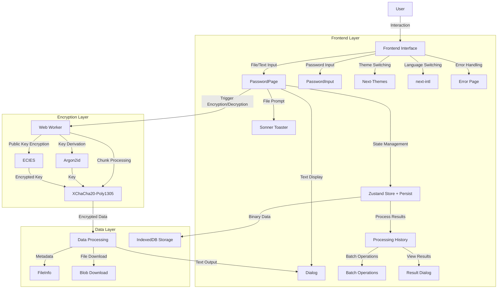

# SecureC

SecureC is a Next.js-based client-side encryption tool designed to securely encrypt and decrypt files and text messages using XChaCha20-Poly1305 symmetric encryption. It leverages the `@noble/ciphers` library for encryption and Argon2id for secure password-based key derivation, supports chunked processing for large files, and ensures smooth performance with Web Workers.

Preview: https://securec.pages.dev/

  
Preview

  

## Features

- **Multi-File Batch Processing**: Select or drag-and-drop multiple files at once for batch encryption/decryption with individual progress tracking.
- **File and Text Encryption**: Encrypt and decrypt any file type or text messages using XChaCha20-Poly1305.
- **Password-Based Security**: Securely derive encryption keys from passwords using Argon2id with random salts.
- **Public Key Encryption**: Support ECIES (Elliptic Curve Integrated Encryption Scheme) for public key encryption with optional digital signatures.
- **Large File Chunking**: Process large files in 10MB chunks to optimize memory usage and performance.
- **Web Worker Performance**: Run encryption and decryption in a Web Worker to keep the UI responsive.
- **Auto-Detection**: Automatically detects encrypted files (by magic bytes) and encrypted text, switching to decrypt mode.
- **Processing History**: Track and manage all encryption/decryption operations with persistent storage (IndexedDB + localStorage).
- **Batch Operations**: Download or delete multiple results at once from the processing history.
- **Internationalization**: Full i18n support with English and Chinese (Simplified) via next-intl.
- **Progress Feedback**: Real-time progress updates during encryption/decryption for a better user experience.
- **Client-Side Privacy**: All operations are performed locally, ensuring data never leaves your device.

## Architecture

```mermaid
graph TD
    A[User]
    A -->|Interaction| B[Frontend Interface]
    B -->|File/Text Input| C[PasswordPage]
    B -->|Password Input| D[PasswordInput]
    C -->|Trigger Encryption/Decryption| E[Web Worker]
    C -->|State Management| F[Zustand Store + Persist]
    C -->|File Prompt| G[Sonner Toaster]
    C -->|Text Display| H[Dialog]
    E -->|Chunk Processing| I[XChaCha20-Poly1305]
    E -->|Key Derivation| J[Argon2id]
    E -->|Public Key Encryption| K[ECIES]
    I -->|Encrypted Data| L[Data Processing]
    J -->|Key| I
    K -->|Encrypted Key| I
    L -->|Metadata| M[FileInfo]
    L -->|File Download| N[Blob Download]
    L -->|Text Output| H
    F -->|Process Results| O[Processing History]
    F -->|Binary Data| P[IndexedDB Storage]
    O -->|Batch Operations| Q[Download/Delete]
    O -->|View Results| R[Result Dialog]
    B -->|Theme Switching| S[Next-Themes]
    B -->|Language Switching| T[next-intl]
    B -->|Error Handling| U[Error Page]

    subgraph Frontend Layer
        B[Frontend Interface]
        C[PasswordPage]
        D[PasswordInput]
        F[Zustand Store + Persist]
        G[Sonner Toaster]
        H[Dialog]
        O[Processing History]
        Q[Batch Operations]
        R[Result Dialog]
        S[Next-Themes]
        T[next-intl]
        U[Error Page]
    end

    subgraph Encryption Layer
        E[Web Worker]
        I[XChaCha20-Poly1305]
        J[Argon2id]
        K[ECIES]
    end

    subgraph Data Layer
        L[Data Processing]
        M[FileInfo]
        N[Blob Download]
        P[IndexedDB Storage]
    end
```

## Instructions

### Encrypting Files or Text

1. **Select Mode**:
   - Choose **File** mode to upload files or **Messages** mode to input text.
   - For files, click the upload area or drag and drop one or more files (any type supported). You can add more files incrementally, and remove individual files from the list.
   - For text, enter the message in the provided textarea.
2. **Enter Password**:
   - Input a secure password in the password field (required).
3. **Click Encrypt**:
   - Click the "Encrypt" button to process the files or text using XChaCha20-Poly1305 encryption.
   - All selected files are queued and processed sequentially, each with its own progress card.
   - Files are processed in 10MB chunks; text is encrypted as a single block and output as Base64.
   - After processing, results appear in the processing history panel.
   - For files, click the "Download" button in the history to save the encrypted file (`.enc` suffix).
   - For text, click the "View" button to see the encrypted text in a dialog (with copy/download options).

### Decrypting Files or Text

1. **Select Mode**:
   - Choose **File** mode for encrypted files (`.enc`) or **Messages** mode for encrypted text (Base64).
   - For files, upload the `.enc` file(s). The app automatically detects encrypted content and switches to decrypt mode.
   - For text, paste the Base64-encoded encrypted text. Auto-detection also works for encrypted text.
2. **Enter Password**:
   - Input the same password used for encryption.
3. **Click Decrypt**:
   - Click the "Decrypt" button to decrypt the files or text.
   - If the password is correct, results appear in the processing history.
   - For files, the decrypted file is available for download (with original extension if available).
   - For text, the decrypted message is shown in a dialog.
   - If the password is incorrect, a "Decryption failed" error is displayed.

### Managing Processing History

1. **Persistent Storage**:
   - Completed results are automatically persisted. Refreshing the page preserves your processing history.
   - Metadata is stored in localStorage; binary data is stored in IndexedDB.
2. **View Results**:
   - All encryption/decryption operations are tracked in the processing history panel.
   - Each entry shows: file/text name, action (encrypt/decrypt), status, size, and a preview icon.
3. **Download Results**:
   - Click the download icon for individual results.
   - Click "Download All" for batch downloads of all completed results.
4. **Delete Results**:
   - Click the remove icon to delete individual results.
5. **Clear All**:
   - Click "Clear All" to clear the entire processing history.

## Security Considerations

- **Client-Side Encryption**: All operations are performed locally using Web Workers, ensuring sensitive data (e.g., passwords, files) never leaves your device.
- **Strong Encryption**: Uses XChaCha20-Poly1305 authenticated encryption with 256-bit keys for maximum security.
- **Password Security**: Use strong, unique passwords and store them securely. A lost password will prevent decryption of files or text.
- **Key Derivation**: Argon2id is used for password-based key derivation with configurable parameters (time cost: 3, memory cost: 1280 KiB, parallelism: 4).
- **Large File Handling**: Chunked processing (10MB chunks) ensures efficient handling of large files without excessive memory usage.
- **Random Salts and Nonces**: Each encryption uses a random salt (for Argon2id) and nonce (for XChaCha20-Poly1305) to enhance security.
- **Public Key Encryption**: Optional ECIES support allows encryption to a recipient's public key with optional digital signatures for authentication.
- **HTTPS**: Deploy SecureC over HTTPS in production to secure file uploads and downloads.
- **Client-Side Risks**: Ensure your browser is free from malware or extensions that could access sensitive data like passwords or files.
- **No Server Storage**: Since all processing is client-side, no data is stored on servers, but users must manage their own backups of encrypted files.

## Thanks

The encryption algorithm is sourced from: https://ns.io/

<!-- - https://pastebin.com/
- https://defuse.ca/pastebin.htm
- https://cowtransfer.com/
- https://www.transfernow.net/en
- https://github.com/nsiod/share
- https://about.encl.io/ -->

## 📜 License

[MIT](./LICENSE) License © 2025-PRESENT [wudi](https://github.com/WuChenDi)
