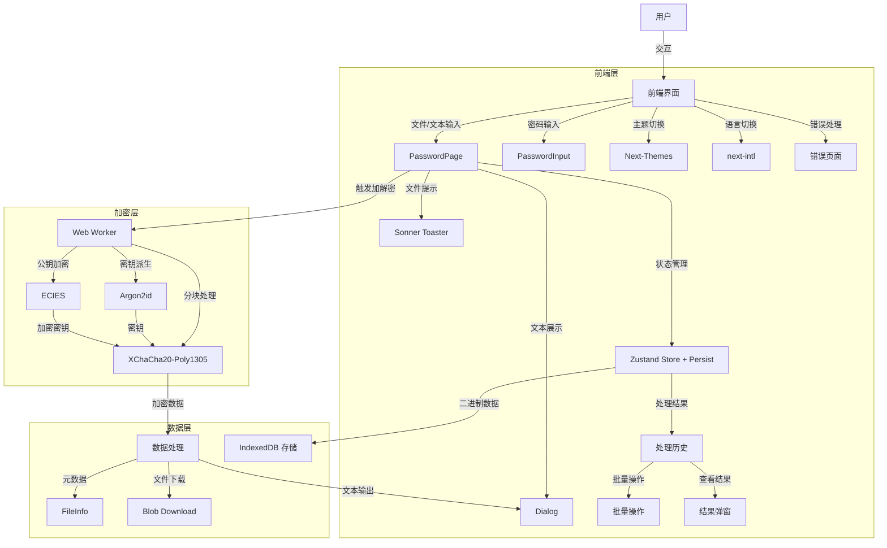

# SecureC

[English](./README.md) | [中文](./README.zh-CN.md)

SecureC 是一个基于 Next.js 的客户端加密工具，使用 XChaCha20-Poly1305 对称加密算法对文件和文本进行安全加解密。借助 `@noble/ciphers` 库实现加密，Argon2id 进行安全的基于密码的密钥派生，支持大文件分块处理，并通过 Web Workers 确保流畅的性能体验。

预览：https://securec.pages.dev/

## 功能特性

- **多文件批量处理**：一次选择或拖拽多个文件，支持批量加解密，并为每个文件单独显示进度。
- **文件与文本加密**：使用 XChaCha20-Poly1305 加密任意文件类型或文本消息。
- **基于密码的安全性**：使用 Argon2id 结合随机盐从密码安全派生加密密钥。
- **公钥加密**：支持 ECIES（椭圆曲线集成加密方案）进行公钥加密，可选数字签名。
- **大文件分块**：以 10MB 为单位分块处理大文件，优化内存使用和性能。
- **Web Worker 性能**：在 Web Worker 中执行加解密，保持 UI 响应流畅。
- **自动检测**：自动检测已加密的文件（通过魔术字节）和加密文本，并切换到解密模式。
- **处理历史**：追踪并管理所有加解密操作，支持持久化存储（IndexedDB + localStorage）。
- **批量操作**：从处理历史中批量下载或删除多个结果。
- **国际化**：通过 next-intl 完整支持中英文。
- **进度反馈**：加解密过程中实时更新进度，提升用户体验。
- **客户端隐私**：所有操作均在本地执行，数据永远不会离开您的设备。

## 架构

## 使用说明

### 加密文件或文本

1. **选择模式**：
   - 选择 **文件** 模式上传文件，或选择 **消息** 模式输入文本。
   - 文件模式：点击上传区域或拖拽一个或多个文件（支持任意类型）。可以继续追加文件，也可以从列表中移除单个文件。
   - 文本模式：在文本框中输入消息内容。
2. **输入密码**：
   - 在密码字段中输入一个安全密码（必填）。
3. **点击加密**：
   - 点击"加密"按钮，使用 XChaCha20-Poly1305 对文件或文本进行处理。
   - 所有选中的文件将依次排队处理，每个文件都有独立的进度卡片。
   - 文件以 10MB 为单位分块处理；文本作为单个块加密，输出为 Base64。
   - 处理完成后，结果将显示在处理历史面板中。
   - 文件：点击历史记录中的"下载"按钮保存加密文件（后缀为 `.enc`）。
   - 文本：点击"查看"按钮在弹窗中查看加密文本（支持复制和下载）。

### 解密文件或文本

1. **选择模式**：
   - 文件模式：上传 `.enc` 文件，应用会自动检测并切换到解密模式。
   - 文本模式：粘贴 Base64 编码的加密文本，同样支持自动检测。
2. **输入密码**：
   - 输入加密时使用的密码。
3. **点击解密**：
   - 点击"解密"按钮对文件或文本进行解密。
   - 密码正确时，结果将显示在处理历史中。
   - 文件：解密后的文件可供下载（如有原始扩展名则保留）。
   - 文本：解密后的消息显示在弹窗中。
   - 密码错误时，显示"解密失败"错误提示。

### 管理处理历史

1. **持久化存储**：
   - 已完成的结果自动持久化，刷新页面后处理历史仍然保留。
   - 元数据存储在 localStorage；二进制数据存储在 IndexedDB。
2. **查看结果**：
   - 所有加解密操作均记录在处理历史面板中。
   - 每条记录显示：文件/文本名称、操作类型（加密/解密）、状态、大小和预览图标。
3. **下载结果**：
   - 点击单条记录的下载图标进行单独下载。
   - 点击"全部下载"批量下载所有已完成的结果。
4. **删除结果**：
   - 点击移除图标删除单条记录。
5. **清空全部**：
   - 点击"清空全部"清除整个处理历史。

## 安全注意事项

- **客户端加密**：所有操作均在本地 Web Worker 中执行，敏感数据（如密码、文件）永远不会离开您的设备。
- **强加密算法**：使用 XChaCha20-Poly1305 认证加密，256 位密钥，提供最高级别的安全性。
- **密码安全**：请使用强密码并妥善保存。密码丢失将导致文件或文本无法解密。
- **密钥派生**：使用 Argon2id 进行基于密码的密钥派生，参数：时间成本 3、内存成本 1280 KiB、并行度 4。
- **大文件处理**：分块处理（10MB/块）确保高效处理大文件，不会占用过多内存。
- **随机盐与随机数**：每次加密均使用随机盐（用于 Argon2id）和随机数（用于 XChaCha20-Poly1305），增强安全性。
- **公钥加密**：可选 ECIES 支持，允许使用接收方的公钥加密，并可附加数字签名进行身份验证。
- **HTTPS**：生产环境请通过 HTTPS 部署 SecureC，以确保文件上传和下载的安全。
- **客户端风险**：请确保浏览器未安装可访问密码或文件等敏感数据的恶意软件或扩展程序。
- **无服务端存储**：由于所有处理均在客户端完成，数据不会存储在服务器上，但用户需自行备份加密文件。

## 致谢

加密算法来源：https://ns.io/

## 📜 许可证

[MIT](./LICENSE) License © 2025-PRESENT [wudi](https://github.com/WuChenDi)
