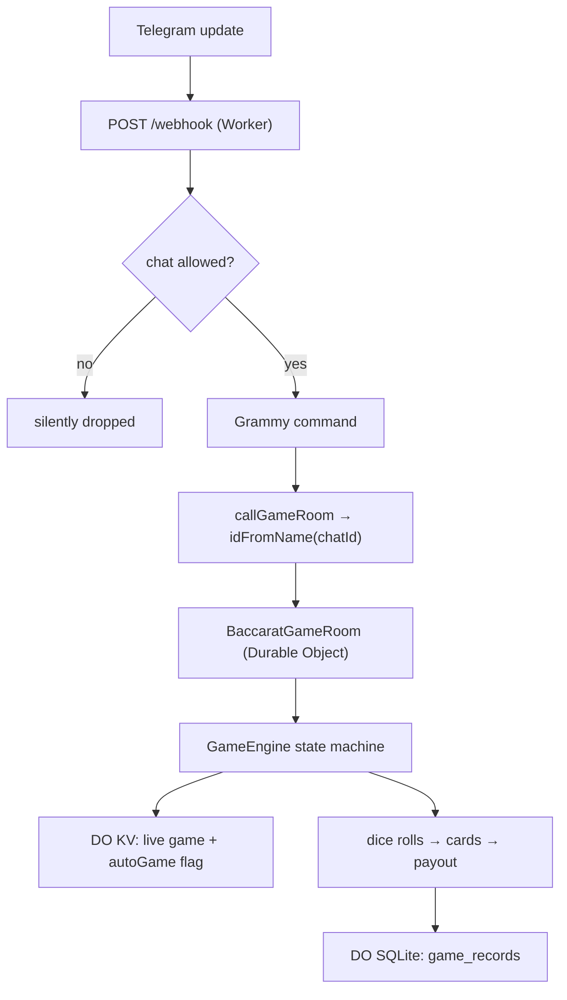

# baccarat

A Telegram Baccarat dealer that runs a full table — betting, dice-dealt cards,
third-card rules, payouts, and history — inside a single **Cloudflare Worker**,
with one **Durable Object** per group holding the game state.

Every group gets its own isolated game room (a Durable Object keyed by chat ID),
so tables never cross-talk. Cards come from Telegram's own **dice rolls** (the
visible 🎲 animation *is* the shuffle), and each finished round is persisted to
the room's embedded SQLite for `/history` and `/gameinfo`.

## Why

Running a baccarat table in a group chat by hand is tedious and trust-dependent:
someone has to shuffle, count points mod 10, remember the third-card matrix, and
tally payouts without anyone disputing the math. Off-the-shelf casino bots want a
backend, a database, and a VM to babysit.

`baccarat` is a single Worker you deploy to your own Cloudflare account:

- **Rules enforced by code** — natural 8/9, the full player/banker third-card
  draw matrix, and tie-8× / banker-player-1× payouts are computed, not
  remembered. No dealer to argue with.
- **Verifiable randomness** — card values are Telegram `sendDice` results (1–6),
  rolled live in the chat. Nobody, including the operator, picks the cards.
- **One room per group** — a Durable Object addressed by `idFromName(chatId)`
  gives each Telegram group a fully isolated state machine, timers, and history.
- **No servers, no database to run** — game state lives in DO key-value storage,
  history in the DO's embedded SQLite. The only moving part is the Worker.
- **Tunable without code** — every phase duration is a `wrangler.jsonc` var, so
  betting windows and dice pacing change per-deploy.

## Features

| Area | What you get |
| --- | --- |
| **Rules** | Full baccarat: natural 8/9, complete player + banker third-card draw matrix, points as dice-sum mod 10. |
| **Dealing** | Cards dealt B1·P1·B2·P2 via live Telegram dice; messages strictly ordered (dice → animation wait → result). |
| **Betting** | `banker` / `player` / `tie`, per-type accumulation, per-bet cap (10000) and per-user total cap (50000). |
| **Auto-game** | Continuous mode: a game auto-starts, auto-closes betting, reveals, pays out, and loops after a delay. |
| **Isolation** | One `BaccaratGameRoom` Durable Object per group — independent state, timers, and history. |
| **History** | Every finished round stored in DO SQLite; `/history` (last 10) + `/gameinfo <number>` (anonymized detail). |
| **Recovery** | On DO re-instantiation, a stuck betting game auto-processes, a stuck reveal is cleaned up, timers re-arm. |
| **REST API** | The same game actions exposed over HTTP for automation, gated by an optional `X-API-Key`. |

## Quick start

`baccarat` is part of the [`@cdlab/projects-monorepo`](../../README.md); run
everything from the repo root.

```bash
pnpm install                            # builds workspace packages too
pnpm --filter @cdlab/baccarat dev       # -> http://baccarat.localhost:3355
```

The dev URL is fixed by [`@dotns/nsl`](https://github.com/dotns/nsl) — no port
hunting. Before the bot answers, set `BOT_TOKEN` in `wrangler.jsonc` (see
[Environment](#environment) below), then point Telegram at the Worker's
`/webhook` (see [Deploy](#build--deploy)).

To play: add the bot to a group, `/newgame`, then `/bet banker 100`. When the
betting window closes the bot deals, reveals, and pays out automatically.

## Bot commands

Commands are group-scoped; a middleware guard silently drops any command from a
chat not in `ALLOWED_CHAT_IDS` (when set).

| Command | Description |
| --- | --- |
| `/start` | Start the bot and show the command overview |
| `/id` | Show group + user ID info (copy the group ID for the API / allow-list) |
| `/newgame` | Start a new baccarat round (opens the betting window) |
| `/bet <type> <amount>` | Place a bet, e.g. `/bet banker 100` — accumulates on the same type |
| `/process` | Close betting and reveal immediately (skip the countdown) |
| `/status` | Current round state, bets, and time remaining |
| `/stopgame` | Force-stop the round and disable auto-game |
| `/autogame` | Enable auto-game mode (rounds run continuously) |
| `/stopauto` | Disable auto-game mode |
| `/history` | Last 10 finished rounds |
| `/gameinfo <number>` | Full detail of one round by game number (users anonymized) |
| `/help` | Show help + rules + current timing |

## Game rules

- **Bet types & payout** — `banker` 1:1, `player` 1:1, `tie` 8:1 (winning tie
  bets pay `amount × 8`; losing bets forfeit the stake).
- **Points** — each card is a dice value 1–6; a side's points are the card sum
  **mod 10**.
- **Natural** — if either side's first two cards total ≥ 8, no third card is
  drawn.
- **Player third card** — draws on a two-card total of 0–5, stands on 6–7.
- **Banker third card** — draws on 0–2; stands on 7+; at 3–6 the draw depends on
  the player's third card:

  | Banker two-card total | Draws when player's third card is |
  | --- | --- |
  | 3 | anything except 8 |
  | 4 | 2–7 |
  | 5 | 4–7 |
  | 6 | 6–7 |

  If the player stood (no third card), the banker draws on 0–5 and stands on 6.
- **Winner** — higher final points wins; equal points is a tie.

## Game lifecycle

A round is a state machine (`idle → betting → processing → revealing →
finished`) living inside the group's Durable Object. Tracing `/bet banker 100`:

```
POST /webhook (Telegram update)
  1. fresh Bot + createConfig(env) + registerCommands           per-request Bot, never reused
  2. chat-guard middleware                                       drop if not in ALLOWED_CHAT_IDS
  3. /bet parses type+amount, validates ≤ maxBetAmount
  4. callGameRoom → GAME_ROOMS.idFromName(chatId).fetch(/place-bet)
  5. DO lazily initEngine() on first hit → engine.initialize()   crash-recovery on re-instantiation
  6. handlePlaceBet re-validates → engine.placeBet()             state==betting, time window, caps
  7. mutate game.bets → storage.put('game', game)                persisted in DO KV
  8. reply bubbles back up to Telegram
  ── betting window closes (timer or /process) ──
  9. processGame → send bet summary → reveal
 10. dealCards: rollDice B1·P1·B2·P2 (dice = RNG) → natural / third-card
 11. calculateAndSendResult → winner → payouts → saveGameRecord  DO SQLite
 12. handleGameCompletion → auto-game loop OR cleanup timer
```



There are **two paths into the room**: the Telegram command path
(`commands.ts` → `callGameRoom`) and the external REST path (`routes.ts` →
`proxyToGameRoom`). Both end at the same DO pathnames.

## HTTP API

The REST surface mirrors the bot commands for automation. `:chatId` selects the
group's room; mutating routes require the `X-API-Key` header (or `?api_key=`)
**only if** `API_SECRET` is set. Read routes are gated by the chat allow-list.

| Method | Path | Auth | Description |
| --- | --- | --- | --- |
| `GET` | `/` | — | Service info + effective timing |
| `GET` | `/health` | — | Health check |
| `GET` | `/config` | — | Full timing configuration |
| `POST` | `/webhook` | — | Telegram webhook handler |
| `GET` | `/game-status/:chatId` | allow-list | Current round status |
| `GET` | `/game-history/:chatId` | allow-list | Finished rounds (`?limit=`, 1–100, default 10) |
| `GET` | `/game-detail/:gameNumber` | allow-list | One round's detail (requires `?chatId=`, numeric game number) |
| `POST` | `/auto-game/:chatId` | `API_SECRET` | Start a new round |
| `POST` | `/place-bet/:chatId` | `API_SECRET` | Place a bet (`{userId, betType, amount, userName}`) |
| `POST` | `/process-game/:chatId` | `API_SECRET` | Close betting and reveal |
| `POST` | `/enable-auto/:chatId` | `API_SECRET` | Enable auto-game mode |
| `POST` | `/disable-auto/:chatId` | `API_SECRET` | Disable auto-game mode |
| `POST` | `/send-message` | `API_SECRET` | Send a message to a group |
| `POST` | `/set-webhook` | `API_SECRET` | Register the Telegram webhook (`{url}`) |

## Configuration

All timing knobs are `vars` in [`wrangler.jsonc`](wrangler.jsonc); `createConfig`
(`src/types.ts`) is the single parse site (called from the entry, routes, and the
DO). Values are strings in milliseconds.

| Var | Default | Meaning |
| --- | --- | --- |
| `BETTING_DURATION_MS` | `30000` | Length of the betting window before auto-processing. |
| `AUTO_GAME_INTERVAL_MS` | `10000` | Delay between rounds in auto-game mode. |
| `DICE_ANIMATION_WAIT_MS` | `4000` | Wait for the Telegram dice animation before posting the result. |
| `DICE_RESULT_DELAY_MS` | `1000` | Pause after a dice result before the next message. |
| `MESSAGE_DELAY_MS` | `2000` | Parsed and echoed by `/config`, but **not consumed by game logic** — the only inter-message pacing comes from the two dice waits above. |
| `GLOBAL_PROCESS_TIMEOUT_MS` | `90000` | Watchdog: force-clean a reveal that hangs this long. |
| `CLEANUP_DELAY_MS` | `30000` | Delay before wiping a finished game's live state. |

**Hardcoded (not env-configurable):** `maxBetAmount = 10000` per bet-type
(`src/types.ts`) and `maxUserTotalBet = 50000` per user (`src/game/game-engine.ts`).

> Three timing vars ship in `wrangler.jsonc` — `DICE_ROLL_TIMEOUT_MS`,
> `DICE_ROLL_MAX_RETRIES`, `CARD_DEAL_DELAY_MS` — but are **not read** by
> `createConfig` or anywhere else. They are inert placeholders; changing them has
> no effect.

## Bindings

| Binding | Type | Purpose | Required |
| --- | --- | --- | --- |
| `GAME_ROOMS` | Durable Object namespace → `BaccaratGameRoom` | Per-group game state, timers, and embedded SQLite history. | ✓ |

Observability is enabled (`head_sampling_rate: 1`); logs are plain `console.*`
captured by Cloudflare. The DO is SQLite-backed via the `v1` migration
(`new_sqlite_classes: ["BaccaratGameRoom"]`).

## Environment

Set `vars` in [`wrangler.jsonc`](wrangler.jsonc); secrets belong in `.dev.vars`
(local) or `wrangler secret put` (prod), **not** as committed vars.

### `BOT_TOKEN` (required)

Telegram Bot API token:

1. Open Telegram and message [@BotFather](https://t.me/BotFather).
2. Send `/newbot` and follow the prompts.
3. Copy the token (like `123456789:ABCdef…`) and set it. For local dev it can be
   a `wrangler.jsonc` var; in production prefer `wrangler secret put BOT_TOKEN`.

### `ALLOWED_CHAT_IDS` (optional)

Comma-separated Telegram group chat IDs allowed to use the bot. Get a group's ID
by opening
`https://api.telegram.org/bot<BOT_TOKEN>/getUpdates` after messaging the group
(look for `"chat":{"id":-100…}`), or run `/id` once the bot is live.

> **If unset, every chat is allowed.** Set it to lock the bot to your groups.

### `API_SECRET` (optional)

Gates the mutating REST routes via the `X-API-Key` header or `?api_key=` query.
It is **not** declared in `wrangler.jsonc` — add it out-of-band as a secret. If
unset, the REST mutation routes are unauthenticated (still chat-allow-listed).

## Build & deploy

```bash
pnpm --filter @cdlab/baccarat build     # bun build (bundle-check only; deploy uses wrangler)
pnpm --filter @cdlab/baccarat deploy    # wrangler deploy --minify
```

There is **no test suite**. After deploying, register the webhook so Telegram
delivers updates to the Worker:

```bash
curl -X POST https://your-worker.workers.dev/set-webhook \
  -H "Content-Type: application/json" \
  -d '{"url": "https://your-worker.workers.dev/webhook"}'
```

> The `deploy:dev` / `deploy:prod` scripts pass `--env development|production`,
> but `wrangler.jsonc` defines **no `[env]` blocks**, so those targets are not
> actually configured — use the plain `deploy` script.

## Non-goals

- **Not real-money gambling.** Points are in-memory scores; there is no wallet,
  ledger, settlement, or persistence of player balances across rounds.
- **Not multi-table per group.** One group = one Durable Object = one active
  round. Concurrent tables in the same chat are out of scope.
- **Not durable timers.** Countdown / auto-process / auto-game loops use plain
  `setTimeout`, which does **not** survive DO eviction — recovery logic re-derives
  the correct action from persisted state instead (see [`DESIGN.md`](DESIGN.md)).
- **Not private-chat play.** Games are group-only; a private chat just returns the
  caller's user ID.

## Design

[`DESIGN.md`](DESIGN.md) is the authoritative spec — the two-layer Worker/DO
architecture, the game state machine and its crash-recovery, the dice-as-RNG and
sequential-messaging models, the storage layout, and the security posture. Read
it before changing state transitions, timer handling, or the DO routing.

## License

[MIT](../../LICENSE) © 2025-PRESENT [wudi](https://github.com/WuChenDi)
