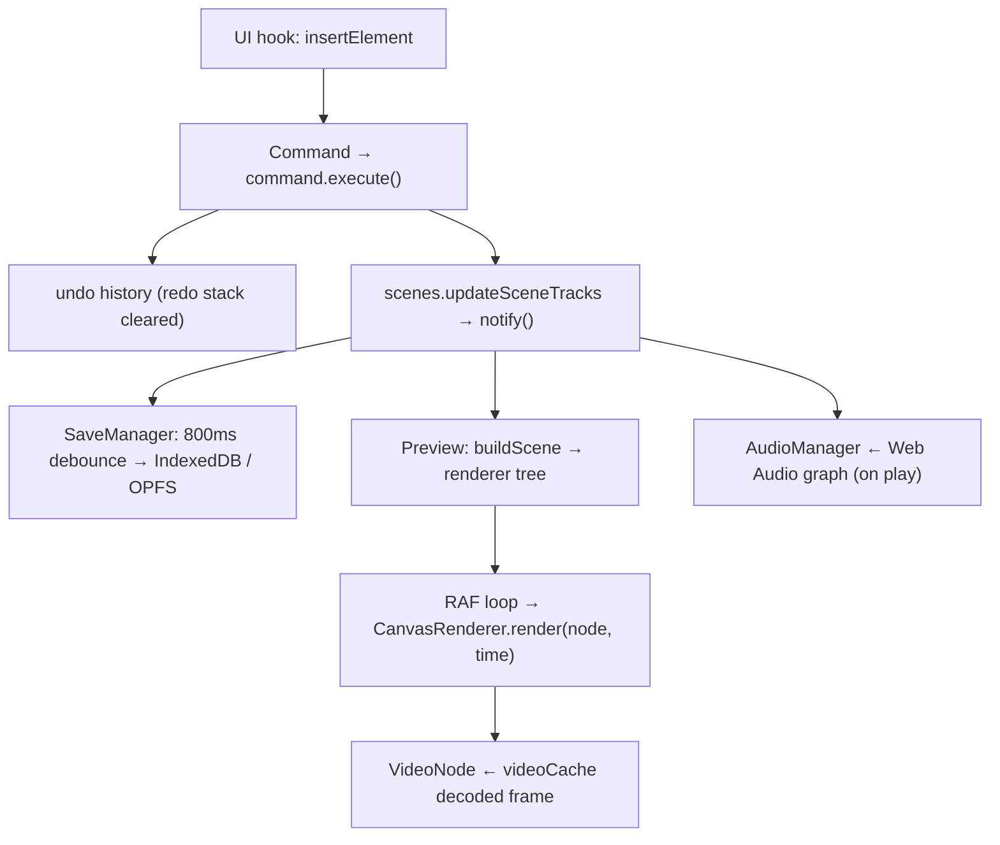

# bycut

Open-source, browser-based video editor — a free CapCut alternative with a
multi-track timeline, AI captions, TTS, and GPU-accelerated canvas rendering.
**Every edit and export runs locally in the browser; nothing is ever uploaded to
a server.**

Preview: <https://bycut.pages.dev/>


The editor core is a set of in-memory **manager singletons** wired to React
through `useSyncExternalStore`; decode, compositing, and encode all go through
[mediabunny](https://mediabunny.dev/) on `OffscreenCanvas`; AI captions run
[Transformers.js](https://huggingface.co/docs/transformers.js) Whisper on
**WebGPU** in a Web Worker. Projects persist to IndexedDB (structured data) and
OPFS (raw media) — there is no backend and no `app/api` directory.

## Why

Every other "online video editor" is a thin client in front of a render farm:
your raw footage is uploaded, transcoded on someone's server, and you wait for a
download. That is slow, it costs the operator money per minute, and it means your
private clips live on a third party's disk.

`bycut` is the opposite — a **static site** you open in a tab that does the real
work locally:

- **Nothing is uploaded.** Media is decoded, composited, and re-encoded entirely
  in the browser (mediabunny + WebCodecs + `OffscreenCanvas`). No account, no
  server, no per-minute bill.
- **A real editor, not a trimmer.** Multi-track timeline, scenes, transitions,
  text/stickers, keyframe transforms, speed/reverse, detach-audio, full
  undo/redo — all built on a command bus.
- **AI on-device.** Whisper captions and speech run through a WebGPU Web Worker;
  the audio buffer is transferred zero-copy, and model weights stream from the
  Hugging Face CDN once and cache.
- **Your data stays yours.** Projects live in IndexedDB, raw files in OPFS.
  Autosave + a `beforeunload` guard mean you don't lose work; clearing site data
  is the only "delete".
- **Ship it anywhere static.** `next build` emits a fully static `out/`; deploy to
  Cloudflare Pages (or any static host).

## Quick start

`bycut` is part of the [`@cdlab/projects-monorepo`](../../README.md); run
everything from the repo root.

```bash
pnpm install                       # builds workspace packages too
pnpm --filter @cdlab/bycut dev     # -> http://bycut.localhost:3355
```

The dev URL is fixed by [`@dotns/nsl`](https://github.com/dotns/nsl) — no port
hunting. The root path redirects to `/<locale>/projects` (the project gallery);
opening a project routes to `/<locale>/editor?projectId=<id>`.

> **Browser support.** The editor needs `OffscreenCanvas`, WebCodecs, Web Audio,
> IndexedDB, and OPFS; AI captions additionally need **WebGPU** (`device:
> 'webgpu'` is a hard requirement, especially for `whisper-large-v3-turbo`).
> Target: Chrome 90+, Edge 90+, Firefox 88+, Safari 14+ (WebGPU narrows this).

## How an edit reaches the screen

Dropping a clip onto the timeline runs through the command bus, mutates the active
scene, and fans out to the autosave + preview subscribers:

```
drop video on timeline
  1. editor.timeline.insertElement(...)                 UI hook
  2. new InsertElementCommand → command.execute()       pushed to undo history
     · validates element, auto-picks/creates a track
     · first visual element sets canvas size + fps      (non-undoable side effect)
  3. scenes.updateSceneTracks(...) → notify()           writes tracks into active scene + project
  4a. SaveManager (subscribed) → 800ms debounce → storageService.saveProject
  4b. Preview panel (subscribed) → buildScene(...) → renderer.setRenderTree
  5. preview RAF loop → new CanvasRenderer().render({ node, time })  each frame
     · VideoNode pulls a decoded frame from videoCache.getFrameAt(...)
  6. on play → AudioManager schedules clip audio through the Web Audio graph
```



Domain state lives in the manager singletons (observer pattern); UI-only state
lives in Zustand; playback broadcasts `playback-seek` / `playback-update` as
`window` CustomEvents that audio and preview listen to. The full model is in
[`DESIGN.md`](DESIGN.md).

## Architecture

| Layer | Path | Responsibility |
| --- | --- | --- |
| Editor core | `src/core/index.ts` | `EditorCore` singleton (`getInstance`); constructs 10 managers + starts autosave. |
| Managers | `src/core/managers/` | `command`, `timeline`, `scenes`, `project`, `media`, `playback`, `audio`, `renderer`, `save`, `selection` — plain in-memory state, each with `subscribe()/notify()`. |
| React bridge | `src/hooks/use-editor.ts` | Fans all manager subscriptions into one `useSyncExternalStore` version counter. |
| Commands | `src/lib/commands/` | Undoable operations (media / project / scene / timeline element+track / clipboard); `base-command`, `batch-command`. |
| Renderer | `src/services/renderer/` | `canvas-renderer` (OffscreenCanvas), `scene-builder` (tracks → node tree), `scene-exporter` (mediabunny encode), `nodes/` (video/image/text/sticker/color/blur/transition/root). |
| Storage | `src/services/storage/` | `storageService` + `indexeddb-adapter` + `opfs-adapter`; versioned `migrations/` (`CURRENT_PROJECT_VERSION = 4`). |
| Transcription | `src/services/transcription/` | Transformers.js Whisper in a WebGPU Web Worker (`worker.ts`) + `transcriptionService`. |
| Frame providers | `src/services/video-cache/`, `src/services/timeline-thumbnail/` | mediabunny frame cache (preview) + filmstrip thumbnails (timeline). |
| UI state (Zustand) | `src/stores/` | `editor-store`, `panel-store`, `keybindings-store` (persisted), `timeline-store`, `media-preview-store`, `sounds-store`, `stickers-store`, `assets-panel-store`. |
| Keybindings | `src/stores/keybindings/` | User-customizable, persisted shortcuts (own migration chain). |
| UI | `src/components/editor/` | Header, export button, dialogs, and `panels/` (assets / preview / properties / timeline). |

## Data model

Types in `src/types/project.ts` + `src/types/timeline.ts`; storage shapes in
`src/services/storage/types.ts`. IDs are Snowflake-style via `@cdlab/driftflake`
(`GenidOptimized({ workerId: 1 })`, `src/utils/genid.ts`).

| Entity | Shape |
| --- | --- |
| `TProject` | `{ metadata, scenes: TScene[], currentSceneId, settings (fps, canvasSize, background), version, timelineViewState }`. New projects default to `version = 4`. |
| `TScene` | `{ id, name, isMain, tracks: TimelineTrack[], bookmarks, … }`. Always ≥1 main scene + main track. |
| `TimelineTrack` | video / audio / text track with `elements[]`; video tracks also carry `transitions[]`. |
| element | video / image / audio / text / sticker: `startTime`, `duration`, `trimStart/trimEnd`, `transform`, `opacity` + type-specific fields (`playbackRate`, `reversed`, `mediaId`, `content`, `iconName`…). |
| `MediaAsset` | `{ id, name, type, file, url, width, height, duration, thumbnailUrl, ephemeral }`. Persisted split: metadata → IndexedDB, raw `File` → OPFS. |

**Databases** (per-origin, browser-local): `video-editor-projects`,
`video-editor-media-{projectId}`, `video-editor-saved-sounds` (IndexedDB);
`media-files-{projectId}` (OPFS). On save, Dates serialize to ISO strings and
audio `buffer` fields are stripped; object URLs are reconstructed on load.

## Configuration

There is no runtime config surface — `bycut` is a static browser app with **no
secrets and no bindings**. The only build/runtime knobs:

| Knob | Where | Meaning |
| --- | --- | --- |
| `output: 'export'` | `next.config.ts` | Static export to `out/` (no server runtime). |
| `BUILD_TIME` | `next.config.ts` (env) | Build timestamp shown in the UI. |
| `NODE_ENV` | — | Drives `IS_DEV` (`src/constants/editor-constants.ts`). |
| `images.remotePatterns` | `next.config.ts` | Allowed remote image hosts (Cloudinary, Unsplash, Iconify, avatars…). |
| locales | `src/i18n/routing.ts` | `['en', 'zh']`, default `en`. |
| project schema version | `src/services/storage/migrations/index.ts` | `CURRENT_PROJECT_VERSION` + migration chain. |
| autosave debounce | `src/core/managers/save-manager.ts` | 800ms. |
| Whisper models / chunking | `src/constants/transcription-constants.ts` | default `whisper-base`. |
| canvas/fps/color defaults | `src/constants/project-constants.ts` | new-project defaults. |
| export MIME / defaults | `src/constants/export-constants.ts` | mp4/webm MIME + default format/quality (codecs `avc`+`aac` / `vp9`+`opus` are picked in `scene-exporter.ts`). |

### External services

All optional and called directly from the browser — none are proxied by this app:

| Service | Used for | Where |
| --- | --- | --- |
| Hugging Face model CDN | Whisper ONNX weights (streamed once, cached). | `src/services/transcription/worker.ts` |
| Iconify (`api.iconify.design` + failover) | Sticker icon search. | `src/lib/iconify-api.ts` |
| Freesound (`cdn.freesound.org`) | Sound-effect previews. | `src/constants/sounds-data.ts` |

> **Three `/api/*` calls need an external backend.** This app ships **no**
> `app/api` routes, yet a few features `fetch` server paths: `POST
> /api/tts/generate` (text-to-speech, `src/lib/tts/service.ts`), `POST
> /api/upload/image` (reference-image upload, `src/lib/media/upload-reference.ts`),
> and `GET /api/proxy/download?url=` (CORS proxy for URL import,
> `src/lib/media/url-import.ts`). TTS, reference-image upload, and URL import only
> work if the deployment platform (e.g. Cloudflare Pages Functions or an external
> worker) serves those paths — core editing/export do not depend on them.

## Build, lint & deploy

```bash
pnpm --filter @cdlab/bycut lint       # next lint
pnpm --filter @cdlab/bycut typecheck  # tsc --noEmit
pnpm --filter @cdlab/bycut build      # next build → static out/
pnpm --filter @cdlab/bycut build:cf   # @cloudflare/next-on-pages (Cloudflare Pages)
```

The live site is a static export on **Cloudflare Pages**
(<https://bycut.pages.dev/>). Because `output: 'export'` is set, `next start` and
`middleware.ts` (the `next-intl` locale middleware) are dev/SSR artifacts only —
they do not run in production. Root-repo lint/format is Biome (single quotes, no
semicolons, 2-space); do not add ESLint/Prettier config.

The only automated tests are the storage-migration fixtures under
`src/services/storage/migrations/__tests__/` — there is no app-local `test`
script; they run under the monorepo-root test runner.

## Non-goals

- **Not a cloud editor.** There is no server render, no account, no collaboration —
  export happens in the tab, bounded by the device's CPU/GPU and memory.
- **No FFmpeg.wasm.** All decode/encode/mux go through **mediabunny** +
  `@mediabunny/mp3-encoder` (WebCodecs), not FFmpeg — despite what older docs said.
- **AI captions are not a fallback path.** They require WebGPU; there is no
  WASM/CPU inference path for Whisper here.
- **No cross-device sync.** Projects are per-origin browser storage (IndexedDB /
  OPFS); clearing site data deletes them.

## Design

[`DESIGN.md`](DESIGN.md) is the authoritative spec — the manager core and its
observer/React bridge, the command/undo system, the render tree and mediabunny
export path, the per-data-type storage model and migration chain, the transcription
worker, and the concurrency guards. Read it before changing manager wiring, the
render-tree node contract, storage adapters, or the migration chain.

## License

[MIT](../../LICENSE) © 2025-PRESENT [wudi](https://github.com/WuChenDi)
