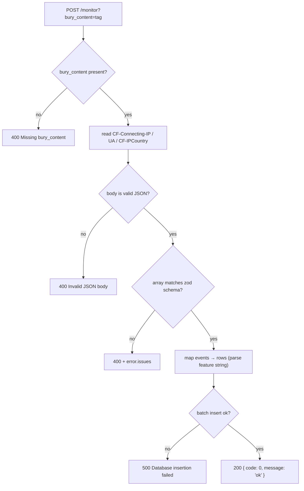

# byplay-log

Single-endpoint telemetry sink for the [ByPlay](https://byplay.pages.dev/) video
player — a **Hono Cloudflare Worker** that validates a batch of client-side
playback events, enriches them with server-side request metadata, and
batch-inserts them into a SQLite-family database via Drizzle.

```diff
- player fetch → self-reported IP/UA/country, ad-hoc shapes, no validation
+ POST /monitor?bury_content=play → zod-validated → CF-Connecting-IP/UA/country stamped server-side → one atomic batch insert
```

Preview: <https://byplay.pages.dev/>


Every request is one array of events; every event is schema-checked before a
single `values([...])` insert, so a malformed payload is a `400` with the parse
errors — never a partial write. The visitor's IP, User-Agent, and country are
read from the edge request (`CF-Connecting-IP`, `CF-IPCountry`), so the client
never self-reports them.

## Why

The ByPlay player emits playback telemetry (buffering, stalls, runtime config,
progress) that has to land somewhere queryable, but the event shape keeps
changing as the player gains features. A rigid, per-field schema would force a
migration on every player change; a schemaless dump would lose the query keys.

`byplay-log` splits the difference:

- **Stable keys, flexible payloads** — the columns worth indexing (`userId`,
  `streamId`, `topicId`, `time`, `buryContent`) are real columns; the volatile
  runtime shapes (`feature`, `playerConfig`, `vplayerRuntime`, `playerRuntime`,
  `executeProgressInfos`) are JSON columns, so the player can add fields with no
  migration.
- **Server-authoritative metadata** — IP, UA, and country come from the edge
  request, not the client, so they can't be spoofed or omitted.
- **Batch-atomic ingest** — all events in a request insert in one statement; any
  row error fails the whole batch with a `500`, so there's no half-written batch
  to reconcile.
- **One Worker, no servers** — Hono on Cloudflare Workers, backed by D1 or a
  LibSQL/Turso database chosen at deploy time by `DB_TYPE`.

## Quick start

`byplay-log` is part of the [`@cdlab/projects-monorepo`](../../README.md); run
everything from the repo root.

```bash
pnpm install                                   # builds workspace packages too
pnpm --filter @cdlab/byplay-log cf:localdb     # apply migrations to the local D1
pnpm --filter @cdlab/byplay-log dev            # -> http://byplay-log.localhost:3355
```

The dev URL is fixed by [`@dotns/nsl`](https://github.com/dotns/nsl) — no port
hunting. `GET /` returns a health/info JSON; the ingest route is
`POST /monitor?bury_content=<tag>`:

```bash
curl -X POST 'http://byplay-log.localhost:3355/monitor?bury_content=play' \
  -H 'content-type: application/json' \
  -d '[{"time":1720000000000,"userId":1,"userIdUuid":"u-1","streamId":"s-1","version":"1.0.0","playerConfig":{"topicId":42}}]'
# -> { "code": 0, "message": "ok" }
```

Copy `.env.example` to `.env` and fill the credentials for your `DB_TYPE` before
running migrations against a remote database.

## How ingest works

```
POST /monitor?bury_content=<tag>
  1. useDrizzle(c)                     obtain the DB handle (D1 or libSQL)
  2. require bury_content query param  → 400 if absent
  3. read edge headers server-side     CF-Connecting-IP → X-Forwarded-For → X-Real-IP; UA; CF-IPCountry
  4. parse JSON body                   → 400 "Invalid JSON body" on malformed JSON
  5. PlayerLogsArraySchema.safeParse    → 400 with error.issues on shape mismatch
  6. map each event → NewPlayerLog     feature (JSON string) is JSON.parse'd; bad JSON → null (row kept)
  7. db.insert(playerLogs).values([…]) one atomic batch → 500 on DB error
  8. { code: 0, message: 'ok' }
```



Note the two-level status scheme: a successful insert returns app-level
`code: 0` (distinct from HTTP `200`); error envelopes reuse the HTTP status as
`code`.

## Configuration

Runtime knobs are `vars` in [`wrangler.jsonc`](wrangler.jsonc), mirrored in
`.env.example`. The Worker reads them from `process.env` (injected via
`nodejs_compat`).

| Var | Default | Meaning |
| --- | --- | --- |
| `DEPLOY_RUNTIME` | `cf` | Logger selection: `cf` → `console.*` wrapper; `node` → winston + daily-rotate file. |
| `DB_TYPE` | `libsql` (worker) / `d1` (wrangler) | Driver: `d1` (the `DB` binding) or `libsql` (Turso). |
| `LIBSQL_URL` | `file:./web/database/data.db` | LibSQL/Turso URL (used when `DB_TYPE=libsql`). |
| `LIBSQL_AUTH_TOKEN` | *(empty)* | LibSQL/Turso auth token. |
| `CLOUDFLARE_ACCOUNT_ID` | — | Used by drizzle-kit for remote D1 (`d1-http` driver). |
| `CLOUDFLARE_API_TOKEN` | — | Used by drizzle-kit for remote D1. |

`drizzle.config.ts` additionally reads `CLOUDFLARE_DATABASE_ID` for the remote
`d1-http` driver — it is **not** in `.env.example`, so export it before running
`db:*` against a remote D1. `NODE_ENV === 'dev'` sets `isDebug`, which gates
debug logs and error-stack exposure.

## Bindings

| Binding | Type | Purpose | Required |
| --- | --- | --- | --- |
| `DB` | D1 | `player_logs` storage, `database_name: byplay`. | ✓ (when `DB_TYPE=d1`) |
| — | LibSQL/Turso | Alternative store via `LIBSQL_URL` + `LIBSQL_AUTH_TOKEN`. | ✓ (when `DB_TYPE=libsql`) |
| `observability` | — | Worker logs, `head_sampling_rate: 1`. | on |

KV, R2, and AI bindings are present but commented out in `wrangler.jsonc`.

## Endpoints

| Route | Purpose |
| --- | --- |
| `GET /` | Health/info JSON (`status: 'ok'`, endpoint list). |
| `POST /monitor?bury_content=<tag>` | Ingest a JSON **array** of player-log events. |

Unknown routes hit the `notFound` handler; all failures return a consistent
`{ code, message, stack? }` envelope (`stack` only when `isDebug`).

## Data model

Single table `player_logs` (`src/database/schema.ts`), autoincrement `id`:

| Group | Columns |
| --- | --- |
| Identity | `userId`, `userIdUuid`, `streamId`, `topicId` (lifted from `playerConfig.topicId`) |
| Event | `time`, `version`, `ua`, `vendor`, `platform` |
| JSON (flexible) | `feature`, `playerConfig`, `vplayerRuntime`, `playerRuntime`, `executeProgressInfos` |
| Request metadata | `buryContent`, `ipAddress`, `userAgent`, `country` |
| Tracking mixin | `createdAt`, `updatedAt` (auto), `isDeleted` (soft-delete default 0) |

Indexes: `userId`, `streamId`, `time`, `buryContent`, `createdAt`, and composite
`(userId, streamId)`.

## Project structure

```
src/
  index.ts             app assembly, middleware, CORS, health route, error/404 handlers
  routes/
    monitor.ts         the only business route: POST /monitor + the zod schema
    index.ts           barrel re-export
  lib/db.ts            DatabaseManager singleton + useDrizzle(c) factory (D1 / libSQL)
  database/
    schema.ts          Drizzle player_logs table + trackingFields mixin + types
    0000_mysterious_shape.sql   generated migration
    meta/              drizzle journal + snapshot
  global.ts            installs globalThis.logger + globalThis.isDebug (side-effect import)
DESIGN.md              architecture + ingest / data-model / config spec
llms.txt               agent-oriented usage guide
```

## Build, deploy & database

```bash
pnpm --filter @cdlab/byplay-log cf-typegen   # regenerate CloudflareBindings types
pnpm --filter @cdlab/byplay-log deploy        # wrangler deploy --minify
```

There is no test script and no test files. `pnpm --filter @cdlab/byplay-log build`
runs `bun build src/index.ts --outdir dist --target browser` to emit a standalone
`dist/` bundle; it is **not** needed for `wrangler deploy`, which bundles
`src/index.ts` directly.

Migrations:

```bash
pnpm --filter @cdlab/byplay-log db:gen        # generate a migration from schema.ts
pnpm --filter @cdlab/byplay-log cf:localdb    # apply to local D1
pnpm --filter @cdlab/byplay-log cf:remotedb   # apply to remote D1 (--remote)
pnpm --filter @cdlab/byplay-log db:studio     # drizzle-kit studio (port 3018)
```

CORS is locked to `https://byplay.pages.dev` and `http://localhost:3016` with
`credentials: true` — update the allow-list in `src/index.ts` if the player
origin changes.

## Non-goals

- Not a query/analytics API — this Worker only **ingests**; reads happen directly
  against D1/Turso (drizzle-studio, dashboards).
- Not multi-tenant — a single dataset for one player; there is no per-owner
  scoping or auth on the ingest endpoint (origin allow-list only).
- No retention/cleanup job — `isDeleted` exists per the shared convention but
  nothing soft-deletes or prunes rows; rows accumulate until pruned externally.

## Design

[`DESIGN.md`](DESIGN.md) is the authoritative spec — the ingest pipeline, the
stable-keys/flexible-JSON data model, the dual-driver DB manager, the logger
split, and the configuration/deployment story. Read it before changing the
schema, the validation shape, or the insert path.

## License

[MIT](../../LICENSE) © 2025-PRESENT [wudi](https://github.com/WuChenDi)
