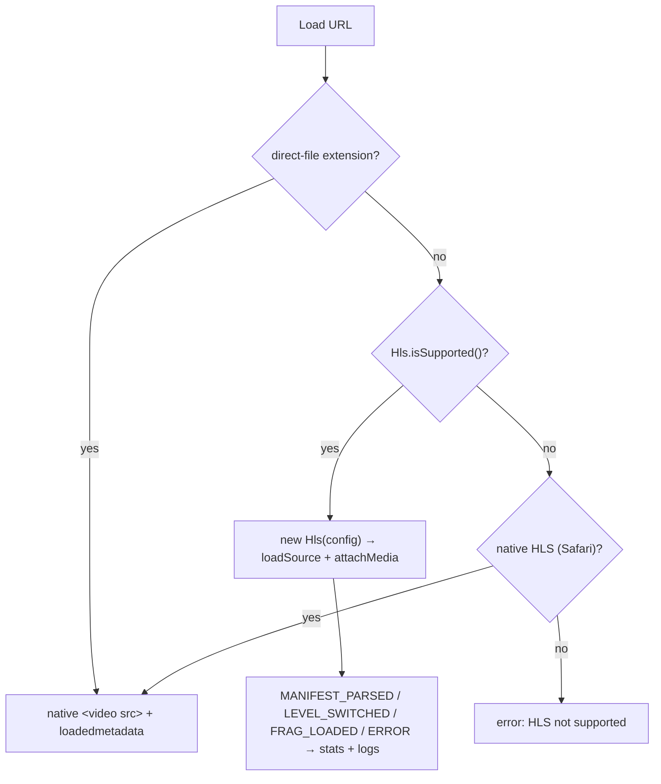

# byplay

An in-browser HLS/M3U8 test player: paste a stream URL, then tune ABR, buffer,
retry, and ad-filter behavior **live** while a real-time stats and event-log
panel shows exactly what hls.js is doing — one Next.js app that runs entirely
client-side, with **no backend**.

```diff
- open a stream in a black-box player, guess why it stalls, edit code, rebuild
+ paste a URL, flip enableWorker / maxBufferLength / abrBandWidthFactor live,
+ watch bandwidth · buffered · dropped-frames · level updates + a 200-line event log
```

Preview: <https://byplay.pages.dev/>


Every knob is a controlled hls.js config field; changing one and re-loading the
source rebuilds the `Hls` instance with the new config, so you can bisect a
playback problem (stalls, wrong quality, ad segments, CORS) without leaving the
page or shipping a build.

## Why

Debugging an HLS stream usually means embedding it in a player whose config is
frozen at build time. To try a different buffer size, ABR factor, or retry
policy you edit code and redeploy — and you still can't see the manifest the
player actually loaded.

`byplay` inverts that: the hls.js config **is** the UI.

- **Live tuning** — buffer, ABR, performance, and loading/retry knobs are React
  state fed straight into `new Hls(config)`. Change one, hit Load, compare.
- **Real-time telemetry** — a `StatsCard` (bandwidth, buffered seconds, dropped
  frames, current level) plus a capped event log surface `MANIFEST_PARSED`,
  `LEVEL_SWITCHED`, `FRAG_LOADED`, and every fatal/non-fatal `ERROR`.
- **Format auto-detection** — an `.m3u8` gets the full hls.js path; an
  `.mp4`/`.webm`/`.mkv`/… plays through the native `<video>` element, and the
  HLS-only panels hide themselves.
- **Client-side ad filtering** — an optional custom hls.js loader rewrites the
  manifest in the browser before playback, with heuristic / keyword / aggressive
  modes.
- **Zero infrastructure** — a fully static export (`output: 'export'`); no API
  routes, no worker, no database. Streams are fetched directly from the URLs you
  paste (subject to their CORS).

## Quick start

`byplay` is part of the [`@cdlab/projects-monorepo`](../../README.md); run
everything from the repo root.

```bash
pnpm install                          # builds workspace packages too
pnpm --filter @cdlab/byplay dev       # -> http://byplay.localhost:3355
```

The dev URL is fixed by [`@dotns/nsl`](https://github.com/dotns/nsl) — no port
hunting. The app is a single screen: a URL field (pre-filled with a public test
stream), a column of config cards, and the `<video>` + stats + log panel.

You can also deep-link a stream via `?url=` (or `?source=`) — the page
auto-loads it on mount if the URL ends in a recognized media extension:

```
http://byplay.localhost:3355/en?url=https://test-streams.mux.dev/x36xhzz/x36xhzz.m3u8
```

## How playback resolves

`loadSource(url, config)` (`src/hooks/use-hls-player.ts`) picks one of three
drivers by inspecting the URL and the browser:

```
loadSource(url, config)
  1. destroy any prior Hls instance + clear native <video> src
  2. url matches /\.(mp4|webm|ogg|ogv|mov|avi|mkv)(\?…)?$/i  → native <video src>   (direct file)
  3. else Hls.isSupported()                                  → hls.js MSE path      (HLS/M3U8)
  4. else canPlayType('application/vnd.apple.mpegurl')       → native <video src>   (Safari HLS)
  5. else                                                    → "HLS not supported" error
```

On the hls.js path the config knobs merge with fixed EWMA / retry-timeout
constants, media attaches, and event handlers stream telemetry + logs back to
the page.



Two retry layers stack: hls.js's own `*LoadingMaxRetry` config **and** an
app-level loop that calls `hls.startLoad()` on fatal network errors and
`hls.recoverMediaError()` on fatal media errors, each up to 3 times, before
destroying the instance.

## HLS config knobs

Every field of `HlsConfig` is a `Pick` of hls.js's own `HlsConfig` plus three
app-level fields. Defaults live in `DEFAULT_HLS_CONFIG`
(`src/hooks/use-hls-player.ts`); the reset button restores them.

| Card | Knob | Default | Meaning |
| --- | --- | --- | --- |
| Performance | `enableWorker` | `true` | Run hls.js demuxing in a Web Worker. |
| Performance | `lowLatencyMode` | `false` | Enable LL-HLS mode. |
| Performance | `startFragPrefetch` | `true` | Prefetch the first fragment before play. |
| Buffer | `maxBufferLength` | `60` | Target forward buffer (s). |
| Buffer | `maxMaxBufferLength` | `120` | Hard cap on forward buffer (s). |
| Buffer | `maxBufferSize` | `60 MB` | Forward buffer size cap (bytes). |
| Buffer | `maxBufferHole` | `0.5` | Max gap jumped without re-buffering (s). |
| Buffer | `backBufferLength` | `30` | Retained back buffer (s). |
| ABR | `abrEwmaDefaultEstimate` | `500000` | Initial bandwidth estimate (bps). |
| ABR | `abrBandWidthFactor` | `0.8` | Safety factor for down-switch. |
| ABR | `abrBandWidthUpFactor` | `0.7` | Safety factor for up-switch. |
| Loading / retry | `fragLoadingMaxRetry` | `6` | Fragment load retries. |
| Loading / retry | `manifestLoadingMaxRetry` | `4` | Manifest load retries. |
| Loading / retry | `levelLoadingMaxRetry` | `4` | Level-playlist load retries. |
| Loading / retry | `fragLoadingRetryDelay` | `1000` | Delay before a fragment retry (ms). |
| Loading / retry | `fragLoadingTimeOut` | `20000` | Fragment load timeout (ms). |
| Loading / retry | `manifestLoadingTimeOut` | `10000` | Manifest load timeout (ms). |
| Loading / retry | `levelLoadingTimeOut` | `10000` | Level load timeout (ms). |
| Playback | `autoPlay` | `true` | Autoplay on manifest parse (falls back to muted). |
| Ad filter | `adFilterMode` | `off` | `off` / `keyword` / `heuristic` / `aggressive` (§ Ad filtering). |
| Ad filter | `adKeywords` | `[]` | Extra URL substrings to treat as ads. |

Playback rate (`0.25x`–`4x`) and manual quality-level selection live on the
Playback card and apply to the live `<video>` / `Hls` instance directly, not
through `HlsConfig`.

## Ad filtering

When `adFilterMode !== 'off'`, `loadSource` installs a custom hls.js loader that
intercepts `manifest` and `level` responses and runs `filterM3u8Ad`
(`src/lib/m3u8-utils.ts`) on the playlist text before hls.js parses it — a
five-stage in-browser pipeline:

1. **Heuristic block scoring** — split the playlist by `#EXT-X-DISCONTINUITY`,
   learn a "MainPattern" fingerprint from the largest block, score every other
   block; blocks over the threshold are stripped
   (`src/lib/m3u8-ad-detector.ts`).
2. **SCTE-35 CUE state machine** — drop everything between `#EXT-X-CUE-OUT` and
   `#EXT-X-CUE-IN`.
3. **Keyword backtracking** — remove segments whose URL matches one of your
   `adKeywords` (the built-in `AD_PATH_KEYWORDS` set feeds the step-1 heuristic
   scorer, not this stage).
4. **Aggressive discontinuity stripping** — in `aggressive` mode, drop
   `#EXT-X-DISCONTINUITY` markers entirely.
5. **URL normalization** — resolve relative segment/key URLs to absolute.

Mode thresholds: `heuristic` = 5.0, `aggressive` = 3.0. Each run logs a
`FilterStats` summary (blocks/segments filtered, CUE sections, keyword hits) and
its elapsed ms to the event log. Filtering happens per request in the browser —
nothing is proxied or sent to a server.

## Cross-tool integration

The Source card renders a **"download this video"** link to
[`vidl`](https://vidl.pages.dev/) — `https://vidl.pages.dev/<locale>?url=<url>` —
so the current stream can be handed off to the downloader with locale preserved.

## Project structure

```
src/
  app/
    page.tsx               root → redirect('/en') (static-export root)
    [locale]/layout.tsx    shell: fonts, bilingual SEO metadata, JSON-LD, providers
    [locale]/page.tsx      the application screen (HlsPage): URL + config cards + video/stats/logs
  hooks/
    use-hls-player.ts      the core — HlsConfig, DEFAULT_HLS_CONFIG, driver selection,
                           retry loop, ad-filter loader injection, 200-entry log ring
  components/
    player/                one controlled card per config group + stats + event log
    layout/                theme + language selector + client providers
  lib/
    m3u8-utils.ts          filterM3u8Ad — 5-stage manifest ad-strip pipeline
    m3u8-ad-detector.ts    heuristic block scoring (parseBlocks / learnMainPattern / scoreBlock)
  i18n/                    next-intl routing (en / zh), request, navigation
  middleware.ts            next-intl locale middleware (inert under output: 'export')
messages/{en,zh}.json      next-intl message catalogs
DESIGN.md                  architecture + player / ad-filter design
llms.txt                   agent-oriented usage guide
```

## Build & deploy

```bash
pnpm --filter @cdlab/byplay lint       # next lint
pnpm --filter @cdlab/byplay typecheck  # tsc --noEmit
pnpm --filter @cdlab/byplay build      # next build → static out/
pnpm --filter @cdlab/byplay build:cf   # @cloudflare/next-on-pages
```

Deployed as a fully static export on **Cloudflare Pages** via
`@cloudflare/next-on-pages`. There are no environment variables, secrets, or
Cloudflare bindings — the only build-time input is a `BUILD_TIME` stamp injected
in `next.config.ts`.

## Non-goals

- **No backend, no persistence.** Config, logs, and stats are React in-memory
  state; nothing is saved across reloads.
- **No analytics reporting.** Playback telemetry stays on the page — despite an
  earlier plan, there is no code that beacons events to any log endpoint.
- **Not a production/consumer player.** It's a diagnostic harness: minimal chrome,
  every internal deliberately exposed.
- **No DRM / Widevine / FairPlay**, and HEVC/H.265 surfaces a soft warning
  rather than a workaround — browsers that can't decode it simply won't.

## Design

[`DESIGN.md`](DESIGN.md) is the authoritative spec — the single-page / single-hook
architecture, driver selection, the retry model, the ad-filter pipeline, and the
static-export constraints. Read it before changing driver selection order,
config field wiring, or the ad-filter loader.

## License

[MIT](../../LICENSE) © 2025-PRESENT [wudi](https://github.com/WuChenDi)
