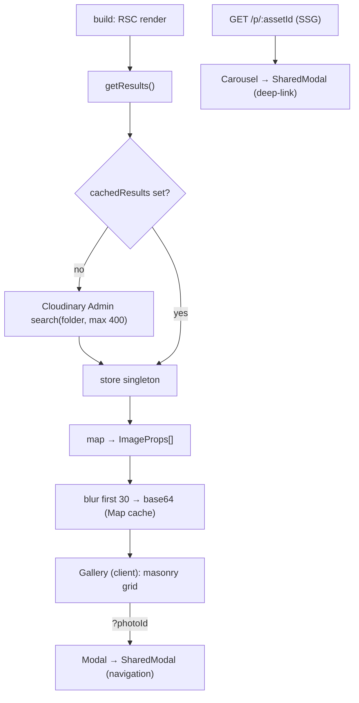

# byshot

A zero-infrastructure personal photography site: a Cloudinary folder becomes a
Pinterest-style masonry gallery with a full-screen lightbox and deep-linkable
photo pages — **no database, no image assets in the repo, no upload pipeline**.

Preview: <https://byshot.pages.dev/>


Every image URL is a Cloudinary transform (`c_scale,w_720` for the grid, `w_1920`
for the lightbox, `w_8` for the blur placeholder), so resizing, format
negotiation, and CDN delivery are Cloudinary's job — Next.js never proxies a
pixel. The whole site is statically exported at build time and served from
Cloudflare Pages.

## Why

A personal photo gallery usually drags in far more than it should: an upload
form, object storage, a database of image rows, a thumbnail-generation job, and
an image-optimizing server. `byshot` deletes all of that. Your photos already
live in Cloudinary; the site is a thin, static view over one folder:

- **No app-side storage** — the "data model" is Cloudinary's folder listing.
  There is no database and no `wrangler` binding; the only persistence in-process
  is two in-memory caches that live for the build.
- **Cloudinary does the heavy lifting** — resizing and format negotiation happen
  in the delivery URL (`images.unoptimized` turns the Next optimizer off), so
  there is no image server to run or scale.
- **Static by construction** — `output: 'export'` plus `generateStaticParams`
  makes every home + per-photo page build-time-resolvable; Cloudflare Pages just
  serves the output.
- **Deep-linkable** — every photo has a stable URL keyed by its Cloudinary
  `asset_id`, so `/p/<asset_id>` survives reordering and re-uploads.

## Quick start

`byshot` is part of the [`@cdlab/projects-monorepo`](../../README.md); run
everything from the repo root.

```bash
pnpm install                         # builds workspace packages too
cp apps/byshot/.env.example apps/byshot/.env.local   # then fill in Cloudinary creds
pnpm --filter @cdlab/byshot dev      # -> http://byshot.localhost:3355
```

The dev URL is fixed by [`@dotns/nsl`](https://github.com/dotns/nsl) — no port
hunting. You need a Cloudinary account with photos uploaded under a folder; grab
the cloud name / API key / secret from the Cloudinary dashboard → Settings →
Access Keys, and set `CLOUDINARY_FOLDER` to the folder you want to publish.

## Using it

- **Grid** — the home page (`/`) is a masonry grid; click any photo to open the
  in-grid lightbox at `/?photoId=<asset_id>`.
- **Lightbox** — arrow keys (`←` / `→`) or swipe to navigate, `Esc` / the close
  button to return to the grid. A bottom thumbnail strip shows the 15 photos on
  either side of the current one. Top-right actions: open the full-size original
  or download it.
- **Deep link** — `/p/<asset_id>` is a standalone, statically-generated page for
  one photo (blurred full-screen backdrop, no prev/next). Its top-right action is
  **Share on X** instead of "open fullsize".
- **Scroll restore** — closing the lightbox scrolls the grid back to the photo
  you were viewing.

## How the home page resolves

```
GET /  (RSC, build time)
  1. getResults()            Cloudinary Admin search → cached singleton (1 call/build)
  2. map resources           → lean ImageProps[] (id=index, asset_id, w/h, public_id, format)
  3. blur first 30 photos    Promise.all(getBase64ImageUrl) — capped for Workers subrequests
  4. <Gallery images=…/>     client masonry grid + modal orchestration
  5. ?photoId=<asset_id>     Gallery mounts <Modal> in-grid; nav via history.replaceState
```



Step 1's result is a **module-level singleton** shared by the home page and every
`/p/[photoId]` page, so the Cloudinary Admin API is hit once per build, not once
per page. Blur placeholders are memoized in a second module-level `Map` keyed by
`public_id.format`. Full detail — caching, the subrequest cap, the deep-link vs
modal divergence — is in [`DESIGN.md`](DESIGN.md).

## Configuration

All four vars are runtime-required; create `apps/byshot/.env.local` from
`.env.example`. Cloudinary is configured once at import in
`src/utils/cloudinary.ts`.

| Var | Scope | Meaning |
| --- | --- | --- |
| `NEXT_PUBLIC_CLOUDINARY_CLOUD_NAME` | public | Cloudinary cloud name; also used client-side in every delivery URL. |
| `CLOUDINARY_API_KEY` | secret | Cloudinary Admin API key (server-side folder search). |
| `CLOUDINARY_API_SECRET` | secret | Cloudinary Admin API secret. |
| `CLOUDINARY_FOLDER` | — | Folder whose photos are published (`folder:<name>/*`). |

`BUILD_TIME` is injected at build in `next.config.ts` and surfaced by the footer
version badge; you don't set it.

### Tunable constants (in code)

| Constant | Where | Meaning |
| --- | --- | --- |
| `BLUR_PLACEHOLDER_COUNT = 30` | `src/app/page.tsx` | Photos that get a blur placeholder per SSR — capped to stay under Cloudflare Workers' subrequest limit (50 free / 1000 paid). |
| `max_results(400)` | `src/utils/cachedImages.ts`, `p/[photoId]/page.tsx` | Max photos fetched from the folder; more than 400 are silently truncated. |
| thumbnail window `±15` | `src/components/SharedModal.tsx` | Photos shown either side of the current one in the strip. |
| transform widths | Gallery / SharedModal / p-route / blur | `720` grid · `1280` nav · `1920` deep-link · `180` thumb · `8` blur · `2560` OG. |
| masonry breakpoints | `src/components/Gallery.tsx` | `columns-1 sm:columns-2 xl:columns-3 2xl:columns-4`. |
| default theme | `src/components/layout/client-providers.tsx` | `dark` + `enableSystem`. |

## Project structure

```
src/
  app/
    layout.tsx               root layout: fonts, SEO metadata, JSON-LD, ClientProviders, Analytics
    page.tsx                 home RSC — folder listing → blur → <Gallery>
    p/[photoId]/page.tsx     deep-link photo (SSG, generateStaticParams, dynamicParams=false)
    globals.css              @cdlab/ui Tailwind entry + aspect-ratio custom variants
  components/
    Gallery.tsx              masonry grid + modal orchestration + scroll-restore
    Modal.tsx                in-grid lightbox (Radix Dialog, history.replaceState nav)
    Carousel.tsx             deep-link viewer (blur backdrop, no in-place nav)
    SharedModal.tsx          shared lightbox UI (motion + swipe + thumbnail strip)
    layout/                  ClientProviders (theme + gradient bg), theme-provider, theme-toggle
    ui/BackToTop.tsx         scroll-to-top FAB
    Icons/                   Logo, Bridge (hero art)
  utils/
    cloudinary.ts            singleton Cloudinary SDK config
    cachedImages.ts          per-build cache around the folder search (the only "store")
    generateBlurPlaceholder.ts   Edge-safe base64 blur generator (Uint8Array + btoa)
    types.ts                 ImageProps + SharedModalProps
    useLastViewedPhoto.ts    Zustand store for scroll restoration
    range.ts, animationVariants.ts, downloadPhoto.ts
DESIGN.md                    architecture + data-flow + gotchas spec
llms.txt                     agent-oriented usage guide
```

## Build, deploy & lint

```bash
pnpm --filter @cdlab/byshot build      # next build → static export (out/)
pnpm --filter @cdlab/byshot build:cf   # @cloudflare/next-on-pages (the real deploy build)
pnpm --filter @cdlab/byshot typecheck  # tsc --noEmit
pnpm --filter @cdlab/byshot lint       # next lint (Biome is the monorepo formatter)
```

Deploy target is **Cloudflare Pages** via `@cloudflare/next-on-pages`. There is
no `wrangler.jsonc` and no Cloudflare binding — the only Cloudflare relevance is
the subrequest-limit constraint that caps the blur placeholders at 30. There are
no tests.

## Non-goals

- **Not a CMS / uploader** — there is no in-app way to add, edit, or delete
  photos; you manage the Cloudinary folder directly.
- **Not dynamic** — the site is a static export; new photos appear on the next
  build, not live. More than 400 photos are truncated, and unknown deep-link ids
  `404` (`dynamicParams = false`).
- **No multi-user / auth** — it is a single personal collection.

## Design

[`DESIGN.md`](DESIGN.md) is the source-of-truth spec: the static-export model,
the two-level caching, the subrequest-driven blur cap, the shared-lightbox
architecture, and the security hardening (Edge-safe base64, JSON-LD escaping,
CORS download). Read it before changing caching, the blur cap, or the routing
key.

## License

[MIT](../../LICENSE) © 2025-PRESENT [wudi](https://github.com/WuChenDi)
