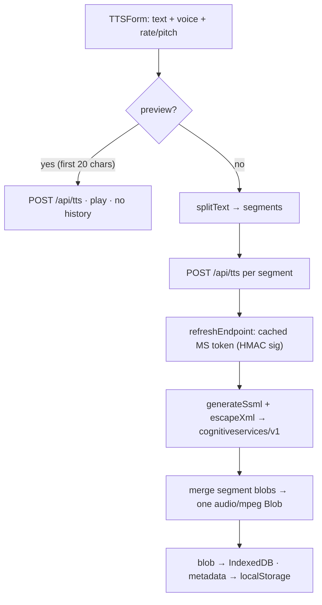

# bytts

Free, browser-based **text-to-speech** — 290+ neural voices, adjustable
rate / pitch, long-text auto-splitting, and a pluggable "API manager" so you can
bring your own TTS backend. A single Next.js app; no account, no Azure key, no
server database.

Preview: <https://bytts.pages.dev/>


The built-in synthesizer proxies the free "Microsoft Edge Read Aloud" speech
pipeline: an Edge route derives a short-lived token with a reverse-engineered
HMAC signature, wraps your text in SSML, and streams the clip back as
`audio/mpeg`. Everything else — history, custom providers, playback — lives in
the browser (IndexedDB + localStorage); there is no backend store to run.

## Why

Good TTS is either locked behind a paid cloud SDK or trapped in a native app.
`bytts` gives you the neural voices with none of that:

- **No key, no bill** — the built-in `edge-api` provider reaches Microsoft's free
  Edge speech endpoint via a signed request; you never register an Azure
  subscription.
- **Long text just works** — a width-aware splitter chops text up to 50,000
  characters on sentence / clause boundaries, synthesizes each segment, and
  merges the audio back into one clip — no manual chunking.
- **Bring your own backend** — the API manager lets you point at any
  OpenAI-format or Edge-format TTS endpoint, override a built-in's URL / key /
  limits, and switch providers from one picker.
- **Your data stays local** — generated audio lives in IndexedDB, metadata in
  localStorage. Nothing is uploaded; there is no database and no telemetry.
- **One artifact** — a Next.js app deployed to Cloudflare Pages. The only
  server-side code is two Edge routes.

## Quick start

`bytts` is part of the [`@cdlab/projects-monorepo`](../../README.md); run
everything from the repo root.

```bash
pnpm install            # builds workspace packages too
pnpm dev:bytts          # -> http://bytts.localhost:3355
```

The dev URL is fixed by [`@dotns/nsl`](https://github.com/dotns/nsl) — no port
hunting. Type text, pick a voice, hit **Generate**; use the 20-character preview
to audition a voice before committing to a full render. No environment variables
are required — set `ACCESS_PASSWORD` only if you want a gate (see below).

## How a generation runs

```
Generate voice (built-in Edge API)
  1. splitText(text, splitLength)          width-aware split on punctuation
  2. genid.nextId() → requestId            Snowflake-style id; addHistory(PROCESSING)
  3. per segment → POST /api/tts           {text, voice, rate, pitch, preview}
  4. server: refreshEndpoint()             cached MS token (HMAC-signed), per isolate
  5. server: generateSsml() + escapeXml    SSML built server-side; text XML-escaped
  6. server: POST cognitiveservices/v1     → arrayBuffer as audio/mpeg
  7. client merges segment blobs → 1 Blob  updateHistory(COMPLETED, audioBlob)
  8. blob → IndexedDB (id), meta → localStorage
```



The **preview path** (`generateVoice(true)`) only synthesizes `text.slice(0,20)`,
plays it via an object URL, and writes **no** history — it is a throwaway
audition.

## Providers & the API manager

Two providers ship built in; you can add your own or override the built-ins in
place (edits are non-destructive and restorable to defaults).

| Provider | Format | Endpoint | Max length | Split |
| --- | --- | --- | --- | --- |
| **Edge API** (`edge-api`) | `edge` | `/api/tts` (this app) | 50,000 | 5,000 |
| **OAI-TTS** (`oai-tts`) | `openai` | `https://oai-tts.zwei.de.eu.org/v1/audio/speech` (9 voices) | 4,096 | 4,096 |
| Custom | `edge` or `openai` | your endpoint | per-config | per-config |

- A **custom provider** is stored in localStorage (`bytts-custom-apis`) with its
  own endpoint, key, auth-header name, voice list, and segmentation toggle. It
  sits alongside the built-ins in the picker.
- A **built-in override** (`{endpoint?, apiKey?, authHeaderName?, maxLength?,
  splitLength?}`) is merged over the default — `{...BUILTIN_APIS[id],
  ...override}` — and can be reset.
- **Auth header semantics**: each provider names its own auth header (default
  `Authorization`) and value. When fetching a model list, a key sent under
  `Authorization` is auto-prefixed with `Bearer `; on the actual TTS request the
  key is sent verbatim under the configured header. Other header names are always
  sent as-is.
- **Format quirks**: OpenAI requests strip `<break>` tags and send
  `response_format` from the UI. The `oai-tts` built-in sends
  `model: 'tts-1', voice: <speaker>`; a **custom** OpenAI provider maps
  `model: <speaker>, voice: 'alloy'` (the selected voice becomes the model).

## Endpoints

Both routes run on the **Edge Runtime** (`export const runtime = 'edge'`).

### `POST /api/tts`

Synthesizes one clip. Request body (JSON):

| Field | Type | Default | Meaning |
| --- | --- | --- | --- |
| `text` | string | — | Text to convert (required). |
| `voice` | string | `zh-CN-XiaoxiaoMultilingualNeural` | Voice short name; validated against `/^[a-zA-Z0-9\-_]+$/`. |
| `rate` | number | `0` | Speech rate, `-100`…`100` (percent). |
| `pitch` | number | `0` | Pitch, `-100`…`100` (percent). |
| `format` | string | `audio-24khz-48kbitrate-mono-mp3` | `X-Microsoft-OutputFormat` value. |
| `preview` | boolean | `true` | `false` adds a `Content-Disposition: attachment` download header. |

**Response:** `audio/mpeg` bytes (the raw synthesized clip). Errors return
`{ error }` with `400` (bad params) or `500`.

### `GET | POST /api/config`

`GET` → `{ hasEnvPassword, persistPassword }` (seeds the client gate).
`POST { password }` → `{ valid }` — a plain string compare against
`ACCESS_PASSWORD`.

## Environment variables

All optional; `bytts` runs with none set. Read from `process.env` in the Edge
routes / layout.

| Variable | Default | Meaning |
| --- | --- | --- |
| `ACCESS_PASSWORD` | *(empty)* | Site password. Empty disables the gate. Read in `api/config` + `layout.tsx`. |
| `PERSIST_PASSWORD` | `true` | `false` forces password re-entry every session (no `localStorage` unlock). |
| `MICROSOFT_CLIENTTRACEID` | *(empty)* | Optional `X-ClientTraceId` seed for the MS endpoint fetch. |
| `BUILD_TIME` | *(injected)* | Set at build in `next.config.ts`; surfaced in the version footer. |

## Storage

No server database — all persistence is client-side.

| Store | Backend | Key | Holds |
| --- | --- | --- | --- |
| `useApiStore` | localStorage | `bytts-custom-apis` | Custom providers + built-in overrides. |
| `useHistoryStore` | localStorage | `bytts-results` | History metadata (blob stripped, `PROCESSING` items dropped). |
| audio blobs | IndexedDB | `tts-history-data` | One `ArrayBuffer` per history item id. |

On reload, `rehydrateBlobs` reloads each completed item's audio from IndexedDB;
a missing blob flips the item to `FAILED` ("Audio data lost"). This split keeps
localStorage under quota while surviving refreshes.

## Non-goals & limitations

- **The password gate is client-side only.** `PasswordGate` gates *rendering*,
  not the API. `POST /api/tts` has no auth — anyone hitting the endpoint directly
  bypasses `ACCESS_PASSWORD`. Do not treat it as access control for the synthesis
  backend; it only hides the UI.
- **The built-in voice relies on a reverse-engineered endpoint.** `edge-api`
  signs requests to Microsoft's free Edge speech pipeline with a hardcoded HMAC
  key and spoofed client headers — not official Azure Cognitive Services with a
  subscription key. It can break if Microsoft changes the scheme, and is a ToS
  grey area. For guaranteed availability, add your own provider via the API
  manager.
- **In-flight generations are not persisted.** A `PROCESSING` item lost to a
  refresh simply disappears (by design) rather than hanging.
- Not a voice cloning / custom-voice tool; it only drives the voices the chosen
  backend already exposes.

## Build, test & deploy

```bash
pnpm --filter @cdlab/bytts typecheck    # tsc --noEmit
pnpm --filter @cdlab/bytts lint         # next lint
pnpm --filter @cdlab/bytts build        # next build --webpack (forced webpack builder)
pnpm --filter @cdlab/bytts run build:cf # next-on-pages → .vercel/output (Cloudflare Pages)
```

There is **no test script** — the project has no tests. The `build` script
forces the **webpack** builder (`--webpack`); Turbopack is not used here. Deploy
target is **Cloudflare Pages** via `@cloudflare/next-on-pages` (there is no
`wrangler.jsonc` — it is a Pages Functions build, not a raw Worker);
`next.config.ts` also emits `output: 'standalone'` for a Node self-host fallback.

## Design

[`DESIGN.md`](DESIGN.md) is the source-of-truth spec — the synthesis proxy and
its token/signature scheme, SSML assembly and injection defense, the segmentation
algorithm, the provider model, and the client storage design. Read it before
changing the request pipeline, the SSML escaping, or the history persistence
split.

## License

[MIT](../../LICENSE) © 2025-PRESENT [wudi](https://github.com/WuChenDi)
