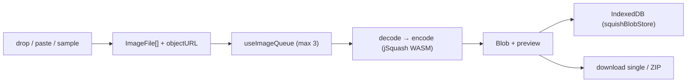

# clearify

Browser-based image & video toolbox — **background removal, image compression,
and video compression** — that runs **100% in your browser**. No account, no
upload, no server: your files never leave the device.

```diff
- upload.jpg  →  someone-else's-server  →  processed.jpg   # your file left your machine
+ image.jpg   →  WebGPU / WASM / WebCodecs (in-tab)  →  image.webp   # nothing uploaded
```

Preview: <https://clearify.pages.dev/>

<details>
  <summary>Preview</summary>
  
  
  
  
</details>

Every pixel is decoded, transformed, and re-encoded inside the tab — background
removal runs a Transformers.js model on WebGPU (WASM fallback), image
compression runs jSquash WebAssembly codecs, and video compression runs
`mediabunny` on the browser's WebCodecs. The "server" only ships static
HTML/JS; there are no API routes and nothing is ever sent to a backend.

## Why

Every online image/video tool asks you to upload the file first — which means
handing your photos and videos to a stranger's server, waiting on a round-trip,
and trusting a retention policy. `clearify` removes the server from the loop:

- **Nothing uploads** — files are read with `URL.createObjectURL` and processed
  in-place. There is no backend, no bucket, no telemetry of your content.
- **Real codecs, not a proxy** — WebGPU/ONNX for matting, jSquash (AVIF / JPEG /
  JXL / PNG / WebP) for images, WebCodecs (`mediabunny`) for H.264/H.265 video.
- **Batch-friendly** — drop or paste many images, compress them with a bounded
  parallel queue, and download individually or as one ZIP.
- **Survives a reload** — completed results persist to IndexedDB, so closing the
  tab mid-session doesn't lose your work.
- **One static bundle** — a Next.js App Router SPA deployed to Cloudflare Pages;
  no origin server to run or pay for.

## Tools

| Route | Tool | Engine | Batch | Formats |
| --- | --- | --- | --- | --- |
| `/bg` | Background removal | Transformers.js (WebGPU → WASM) | sequential | PNG out (transparent / filled) |
| `/squish` | Image compression | jSquash WebAssembly | parallel queue (3) | AVIF, JPEG, JXL, PNG, WebP |
| `/compress` | Video compression | `mediabunny` (WebCodecs) | single file | MP4 (H.264 / H.265, AAC) |
| `/` | Landing + tool picker | — | — | — |

> The three tools deliberately use **three different concurrency models** —
> `/squish` runs a bounded parallel queue, `/bg` runs strictly one image at a
> time, `/compress` handles one file. Don't assume they behave alike.

## Quick start

`clearify` is part of the [`@cdlab/projects-monorepo`](../../README.md); run
everything from the repo root.

```bash
pnpm install                              # builds workspace packages too
pnpm --filter @cdlab/clearify dev         # -> http://clearify.localhost:3355
```

The dev URL is fixed by [`@dotns/nsl`](https://github.com/dotns/nsl) — no port
hunting. Open the landing page, pick a tool, drop a file, and download the
result. No sign-in, no configuration, no env vars.

## How image compression works (`/squish`)

The canonical pipeline; the other two tools are variations on it.

```
1. drop / paste / sample  → ImageFile[] (snowflake id + objectURL preview), addToQueue
2. useImageQueue          → bounded parallel queue, MAX_PARALLEL_PROCESSING = 3
3. per image: file.arrayBuffer() → getFileType() → decode(src) → encode(out, {quality})
4. decode/encode          → ensureWasmLoaded(format): lazy dynamic-import the @jsquash/* module (memoized)
5. result ArrayBuffer      → Blob(image/<out>) → objectURL preview, status:'complete'
6. updateImage            → persist the blob's bytes to IndexedDB (squishBlobStore)
7. download               → single: downloadFile; many: downloadFilesAsZip(files, 'clearify')
```



jSquash WASM is **lazy per format** — the first image of a given format pays a
one-time module load, memoized in a `Map` after. AVIF hardcodes `effort: 4`;
PNG is lossless (quality is ignored). Default quality: AVIF 50, JPEG / JXL /
WebP 75.

## Background removal (`/bg`)

Runs a Transformers.js segmentation model in the browser and alpha-composites
the mask onto the original. Three models with a fallback cascade:

| Model | Backend | Role |
| --- | --- | --- |
| `wuchendi/modnet` | WebGPU | Preferred — used when a GPU adapter is available. |
| `briaai/RMBG-2.0` | WASM (ONNX) | Fallback when WebGPU init fails. |
| `briaai/RMBG-1.4` | WASM (ONNX) | Cross-browser last resort; **forced on iOS**. |

WebGPU is probed via `navigator.gpu.requestAdapter()`; on failure the page walks
the cascade with user-facing toasts. Model weights are fetched from the Hugging
Face Hub each session (`env.cacheDir = ''` — the model cache is intentionally
disabled), so the *first* background removal downloads weights even though the
app shell is otherwise offline-capable. Background removal runs **one image at a
time**.

## Video compression (`/compress`)

Uses `mediabunny`'s `Conversion` with `Mp4OutputFormat` + `BufferTarget`
(in-memory). Three compression methods:

| Method | Behaviour |
| --- | --- |
| `quality` | Preset → `QUALITY_LOW/MEDIUM/HIGH/VERY_HIGH`. |
| `bitrate` | Parse `'2500k'` → bits/sec. |
| `filesize` | Compute target bitrate from duration (floor 100 kbps, minus audio). |

Codec support is **negotiated against the browser**: if `canEncodeVideo(hevc)`
fails it auto-falls back to `avc` (H.264) with a toast; if neither encodes it
throws. If `canEncodeAudio('aac')` is false the output is muted. This tool keeps
everything in local `useState` — single file, no store, no IndexedDB.

## Persistence & privacy

- **Metadata → Zustand `persist` (localStorage)** — stores `clearify-bg-images`
  and `clearify-squish-images` persist **only `status:'complete'` items** and
  strip `file` / `preview` / `blob` / objectURLs before writing.
- **Binary blobs → IndexedDB** (`clearify-bg-blobs`, `clearify-squish-blobs`)
  via `@cdlab/utils` `createIDBStore`. On reload, `rehydrateBlobs()` reloads the
  bytes and rebuilds objectURLs; a blob missing from IndexedDB marks its item
  `status:'error', error:'Data lost'`.
- **Nothing leaves the device.** Outbound network is limited to model weights
  (Hugging Face Hub), sample images (Cloudinary), and Google Analytics — never
  your files.

## Configuration

There is **no `.env`, no secret, no binding**. The only build-time input:

| Var | Source | Meaning |
| --- | --- | --- |
| `BUILD_TIME` | `next.config.ts` (injected at build) | Logged to the browser console by `IKVersionInfo` (rendered via `ClientProviders`). |

`next.config.ts` also sets `images.unoptimized: true` (Cloudflare Pages has no
Next image optimizer), an image `remotePatterns` allow-list
(`res.cloudinary.com`, `wcd.pages.dev`), and `allowedDevOrigins`.

## Build, deploy & how to run it

```bash
pnpm --filter @cdlab/clearify lint        # next lint
pnpm --filter @cdlab/clearify typecheck   # tsc --noEmit
pnpm --filter @cdlab/clearify build       # next build --webpack (type-check + bundle)
pnpm --filter @cdlab/clearify build:cf    # @cloudflare/next-on-pages build
```

Deploys to **Cloudflare Pages** via `@cloudflare/next-on-pages` (`build:cf`).
There is no `wrangler.jsonc`, no edge-runtime declaration, and **no test suite**
in this app.

> **`--webpack` is mandatory.** The WebAssembly async modules + workers mix does
> not build under Turbopack — do not "modernize" `build`/`dev` to drop the flag.

## Project structure

```
src/
  app/
    page.tsx           landing + tool picker
    bg/page.tsx        background removal (Transformers.js, sequential)
    squish/page.tsx    image compression (jSquash WASM, parallel queue)
    compress/page.tsx  video compression (mediabunny / WebCodecs, single file)
    layout.tsx         root layout: fonts, JSON-LD, GA, IKHeader, Toaster
    error.tsx, not-found.tsx
  lib/
    wasm.ts            lazy per-format jSquash loader (memoized)
    imageProcessing.ts decode / encode / getFileType
    process.ts         background-removal engine (model cascade, WebGPU/iOS)
    canvas.ts, resize.ts   canvas helpers
    storage.ts         IndexedDB stores via @cdlab/utils createIDBStore
    formatDefaults.ts  default quality per format
    genid.ts           snowflake ids (@cdlab/driftflake)
    index.ts           barrel + sample image URLs
  hooks/useImageQueue.ts   store-backed concurrency-3 queue (/squish)
  store/                   useBgStore, useSquishStore (Zustand persist)
  types/                   bg, squish, compress, encoders type shapes
  components/pages/{bg,squish,compress}/   per-tool UI
DESIGN.md            architecture + per-tool pipeline spec
llms.txt             agent-oriented usage guide
```

## Design

[`DESIGN.md`](DESIGN.md) is the authoritative spec — the three processing
pipelines and why their concurrency models differ, the WASM lazy-load and model
fallback logic, the localStorage-metadata / IndexedDB-blob split, and the
Cloudflare Pages build constraints. Read it before touching the queue, the model
cascade, or the persistence layer.

## License

[MIT](../../LICENSE) © 2025-PRESENT [wudi](https://github.com/WuChenDi)
