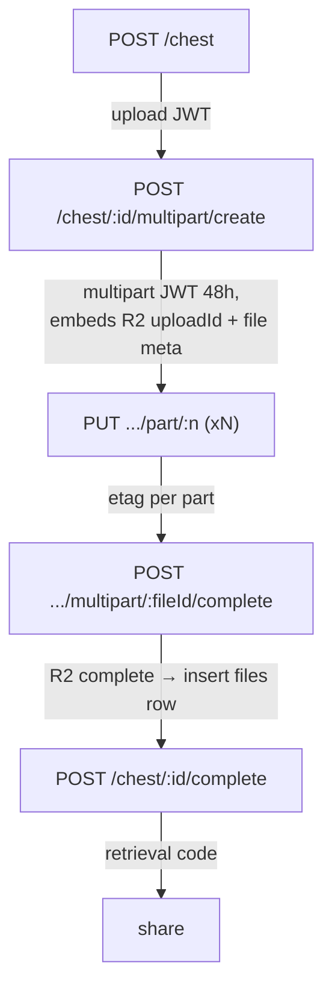

# dropply-api

Zero-knowledge file-sharing backend — one **Hono** Cloudflare Worker that stores
**only ciphertext + metadata**, never plaintext or keys. It is the server half of
[`dropply-web`](../dropply-web); all encryption happens in the browser, and this
service just holds blobs in R2, gates them behind short-lived signed tokens, and
sweeps them when they expire.

```diff
- upload file → server encrypts → server holds the key → server can read it
+ browser encrypts → uploads ciphertext → server never sees the key → share a 6-char code
```

Preview (paired frontend): <https://dropply.pages.dev/>

Every share is a **session** (a random UUID owning one or more files) unlocked by
a **6-character retrieval code**. The code resolves to a scoped download token;
files live as `${sessionId}/${fileId}` objects in R2 and are soft-deleted from D1
and hard-deleted from R2 by an hourly cron once they expire.

## Why

Most file-drop services can read what you upload — the server holds the bytes and
often the key. `dropply-api` is built so it *structurally can't*:

- **The server never holds a key.** `dropply-web` encrypts client-side and puts
  the key in the URL fragment; the Worker only ever receives and returns
  ciphertext. This backend has no decrypt path — there is nothing to leak.
- **Access is a capability, not a login.** There are no user accounts. A share is
  reachable only by its 6-char retrieval code, which mints a short-lived,
  session-scoped JWT; downloads require that token, and it expires with the share.
- **Nothing lingers.** Expired shares and abandoned uploads are swept hourly — R2
  objects are deleted, DB rows soft-deleted — so storage doesn't accrete.
- **No auth library, no Node crypto.** JWT (HS256) and TOTP (base32 + HMAC-SHA1)
  are hand-rolled over Web Crypto so they run on the edge with zero dependencies
  beyond the platform.
- **Two upload paths, one model.** Small payloads go through a direct multipart
  form; large files use R2 native multipart (create → part → complete) — both end
  as the same `files` rows keyed the same way.

## Quick start

`dropply-api` is part of the [`@cdlab/projects-monorepo`](../../README.md); run
everything from the repo root.

```bash
pnpm install                                # builds workspace packages too
pnpm --filter @cdlab/dropply-api cf:localdb # apply migrations to the local D1
pnpm --filter @cdlab/dropply-api dev        # -> http://dropply-api.localhost:3355
```

The dev URL is fixed by [`@dotns/nsl`](https://github.com/dotns/nsl) — no port
hunting. A health check lives at `GET /`; all business routes are under `/api`.
Copy `.env.example` to `.env` (and set `vars` / secrets in `wrangler.jsonc` /
`.dev.vars`) before enabling TOTP or email.

## How a share flows

```
POST /api/chest                       → sessionId + upload JWT (24h)   [TOTP gate optional]
POST /api/chest/:id/upload            → stream files/text to R2 + files rows
POST /api/chest/:id/complete          → mint 6-char retrieval code + expiry
─────────────────────────────────────  (share the code out-of-band)
GET  /api/retrieve/:code              → file list + chest JWT (tied to expiry)
GET  /api/download/:fileId            → stream bytes from R2   [Bearer OR ?token=]
```

Large files swap the middle step for R2 native multipart:



1. **Create** mints a `sessionId` (UUID) and an `upload` JWT, inserting a
   `sessions` row with `uploadComplete = 0`. If `REQUIRE_TOTP=true`, a valid
   6-digit code is required first.
2. **Upload** streams each `files` entry to R2 at `${sessionId}/${fileId}` and
   each `textItems` snippet as text at the same key; R2 puts and the batched
   `files` insert run in parallel.
3. **Complete** mints a CSPRNG 6-char retrieval code and an expiry, flipping the
   session to `uploadComplete = 1`.
4. **Retrieve** resolves the code to the file list and issues a `chest` JWT
   scoped to the session and its expiry.
5. **Download** verifies the `chest` token (header or `?token=` query, so plain
   `<a>` links work), re-checks expiry, and streams the R2 object back with an
   RFC 5987 `Content-Disposition`.

The full model — token scoping, the ownership-by-count nuance, the cleanup
windows, and the security reasoning — is in [`DESIGN.md`](DESIGN.md).

## Endpoints

| Route | File | Purpose |
| --- | --- | --- |
| `GET /` | `src/index.ts` | Static health / status JSON. |
| `GET /api/config` | `routes/config.ts` | Frontend knobs: `requireTOTP`, `emailShareEnabled`, `maxFileSize`. |
| `POST /api/chest` | `routes/chest.ts` | Create a session (optional TOTP gate); returns an `upload` JWT (24h). |
| `POST /api/chest/:sessionId/upload` | `routes/chest.ts` | Direct multipart-form upload of files + text into R2 + `files` rows. |
| `POST /api/chest/:sessionId/complete` | `routes/chest.ts` | Verify file count, mint the retrieval code + expiry. |
| `POST /api/chest/:sessionId/multipart/create` | `routes/chest.ts` | Start an R2 multipart upload; returns a `multipart` JWT (48h). |
| `PUT /api/chest/:sessionId/multipart/:fileId/part/:partNumber` | `routes/chest.ts` | Upload one part, resuming via the `multipart` JWT; returns its etag. |
| `POST /api/chest/:sessionId/multipart/:fileId/complete` | `routes/chest.ts` | Complete the R2 upload, insert the `files` row from JWT-carried metadata. |
| `GET /api/retrieve/:retrievalCode` | `routes/retrieve.ts` | Resolve a code to its file list; returns a `chest` JWT. |
| `GET /api/download/:fileId` | `routes/download.ts` | Stream a file from R2, authorized by a `chest` JWT (`Authorization: Bearer` **or** `?token=`). |
| `POST /api/email/share` | `routes/email.ts` | Send the retrieval code + file summary via Resend (gated). |

**Response envelope.** Business routes return `ApiResponse<T>` =
`{ code, message, data? }` with `code: 0` on success. Uncaught errors and
unmatched routes go through the global `onError` / `notFound` handlers, returning
`{ statusCode, message, stack? }` where `stack` (line-split) appears only when
`isDebug`.

## Tokens

Three HS256 JWTs, all hand-signed with `JWT_SECRET` over Web Crypto — each
verifier asserts `payload.type`, so tokens can't be used cross-scope.

| Token | TTL | Scope | Carries |
| --- | --- | --- | --- |
| `upload` | 24h | one session — upload / complete / multipart-create | `sessionId` |
| `multipart` | 48h | one file within a session | `sessionId`, `fileId`, R2 `uploadId`, filename, mimeType, fileSize |
| `chest` | session expiry (else +365d) | download from one session | `sessionId` |

## Modules

| Path | Responsibility |
| --- | --- |
| `src/index.ts` | Hono entry: `accesslog` → `prettyJSON` → `requestId` → open `cors`; mounts route groups under `/api`; exports `fetch` + the cron `scheduled()`. |
| `src/routes/` | Five Hono sub-apps (`chest`, `retrieve`, `download`, `config`, `email`), barrel-exported from `routes/index.ts`. |
| `src/lib/jwt.ts` | Hand-rolled HS256 JWT sign/verify + the three `create*`/`verify*` token helpers. |
| `src/lib/totp.ts` | Hand-rolled TOTP (base32 + HMAC-SHA1, 30s step, ±1 window); `parseTOTPSecrets` reads `name:secret,name2:secret2`; `verifyAnyTOTP` matches any. |
| `src/lib/db.ts` | Thin adapter over `@cdlab/db/node`'s `defineDb`; `useDrizzle(c)` builds a driver from `c.env` per `DB_TYPE`. Re-exports the `withNotDeleted` / `softDelete` helpers. |
| `src/lib/utils.ts` | `generateUUID`, `generateRetrievalCode` (CSPRNG), format validators, `calculateExpiry`, `getFileExtension`. |
| `src/lib/validationSchemas.ts` | All zod schemas for params / body / query. |
| `src/cron/cleanup.ts` | `cleanupExpiredContent(env)` — sweeps expired + stale-incomplete sessions from R2 and D1. |
| `src/global.ts` | Sets global `logger` (winston or a `cf` console shim) + `isDebug`; imported for side effects. |
| `src/database/schema.ts` | Drizzle SQLite schema: `sessions` + `files`, sharing `trackingFields`. |
| `scripts/generate-secrets.sh` | Emits a `JWT_SECRET`, a base32 TOTP secret, and an `otpauth://` URI (+ optional QR). |

## Configuration

All knobs are `vars` in [`wrangler.jsonc`](wrangler.jsonc); secrets belong in
`.dev.vars` (local) or `wrangler secret put` (prod), never in `vars`.

| Variable | Default | Meaning |
| --- | --- | --- |
| `DEPLOY_RUNTIME` | `cf` | `cf` → console-only logging; anything else → full winston + daily-rotate file. |
| `DB_TYPE` | `libsql` | Driver: `libsql` (Turso) or `d1` (the `DB` binding). |
| `LIBSQL_URL` / `LIBSQL_AUTH_TOKEN` | — | LibSQL / Turso connection (used when `DB_TYPE=libsql`). |
| `MAX_FILE_SIZE_MB` | `100` | Max file size reported by `GET /api/config` (advisory; the hard cap is 5 GB per file in zod). |
| `REQUIRE_TOTP` | `false` | Require a valid TOTP code to create a chest session. |
| `TOTP_SECRETS` | — | `name:secret,name2:secret2` list of base32 TOTP secrets. |
| `JWT_SECRET` | — | HMAC secret for the `upload` / `multipart` / `chest` JWTs. |
| `ENABLE_EMAIL_SHARE` | `false` | Enable `POST /api/email/share` (also needs `RESEND_API_KEY`). |
| `RESEND_API_KEY` | — | Resend API key. |
| `RESEND_FROM_EMAIL` | `noreply@resend.dev` | Sender address for share emails. |
| `RESEND_WEB_URL` | — | Public `dropply-web` URL used to build retrieval links (falls back to `http://localhost:3001`). |
| `CLOUDFLARE_ACCOUNT_ID` / `CLOUDFLARE_DATABASE_ID` / `CLOUDFLARE_API_TOKEN` | — | Only read by drizzle-kit's `d1-http` driver for remote migrations — **not** at Worker runtime. |

## Bindings

| Binding | Type | Purpose | Required |
| --- | --- | --- | --- |
| `R2_STORAGE` | R2 | Blob store for ciphertext (bucket `dropply`), including native multipart. | ✓ |
| `DB` | D1 | `sessions` + `files` — source of truth. | ✓ when `DB_TYPE=d1` (commented out by default; uncomment + set `database_id`) |

When `DB_TYPE=libsql` (the default) the `DB` binding is unused and the driver
connects to Turso via `LIBSQL_URL` + `LIBSQL_AUTH_TOKEN`.

## Data model

Drizzle over SQLite (`src/database/schema.ts`); both tables share a
`trackingFields` block — `createdAt`, `updatedAt` (`$onUpdateFn`), `isDeleted`
(soft delete; **never hard-delete**). Only R2 blobs are ever truly deleted.

| Table | Purpose | Key constraints |
| --- | --- | --- |
| `sessions` | One share: `retrievalCode`, `uploadComplete`, `expiresAt` (nullable = permanent). | `retrievalCode` **unique**; index on `expiresAt`. |
| `files` | One file/text item: `originalFilename`, `mimeType`, `fileSize`, `fileExtension`, `isText`. | `sessionId` FK → `sessions.id` **`onDelete: cascade`**; index on `sessionId`. |

Object key convention everywhere: `${sessionId}/${fileId}`.

## Cleanup (cron)

`triggers.crons: ["0 * * * *"]` (hourly) drives `scheduled()` →
`cleanupExpiredContent`, which sweeps two cohorts:

- **Expired** sessions (`expiresAt < now`; `NULL` permanent sessions excluded).
- **Stale-incomplete** sessions (`uploadComplete = 0`, older than 48h — matching
  the multipart JWT window, so abandoned multipart uploads get reclaimed).

Per session it lists + deletes R2 objects under `${sessionId}/`, then soft-deletes
the `files` rows and the `session`. Failures are accumulated into an `errors[]`
tally and never abort the sweep.

## Build, test & deploy

```bash
pnpm --filter @cdlab/dropply-api cf-typegen  # regenerate CloudflareBindings types
pnpm --filter @cdlab/dropply-api deploy       # wrangler deploy --minify
```

There is **no test suite** wired up for this app. Database migrations apply
separately:

```bash
pnpm --filter @cdlab/dropply-api db:gen       # generate a migration from schema.ts
pnpm --filter @cdlab/dropply-api db:migrate    # apply (LibSQL / Turso)
pnpm --filter @cdlab/dropply-api cf:localdb    # apply to local D1
pnpm --filter @cdlab/dropply-api cf:remotedb   # apply to remote D1
pnpm --filter @cdlab/dropply-api db:studio     # Drizzle Studio (port 3015)
```

Deploying requires the `R2_STORAGE` bucket plus a database for the active
`DB_TYPE` — the `DB` binding (D1) or `LIBSQL_URL` + `LIBSQL_AUTH_TOKEN` (Turso).

## Non-goals

- **No accounts, no sessions-as-login.** Access is capability-based (the retrieval
  code + its token); there is no user table and no per-user isolation.
- **No server-side encryption or decryption.** The server is deliberately blind to
  plaintext — encryption is `dropply-web`'s job.
- **Not a permanent store.** Shares are meant to expire; the cron reclaims them.
- **CORS is fully open** — this is a public capability API, not an
  origin-restricted one.

## Design

[`DESIGN.md`](DESIGN.md) is the authoritative spec — the token model and its
scoping, the two upload paths, the data model and R2 key convention, the cleanup
windows, and the security reasoning. Read it before changing token lifetimes,
the ownership check, or the cleanup logic.

## License

[MIT](../../LICENSE) © 2025-PRESENT [wudi](https://github.com/WuChenDi)
