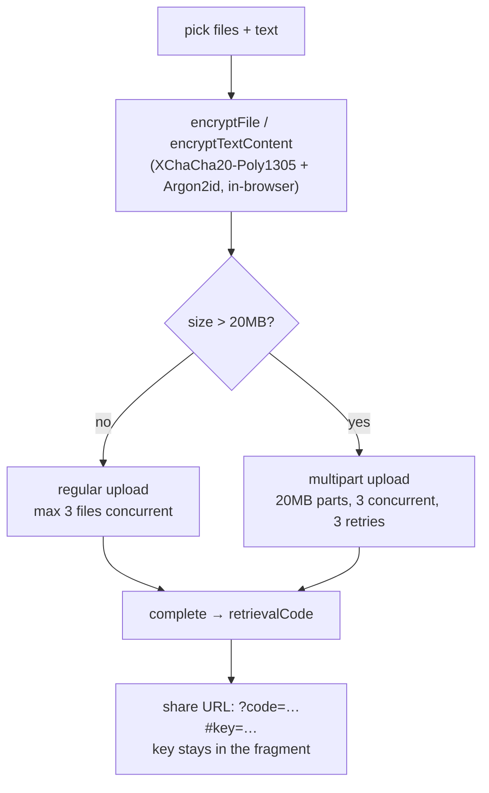

# dropply-web

Zero-knowledge file & text sharing — encryption happens **in the browser**, the
256-bit key travels only in the URL fragment (`#key=…`), and the server
([`dropply-api`](../dropply-api)) only ever stores ciphertext. A single Next.js
app **statically exported** to Cloudflare Pages, with no server of its own.

```diff
- upload.example.com/file.pdf     # server holds your plaintext, you trust it not to read it
+ dropply.pages.dev/?code=ABC123#key=…   # server holds ciphertext; the key never leaves the URL fragment
```

Preview: <https://dropply.pages.dev/>


Files and text are XChaCha20-Poly1305 encrypted (key derived with Argon2id, via
`@cdlab/cipher`) **before anything leaves the tab**. The share link carries the
retrieval code in the query (`?code=`) and the decryption key in the fragment
(`#key=`) — and browsers never send the fragment to a server, so the API stores
ciphertext it can't read.

## Why

Most "secure" file-drop tools still upload plaintext and ask you to trust the
operator. `dropply-web` removes that trust: it is the **client half** of an
end-to-end-encrypted pair, and it does the crypto itself.

- **The server can't read your data** — encryption and decryption are 100%
  client-side; the 256-bit key only ever lives in the URL fragment, which is
  never transmitted. The paired [`dropply-api`](../dropply-api) sees ciphertext
  and metadata, nothing else.
- **No key on disk, ever** — the share list persists to `localStorage`, but the
  key field is stripped before writing (`useShareStore` `partialize`), so a
  device compromise can't recover past keys from storage.
- **Big files, thin memory** — large files stream through a chunked multipart
  upload (20 MB parts, 3 concurrent, per-part retry) instead of buffering whole.
- **No backend to run here** — the app is a **static export** (`output: 'export'`);
  the deployed artifact is plain HTML/JS assets. All logic is client-side React.
- **Nothing to configure but one URL** — point `NEXT_PUBLIC_API_URL` at your
  `dropply-api` instance and deploy the `out/` folder.

## Quick start

`dropply-web` is part of the [`@cdlab/projects-monorepo`](../../README.md); run
everything from the repo root. It needs a running
[`dropply-api`](../dropply-api) (local or deployed) to talk to.

```bash
pnpm install                              # builds workspace packages too
echo "NEXT_PUBLIC_API_URL=https://localhost:3014" > apps/dropply-web/.env.local
pnpm --filter @cdlab/dropply-web dev      # -> http://dropply-web.localhost:3355
```

The dev URL is fixed by [`@dotns/nsl`](https://github.com/dotns/nsl) — no port
hunting. The whole UI is one page with two tabs: **Share** (encrypt + upload)
and **Retrieve** (download + decrypt).

## Using it

**Share.** Drop files and/or type text, pick an expiry (1–365 days, slider),
and submit. The app auto-generates a key if you didn't set one, encrypts
everything, uploads, and hands you a share URL:
`…/?code=<retrievalCode>#key=<key>`. Optionally email the code from the app.

**Retrieve.** Open a share URL and the code (`?code=`) + key (`#key=`) auto-fill;
or paste a 6-character code and key by hand. Text items decrypt inline; binary
files decrypt on demand and download individually.

If the server has TOTP enabled, sharing is gated behind a one-time code prompt
(retrieval is not gated).

## How a share resolves

```
Share (upload)
  1. GET /api/config                 → { requireTOTP, emailShareEnabled, maxFileSize }
  2. (TOTP gate, if requireTOTP)     → createChest(token) doubles as the verify
  3. POST /api/chest                 → { sessionId, uploadToken }
  4. encrypt each file / text        → XChaCha20-Poly1305 + Argon2id, in-browser (first 50% of progress)
  5. upload: small ≤20MB (3 parallel) | large >20MB (multipart, 20MB parts, 3 concurrent)
  6. POST /api/chest/:id/complete    → { retrievalCode, expiryDate }
  7. build URL  …?code=<code>#key=<key>   (key stays in the fragment)

Retrieve (download)
  1. GET /api/retrieve/:code         → { files, chestToken, expiryDate }
  2. text files → GET /api/download/:fileId → decryptTextContent (inline)
  3. binary files → GET /api/download/:fileId → decryptFile → browser download
```



The full model — the crypto boundary, the upload driver split, progress
accounting, and the client-storage security rules — is in [`DESIGN.md`](DESIGN.md).

## Configuration

The only build/runtime knob is one public env var (baked into the static bundle
at build time). Everything else — max file size, whether TOTP is required,
whether email share is on — is fetched from the server at page load via
`GET /api/config`.

| Var | Default | Meaning |
| --- | --- | --- |
| `NEXT_PUBLIC_API_URL` | `https://localhost:3014` | Base URL of the `dropply-api` backend (`.env.example` points it at a Worker URL). |

Server-driven runtime config (fetched at mount, `page.tsx`):

| Field | Effect |
| --- | --- |
| `requireTOTP` | Gate the Share tab behind a TOTP prompt (validated by attempting `createChest`). |
| `emailShareEnabled` | Show the "email the code" action. |
| `maxFileSize` | Upload size cap (client default fallback `100 MB`). |

Hardcoded upload tuning (in `src/lib/api.ts`): `CHUNK_SIZE = 20 MB`,
`MAX_CONCURRENT_SMALL_FILES = 3`, part `concurrencyLimit = min(3, totalParts)`,
`MAX_RETRIES = 3` (linear `1000ms × attempt` backoff). Expiry options
`[1,2,3,4,5,6,7,14,30,90,180,365]` days, default `7` (`ExpirySelector.tsx`).

There are **no Cloudflare bindings** — no KV/R2/D1/DO. `wrangler.jsonc` only
serves `./out` as static assets (`not_found_handling: "404-page"`,
`compatibility_flags: ["nodejs_compat"]`). Email delivery and TOTP verification
live entirely in `dropply-api`.

## Backend endpoints

All HTTP goes through `PocketChestAPI` (`src/lib/api.ts`) to `dropply-api`. The
envelope is `{ code, message, data }`; success is `code === 0`.

| Method | Route | Purpose |
| --- | --- | --- |
| `GET` | `/api/config` | Runtime config (`requireTOTP`, `emailShareEnabled`, `maxFileSize`). |
| `POST` | `/api/chest` | Create a chest → `{ sessionId, uploadToken }` (carries `totpToken` when gated). |
| `POST` | `/api/chest/:sessionId/upload` | Regular (multipart form) upload of small files + text. |
| `POST` | `/api/chest/:sessionId/multipart/create` | Start a large-file multipart upload (`uploadId` is itself a JWT). |
| `PUT` | `/api/chest/:sessionId/multipart/:fileId/part/:n` | Upload one 20 MB part. |
| `POST` | `/api/chest/:sessionId/multipart/:fileId/complete` | Finalize a multipart file. |
| `POST` | `/api/chest/:sessionId/complete` | Seal the chest → `{ retrievalCode, expiryDate }`. |
| `GET` | `/api/retrieve/:code` | Resolve a code → `{ files, chestToken, expiryDate }`. |
| `GET` | `/api/download/:fileId` | Download one ciphertext blob (`Bearer chestToken`). |
| `POST` | `/api/email/share` | Email the retrieval code (server-side send). |

## Project structure

```
src/
  app/
    layout.tsx               trivial root layout (root not-found.tsx exists)
    page.tsx                 root → redirect('/en')
    [locale]/layout.tsx      fonts, SEO metadata + JSON-LD, providers, header/footer chrome
    [locale]/page.tsx        the entire app UI (Share/Retrieve tabs, config fetch, TOTP gate)
  lib/
    api.ts                   PocketChestAPI — the sole HTTP client to dropply-api
    crypto.ts                @cdlab/cipher wrapper: keygen, URL-fragment encode/decode, encrypt/decrypt
    storage.ts               IndexedDB store for decrypted text bodies
    genid.ts                 @cdlab/driftflake snowflake IDs for local result rows
  hooks/usePocketChest.ts    upload / retrieve / download orchestration + progress state
  store/                     Zustand: useShareStore, useRetrieveStore, useAuthStore
  components/share/          ShareTab, ShareForm, ShareResults, ShareResultCard
  components/retrieve/       RetrieveTab, RetrieveForm, RetrieveResults, RetrieveResultCard, FilePreviewModal
  components/                FileUpload, TextInput, ExpirySelector, TabSwitcher, TOTPModal, EmailShare
  i18n/                      next-intl routing/request/navigation (en, zh)
  middleware.ts              next-intl locale middleware (inert in static export; present for dev)
DESIGN.md                    architecture + crypto / upload / storage / security spec
llms.txt                     agent-oriented usage guide
```

## Build, lint & deploy

```bash
pnpm --filter @cdlab/dropply-web lint       # next lint
pnpm --filter @cdlab/dropply-web typecheck  # tsc --noEmit
pnpm --filter @cdlab/dropply-web build       # next build → static out/
pnpm --filter @cdlab/dropply-web build:cf    # next-on-pages (Cloudflare Pages build)
```

There is no test script and no test files in this app. `next build` produces a
static `out/` (because of `output: 'export'`); `wrangler.jsonc` serves that
directory as static assets, and `dropply.pages.dev` is the live deployment.

## Non-goals

- **Not a standalone app.** It is useless without a reachable
  [`dropply-api`](../dropply-api) — that's where storage, TOTP, and email live.
- **No server logic here.** Static export means no SSR data fetching, no API
  routes, no edge/node functions. `middleware.ts` and `generateMetadata` run at
  dev/build only; the shipped artifact is plain files.
- **Not a key-recovery service.** Lose the fragment (`#key=…`) and the data is
  unrecoverable by design — the server can't help.

## Design

[`DESIGN.md`](DESIGN.md) is the authoritative spec — the client-side crypto
boundary, the upload driver split and progress model, the multipart/JWT-token
chain, and the client-storage security rules (key never on disk, TOTP
session-scoped, text bodies in IndexedDB). Read it before changing the upload
orchestration, the URL-fragment contract, or any store `partialize`.

## License

[MIT](../../LICENSE) © 2025-PRESENT [wudi](https://github.com/WuChenDi)
