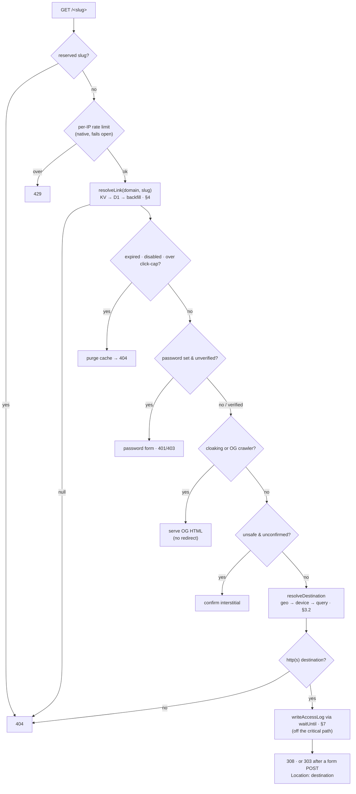
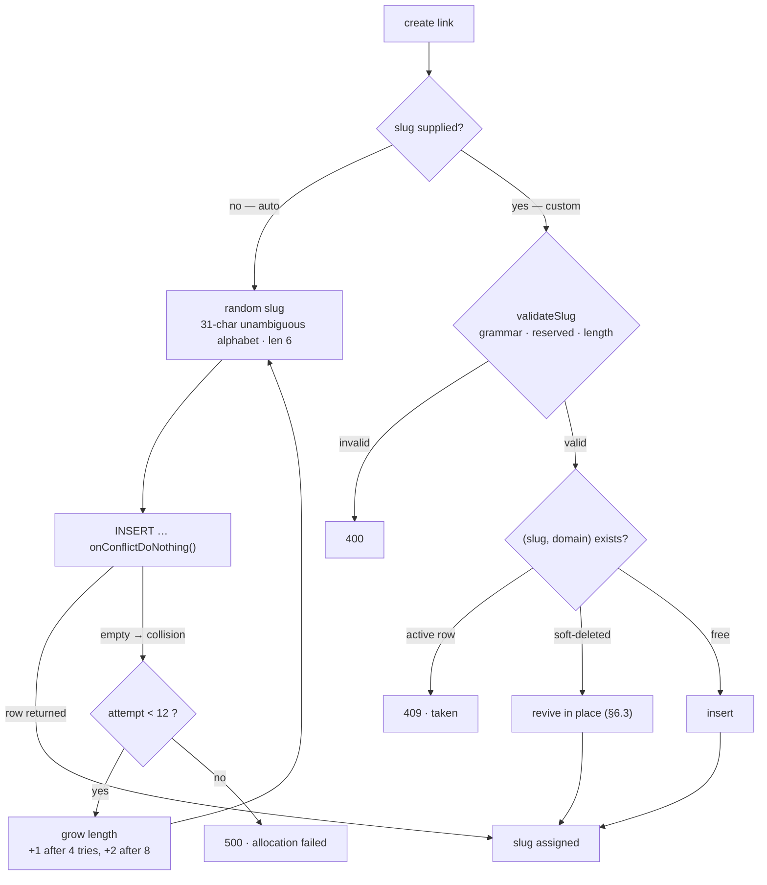
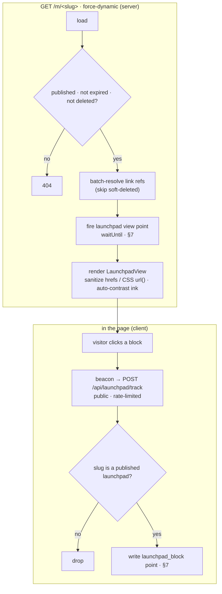

# flnk — Design

> A privacy-first, server-authoritative link shortener on Cloudflare Workers.
> The short link is a **name**, not a URL: the destination, routing rules, and
> access gates live in D1, resolved at the edge through a KV read-through cache,
> and every click is logged to Analytics Engine with the visitor IP hashed
> before it is ever stored.

This is the authoritative design spec; the implementation follows it. Section
numbers are stable anchors — source doc-comments and reviews reference them as
`design §N`. It is a lineage rewrite of [Sink](https://github.com/ccbikai/Sink)
(the Cloudflare Workers shortener): the export format and the analytics globe
endpoint stay wire-compatible, but the engine, gates, data model, and dashboard
are reimplemented on Next.js + OpenNext.

**Contents**

1. [Background & goals](#1-background--goals)
2. [Architecture](#2-architecture)
3. [The redirect engine](#3-the-redirect-engine)
4. [Caching model](#4-caching-model)
5. [Security gates](#5-security-gates)
6. [Data model](#6-data-model)
7. [Analytics](#7-analytics)
8. [Launchpads](#8-launchpads)
9. [Auth & multi-tenancy](#9-auth--multi-tenancy)
10. [Configuration & deployment](#10-configuration--deployment)
11. [Performance characteristics](#11-performance-characteristics)

---

## 1. Background & goals

A URL shortener is trivial to build and hard to build *well*: the redirect path
is the hottest route in the system, it is unauthenticated and internet-facing,
and it is a natural target for scanners, open-redirect abuse, and log injection.
Most hosted shorteners solve the operational side by tracking your visitors for
their own analytics; most self-hosted ones hand you a database and a VM to run.

`flnk` takes a third path — a single Cloudflare Worker you deploy to your own
account — and holds itself to these goals:

- **G1 — Server-authoritative.** The destination is stored, never encoded in the
  short URL. A link's target, routing, and gates change without reissuing it.
- **G2 — Edge-fast, DB-light.** A cached, gate-free redirect must resolve with a
  single KV read and **no** database round-trip. Misses and scans must not fall
  through to D1 unbounded.
- **G3 — Privacy by construction.** No tracking cookies on the redirect path; the
  raw visitor IP is never persisted — only a daily-rotating keyed hash is.
- **G4 — Safe by default.** The unauthenticated redirect path must resist
  open-redirect, log-injection, cache-penetration, brute-force, and SSRF abuse
  without operator tuning.
- **G5 — Own your data.** Analytics live in your Analytics Engine dataset;
  export / import / backup are first-class and non-destructive.

### Non-goals

- Not a cookie-based web-analytics suite — it counts clicks, it does not profile
  sessions across sites.
- Not a general CMS — launchpads are a constrained block model, not arbitrary HTML.
- Not a team/org tool — isolation is strictly per-user (each account sees only
  its own links, tags, launchpads, and analytics); there are no shared
  workspaces, teams, or role-based access (§9).

---

## 2. Architecture

```
                         Cloudflare edge
  visitor ─── GET /<slug> ──►┌───────────────────────────────────────┐
                             │ src/worker/index.ts                    │
  operator ── /dashboard ───►│  fetch  → OpenNext → Next.js App Router│
                             │  scheduled → daily backup + cleanup    │
                             └──────┬───────────────┬────────────┬────┘
                                    │               │            │
                             KV read-through   D1 / libSQL   Analytics Engine
                             (cache, counters,  (source of    (write points +
                              gate buckets)      truth)         SQL-API reads)
                                                     │
                                                  R2 (optional: assets + backups)
                                                  Workers AI (optional: slug/OG)
```

Two entry surfaces share one Worker:

- **Public** — `GET/POST /<slug>` (redirect engine, §3), `GET /<slug>/og` (social
  preview), `GET /m/<slug>` (launchpad page, §8). No auth context; resolution is
  purely by `(host, slug)`.
- **Console** — `/dashboard/*` and `/api/*`, gated by a better-auth session (§9).

**Worker entry.** OpenNext emits only a `fetch` handler. `src/worker/index.ts`
wraps the generated `.open-next/worker.js` and adds a `scheduled()` handler so
the cron path (daily backup → cleanup) runs without touching OpenNext's output.
The cron handler forwards `env` explicitly — `getCloudflareContext()` is only
installed inside OpenNext's fetch wrapper, so a cron-first cold start can't rely
on it.

**Dual driver.** `DB_TYPE` selects D1 (the `DB` binding) or libSQL/Turso
(`LIBSQL_URL` + token) at request time, via `@cdlab/db/web`'s `defineDb(schema)`
→ `getDb(env?)`. Both run in production on Workers. `getDb` accepts an injected
`env` so the cron path (which has no fetch context) still resolves a driver.
`@libsql/client` must stay in `serverExternalPackages` (`next.config.ts`) so
wrangler resolves it via the `workerd` export condition — see the
[OpenNext workerd guide](https://opennext.js.org/cloudflare/howtos/workerd).

**Per-isolate memoization.** The auth instance (§9) and the parsed config (§10)
are built once per isolate and reused — the D1 binding and env only exist inside
a request, but once built they are stable for the isolate's life.

---

## 3. The redirect engine

**Entry:** `src/app/[slug]/route.ts` (`GET` for clicks + crawlers, `POST` for
gate form submissions). A request flows through a fixed pipeline, each stage a
guard that can short-circuit:



Each stage is a guard that either short-circuits or falls through to the next.
The ordering is load-bearing — see §5.1 for why the password gate must precede the
cloaking/crawler branch.

### 3.1 Resolution key

The lookup key is `(domain, slug)`, not `slug` alone — `links` carries a
`(slug, domain)` composite unique index, so the **same slug points to different
destinations per host**. `domain` is the request hostname; a single-domain
deployment simply stores `domain = ''`. Slugs are normalized to lowercase unless
`CASE_SENSITIVE` is set (`normalizeSlug`).

### 3.2 Destination routing (`resolveDestination`)

Routing is an **override cascade on the destination — last writer wins**, not
first-match. Starting from `link.url`:

1. `config.geo[cf.country]` — ISO-3166-1 alpha-2 country → URL (codes uppercased
   at write time). `cf.country` is Cloudflare's edge geo-IP, not client-reported.
2. `config.apple` if the UA matches `iphone|ipad|ipod|crios` — **iOS only**;
   desktop macOS is deliberately excluded, or a Mac visitor would be sent to a
   link's App Store URL.
3. `config.google` if the UA matches `android`.

Because it is a cascade, a **device override beats a geo override** when both
match. Then, if `redirectWithQuery` is on (global default or per-link override),
incoming query params are merged onto the destination for keys it doesn't
already have — except `qr`, which is an analytics marker (§7), not forwarded.

### 3.3 Redirect status

`308 Permanent` by default (cacheable, method-preserving). A redirect that
follows a **form POST** (password / unsafe confirm) is emitted as `303 See Other`
so the browser re-issues it as `GET` — a `307`/`308` would preserve the method
and re-POST to the external destination, which answers `405`.

---

## 4. Caching model

KV is a **read-through cache in front of D1**, keyed per host as
`link:{domain}:{slug}`. `resolveLink` (`src/lib/data/links/resolve.ts`) is the
single funnel:

```
validateSlug fails?  → return null          (malformed → can never match a row; skip all I/O)
KV hit (positive)?   → return Link          (the hot path: one KV read, no D1)
KV hit (negative)?   → return null          (known-missing; D1 skipped)
KV miss              → D1 SELECT WHERE slug, domain, is_deleted=0
   found & live       → writeCache; return
   not found          → writeNegativeCache; return null
```

### 4.1 Positive cache

A resolved link is cached for `LINK_CACHE_TTL` seconds (floored to KV's 60s
minimum). A link **expiring within that floor is left uncached** — otherwise a
stale entry could outlive the link itself (KV can't hold a sub-60s TTL). Those
links fall through to D1; they're about to vanish, so the traffic is negligible.
The hot-path read keeps the raw row (tag *IDs*, unresolved) — the redirect never
displays tag names, so it skips the name-resolution join.

### 4.2 Negative cache (cache-penetration guard)

A slug that resolves to nothing writes a short-TTL **tombstone** (`__miss__`
sentinel) under the same key for `NEGATIVE_CACHE_TTL` seconds. A flood of lookups
for the same missing slug then stops hitting D1. Two layered defenses keep the
tombstone table from being weaponized:

- **Shape guard first.** `validateSlug` rejects malformed slugs before any I/O, so
  a scan of junk paths never even reaches KV — no tombstone is written for
  garbage, only for validly-shaped but non-existent slugs.
- **Overwrite-in-place.** A later create/import writes the real link under the
  *same* key, so a slug becomes visible immediately with no separate
  invalidation step.

### 4.3 Invalidation

Writes purge or overwrite the KV entry synchronously (`purgeLink` /
`writeCache`). Expiry, disable-on-cap, and time-expiry all `purgeLink` on the
redirect path so the next request re-resolves against D1.

### 4.4 Visit counters

`config.maxVisits` uses a KV counter `visits:{id}`: one read on the hot path,
a background increment via `waitUntil`. On reaching the cap the link is disabled
**in D1** (`json_set($.disabled, true)`) so the limit survives a cache
rebuild — otherwise the counter would restart from zero and serve another N
visits. KV is eventually consistent, so the cap is approximate under concurrency
(by design — availability over exactness).

---

## 5. Security gates

The redirect path is unauthenticated and internet-facing; every gate is
**fail-safe** and ordered so no gate can be bypassed by another.

### 5.1 Ordering invariant

The **password gate runs before the OG/cloaking branch**. If cloaking ran first,
a social crawler would receive the destination via `og:url` and defeat the
password. So: password → cloaking/crawler → unsafe → redirect.

### 5.2 Password (Argon2id)

`config.passwordHash` is an Argon2id `saltHex:hashHex` (via `@cdlab/utils`), never
plaintext. Two paths:

- **Browser** — an HTML form; a wrong password re-serves the form (`401`).
- **Programmatic** — headers `x-link-password` (+ `x-link-confirm` for unsafe
  links); failures return `403`, not the form.

Brute force is capped per `(ip, slug)` via a KV bucket `pwfail:{ip}:{slug}`
(max 5 / 600s → `429`).

### 5.3 Gate tokens (the unsafe-confirm chain)

An unsafe *and* password-protected link needs a second confirmation step without
re-echoing the plaintext password into HTML. On a correct password, the server
issues a **gate token** (`src/lib/redirect/gate-token.ts`): HMAC-SHA-256 over
`slug:ip:expiresAtMs`, key HKDF-derived from `BETTER_AUTH_SECRET`, 5-minute TTL,
IP-bound, verified in constant time. The unsafe-confirm form carries the token
instead of the password; a valid token counts as password-verified.

### 5.4 Open-redirect & log-injection defense

- **Scheme allow-list.** After routing, a destination whose protocol isn't
  `http:`/`https:` (`javascript:`, `data:`, …) → `404`. A malformed URL → `404`.
- **Log the stored URL, not the merged one.** The access log records
  `link.url` (owner-controlled), never the query-merged `dest` (visitor-
  controlled) — so a crafted `?…` can't inject arbitrary data into the log blob.

### 5.5 SSRF hardening (server-side fetch)

Two features fetch operator-supplied URLs from the Worker — link health checks
and Safe Browsing (§ `src/lib/ai/`). Both canonicalize IPv4/IPv6-mapped/encoded
forms, block private / loopback / link-local / CGNAT ranges, reject `userinfo` in
the authority, and use `redirect: 'manual'`. The platform flag
`global_fetch_strictly_public` is a second, Worker-level SSRF backstop.

### 5.6 Rate limiting summary

| Surface | Mechanism | Limit | On trip |
| --- | --- | --- | --- |
| `/<slug>` resolve | native Rate Limiting binding (per-colo) | 100 / 60s per IP | `429`, fails open |
| password attempts | KV `pwfail:{ip}:{slug}` | 5 / 600s | `429` |
| launchpad track | KV `lptrack` | 60 / 60s | dropped |
| auth | better-auth, keyed on `cf-connecting-ip` | built-in | `429` |

---

## 6. Data model

Drizzle over SQLite (`src/database/schema.ts`). Every business table shares a
`trackingFields` block — `createdAt`, `updatedAt` (`$onUpdateFn`), `isDeleted`
(soft delete; **never hard-delete**).

| Table | Purpose | Key constraint |
| --- | --- | --- |
| `links` | Short links: `url`, `config` (JSON), `tags` (JSON of tag IDs), `expiresAt`, `createdBy`. | **`(slug, domain)` unique** — the redirect key; covers soft-deleted rows too, so a slug revives in place. |
| `launchpads` | Bio-link pages: `config` (JSON), `og`, `status`, `ownerId`. | `slug` **globally unique** — the public route has no host/auth context. |
| `tags` | Tag dictionary — one row per name. | `name` unique. Links store tag **IDs**, so a rename is one row, no fan-out. |
| `user` / `session` / `account` / `verification` | better-auth core tables. | Names must match better-auth's adapter expectations. |

### 6.1 Why JSON config columns

`links.config` (`LinkConfig`) and `launchpads.config` (`LaunchpadConfig`) are
single JSON columns. The redirect engine reads *everything it needs for a
decision from one row* — routing, gates, OG, QR style — with no joins on the hot
path. The trade-off (no per-field indexing) is acceptable because the only
indexed lookup is `(slug, domain)`.

### 6.2 Tag indirection

`links.tags` stores tag **IDs**; the `tags` table is the single source of truth
for names. The repository resolves IDs → names before handing a link to the
API/UI (so `Link.tags` is always a name list), but the redirect hot path leaves
the IDs unread. Renaming a tag is therefore O(1).

### 6.3 Revive-in-place

The `(slug, domain)` unique index intentionally covers soft-deleted rows.
Create/import must see a deleted row to revive it rather than colliding — this is
what makes import non-destructive (§10) and lets a deleted slug be reclaimed.

### 6.4 Slug allocation

A slug is minted one of three ways, all racing for the same `(slug, domain)`
unique index:



- **Auto (default).** A random slug drawn with `crypto.getRandomValues` over a
  31-char **unambiguous alphabet** — `23456789abcdefghjkmnpqrstuvwxyz`, dropping
  `0/o/1/l/i` so slugs stay dictatable and mistype-resistant — of length
  `SLUG_DEFAULT_LENGTH` (default 6 ≈ 8.9×10⁸ combinations). Insertion is
  **race-safe without a pre-query**: `onConflictDoNothing().returning()` lets the
  unique index decide — a returned row means the slug landed; an empty result
  means another writer took it first, in which case it retries (up to 12×) with an
  **escalating length** to escape a saturated keyspace before giving up with `500`.

- **Custom.** A chosen slug is grammar-checked (`^[a-z0-9]+(?:-[a-z0-9]+)*$` — no
  dots, which are reserved for static assets — non-empty, ≤ 2048 chars, not a
  reserved word) and normalized (lowercased unless `CASE_SENSITIVE`). An active
  `(slug, domain)` is rejected `409`; a **soft-deleted** row holding it is revived
  in place rather than duplicated (§6.3).

- **AI-suggested (opt-in).** The dashboard can ask Workers AI (default
  `llama-3.1-8b-instruct`) for a readable slug derived from the destination URL.
  Because that URL is attacker-controlled, it is wrapped in explicit
  untrusted-data markers with a "treat as data, not instructions" directive
  (prompt-injection guard); the reply is coerced to a valid slug, cached in KV for
  7 days, and falls back to a random slug when AI is unavailable. The result is
  only a **suggestion** — it enters through the custom path above; creation never
  invokes AI on its own.

> Source: `src/lib/data/links/repo.ts` (allocation + retry), `src/lib/redirect/slug.ts`
> (alphabet + grammar), `src/lib/ai/ai-slug.ts` (AI suggestion).

---

## 7. Analytics

Self-hosted, cookieless, and privacy-preserving. Clicks and launchpad views
become **Analytics Engine** data points; the dashboard reads them back through
the AE SQL REST API.

### 7.1 Write path

`extractAccessLog` (`src/lib/analytics/analytics.ts`) builds a record from the
request + `request.cf` (country / region / city / timezone / colo / lat / lng) +
`ua-parser-js` (os / browser / device). `writeAccessLog` emits **one data point**:
`indexes: [slug]`, **19 blobs** (blob1..19, mapped in `analytics-query.ts`),
`doubles: [lat, lng]`. It fires via `ctx.waitUntil` — a logging failure never
affects the redirect. `blob19` (`type`) distinguishes `link` / `launchpad` /
`launchpad_block` so the two families never inflate each other's counts.
`blob18` (`source`) is `qr` when the URL carried `?qr=1`, else `link`.

### 7.2 IP anonymization

The raw IP never leaves the request. `anonymizeIp` stores
`hex(HMAC-SHA-256("${ip}:${YYYY-MM-DD}"))` truncated to 32 chars, keyed by a
secret pepper (`ANALYTICS_IP_SALT`; falls back to a key *derived from*
`BETTER_AUTH_SECRET`, **never** a public salt). The digest is a daily-rotating
fingerprint: unique-visitor counts hold within a UTC day, but without the pepper
the hash can't be reversed to an IP from public data.

### 7.3 Read path

The AE binding only **writes**; reads go through the AE SQL REST API
(`CLOUDFLARE_ACCOUNT_ID` + a token with Analytics `Read`). Queries are
ClickHouse-dialect SQL; visitor-controlled filter values pass through a
backslash-safe `sanitize`. Counts are **sampling-weighted**
(`SUM(_sample_interval)`, scaled `COUNT(DISTINCT ip)`). Builders cover counters,
time-bucketed views, per-dimension top-N (13 dimensions), map coordinates,
a recent-events realtime feed, CSV export, and launchpad view/block stats.

---

## 8. Launchpads

A **launchpad** is a hosted link-in-bio / landing page published at `/m/<slug>`.

### 8.1 Model

`LaunchpadConfig` is a single JSON column: `profile` (avatar/name/bio), `theme`
(preset, colors, button shape/fill/shadow, background & header surfaces —
solid/gradient/image, font, layout: classic/left/hero/banner/cover/compact),
a page-level `socials` bar, `hideBranding`, and an **ordered `blocks` array**
(array order = render order). Block types: `header`, `socials`, `button`,
`shortlink`, `image`, `text`, `divider`.

### 8.2 Blocks reference links by ID

A `button`/`shortlink` block stores a **link ID reference, never a copied URL**.
Clicks route through the short link's own `/<slug>`, so they **reuse its stats
and its editable destination** — editing the link updates the launchpad button
with no republish, and launchpad clicks show up in the link's analytics.

### 8.3 Rendering & safety

`src/app/m/[slug]/page.tsx` is `force-dynamic`: every load re-resolves the
launchpad (publish + expiry checks), so a snapshot is never cached. It batch-
resolves link refs (skipping soft-deleted), fires a `launchpad` view point, and
renders `LaunchpadView`. Because launchpad config is operator-authored HTML-
adjacent data, it is hardened at both ends: the Zod schema (`src/schemas/`)
rejects non-http(s) hrefs and CSS-breaking image URLs; the renderer re-sanitizes
hrefs and CSS `url()` values and auto-contrasts ink against the chosen surface.
The client `LaunchpadTracker` beacons block clicks to the public,
rate-limited `/api/launchpad/track`, which verifies the slug is a published
launchpad before writing a `launchpad_block` point.



Because button/shortlink blocks reference a link **id** (§8.2), those clicks route
through `/<slug>` and land in the link's own analytics; the `launchpad_block`
point above tracks engagement with non-link blocks.

---

## 9. Auth & multi-tenancy

**better-auth** with a Drizzle (sqlite) adapter, built lazily per isolate
(`getAuth`) because the D1 binding and env only exist inside a request.

- **Social login only** — Google and GitHub OAuth; each provider is enabled only
  when its client id + secret are set. First social sign-in *is* registration.
- **Email allow-list** (`ALLOWED_EMAILS`, comma-separated, case-insensitive)
  enforced in two places: `databaseHooks.user.create.before` blocks first sign-in
  for non-listed emails (the sign-up gate), and every session check re-tests the
  list — so **tightening the allow-list revokes existing sessions**. Empty list =
  allow-all (a one-time warning is logged).
- IP is pinned to `cf-connecting-ip` (better-auth defaults to `X-Forwarded-For`,
  absent on Workers, which would collapse rate limiting into one shared bucket).

**Server-side authorization.** Console APIs are gated server-side, not by a
client check:

- `requireSession(request)` — API gate: `401` (no session) / `403` (not
  allow-listed) or `{ ok, user }`.
- `getAllowedSession(headers)` — dashboard server-layout gate; redirects to login
  when null.
- `withAuth(schema, handler)` — the mutation wrapper: session gate + Zod body
  validation + a uniform `{ error }` envelope, passing `{ user, request, env }`
  and a typed `ApiError` for explicit statuses.

**Per-owner isolation (enforced).** Every write stamps `ownerId` (launchpads) /
`createdBy` (links), and every read/mutation is owner-scoped — **links & tags by
`createdBy` (email), launchpads by `ownerId` (`user.id`)**; launchpad list/count
funnel through the `scopeToOwner(conds, session)` helper. Cross-owner by-id
access returns **404** (never 403 — existence isn't disclosed). Tags are a
per-owner namespace via the `(name, created_by)` unique index. The public
`/<slug>` redirect and `/m/<slug>` render stay owner-agnostic (they resolve by
globally-unique slug with no auth context). No schema backfill was needed —
every row already carried its owner.

---

## 10. Configuration & deployment

### 10.1 Config

All runtime knobs are `vars` in `wrangler.jsonc`; `src/lib/platform/env.ts`
parses and **Zod-validates them once per isolate** (`getConfig`), with three-tier
precedence: explicit `env` arg (cron path) → fetch-time Cloudflare context →
`process.env` (dev / build / Node test). A malformed value fails loudly with a
logged fallback rather than flowing through as garbage. Full table in the
[README](README.md#configuration); secrets are **never** vars.

### 10.2 Cron

`triggers.crons: ["0 0 * * *"]` drives the `scheduled()` handler: **backup before
cleanup** (so links expiring today are still `isDeleted=0` and get snapshotted),
each step isolated in its own try/catch. `backupToR2` writes a JSON snapshot of
active links to R2 (paged, capped, no-op when R2 is off); `cleanupExpiredLinks`
soft-deletes expired rows and purges their KV cache.

### 10.3 R2 is optional

R2 backs launchpad/OG/QR-logo asset uploads and daily backups. The binding is
**commented out by default**; `isR2Enabled` gates every caller so upload returns
`503` and backup is a no-op when it's absent — the core shortener runs without it.

### 10.4 Import / export

Export is JSON (`version 1.0`, Sink-compatible link shape) or CSV. Import is
**non-destructive** (`importLinks`): an active `(slug, domain)` is skipped, a
soft-deleted one revived, otherwise inserted — config (including `passwordHash`)
and timestamps preserved verbatim. Batch sizes are driven by **D1's 100
bound-parameter cap** (`IMPORT_CHUNK=100`), and the payload is bounded (1000
links) with `passwordHash` shape-validated (`^[0-9a-f]{32}:[0-9a-f]{64}$`).

### 10.5 Migrations

Generated from `schema.ts` with drizzle-kit. **Migrations must use the sqlite
dialect (`DB_TYPE=d1`)** — the default libSQL dialect emits `ALTER COLUMN`, which
D1 rejects. Apply with `cf:localdb` (local) / `cf:remotedb` (remote D1).

### 10.6 Deploy

Deploys run through the `deploy-flnk.yml` GitHub workflow (manual dispatch):
`opennextjs-cloudflare build && deploy`, with `FLNK_`-prefixed secrets synced
from repository secrets. The local `pnpm --filter @cdlab/flnk deploy` works but
skips the secret sync — prefer the workflow. Deployment-affecting changes (new
secrets, migrations, build steps) must be reflected in that workflow.

---

## 11. Performance characteristics

The redirect path is unauthenticated, internet-facing, and the highest-volume
route, so its cost model is a design constraint rather than an afterthought. This
section summarizes the resulting properties; each mechanism is specified in the
section referenced.

### 11.1 Hot-path cost

A cached, gate-free redirect performs **one KV read and no database round-trip**
(§4.1). That read returns the entire link — routing, gates, OG, QR — from a single
JSON value, so no joins or follow-up queries are needed (§6.1). Click analytics
are emitted through `ctx.waitUntil` (§7.1), off the critical path, so logging adds
no latency to the response. The env config (Zod-parsed) and the auth instance are
built once per isolate and memoized (§2), so steady-state requests skip that setup.

### 11.2 Bounded database load

D1 is shielded from the three ways a public redirect gets hammered: the
read-through cache absorbs repeat **hits** (§4.1); the negative-cache tombstone
absorbs repeat **misses**; and the slug shape-guard rejects malformed slugs before
any I/O, so cache-penetration **scans** never reach the database (§4.2). Native
per-colo rate limiting (§5.6) sheds abusive volume in edge memory, at no D1/KV
quota cost.

### 11.3 Correctness under concurrency & sampling

Random slug allocation is race-safe by construction: `onConflictDoNothing` lets
the `(slug, domain)` unique index arbitrate atomically, with an escalating-length
retry instead of a check-then-insert race (§3.1). The click cap reads one KV
counter on the hot path and increments in the background, persisting the disable
to D1 so the cap survives a cache rebuild (§4.4). Analytics reads scale sampled
counts with `SUM(_sample_interval)` (§7.3), so dashboards stay accurate even when
Analytics Engine samples under load, and the visitor IP is HMAC-hashed inline and
never stored raw (§7.2).
