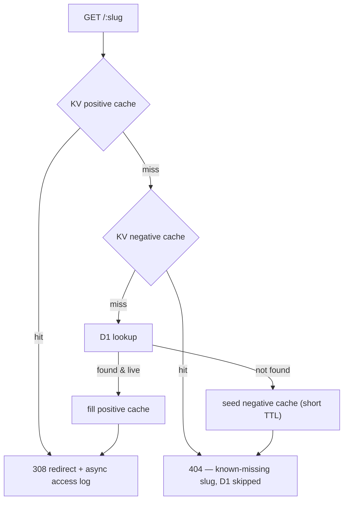

# Flnk

[English](./README.md) | [中文](./README.zh-CN.md)

Privacy-first link shortener with geo / device routing and edge analytics — no trackers, no cookies on the redirect path. Built with **Next.js (App Router) + Drizzle** and deployed to **Cloudflare Workers** via [`@opennextjs/cloudflare`](https://opennext.js.org/cloudflare).

Preview: https://flnk.cdlab.workers.dev/


## Features

- **Edge redirect engine** (`app/[slug]/route.ts`)
  - KV cache → D1 fallback → cache fill, so hot links resolve at the edge
  - Configurable status code (default `308`) and per-link expiration purge
  - Optional case-insensitive slugs (`CASE_SENSITIVE`)

- **Smart routing**
  - **Geo routing** by `cf.country` — send each region to a different destination
  - **Device routing** — dedicated targets for Apple / Android user agents
  - **Query forwarding** (`REDIRECT_WITH_QUERY`, with per-link override)

- **Link protection**
  - **Password gate** — HTML form guarded by Argon2id with a per-link salt
  - **Unsafe interstitial** for flagged destinations; non-`http(s)` schemes render as `about:blank`
  - **Social-bot OG HTML** (`app/[slug]/og/route.ts`) with link cloaking

- **Analytics & privacy**
  - Access logging to **Cloudflare Analytics Engine** via `ctx.waitUntil` — bot detection, UA parsing, geo dimensions
  - Zero tracking cookies on the redirect path; logging is toggleable (`DISABLE_BOT_ACCESS_LOG`)

- **Dashboard**
  - Manage links, view per-link click stats, export / import / backup
  - **AI slug generation** via Cloudflare Workers AI
  - **Multi-domain** support through a `(slug, domain)` composite unique key

- **Auth** — social login (better-auth: Google + GitHub, login == signup) guarding the dashboard and every `/api/*` route via a session cookie

- **Internationalization** — English and Chinese (`next-intl`) with a cookie-based locale, so it never collides with the top-level `[slug]` route

- **Cron cleanup** — soft-deletes expired links and purges KV from the worker's `scheduled()` handler

## Tech Stack

- **Framework** — Next.js (App Router), React, TypeScript
- **Database** — Drizzle ORM over Cloudflare D1 or LibSQL / Turso (selectable at runtime)
- **Auth** — better-auth (Google + GitHub OAuth)
- **Platform** — Cloudflare Workers (KV, D1, Workers AI, Analytics Engine) via OpenNext
- **i18n** — next-intl (en / zh)

## How it works

A request to `https://flnk.example/<slug>` resolves entirely at the edge, with
two cache layers in front of D1 so hot links never touch the database:



- **Positive cache** — a resolved link is cached in KV for `LINK_CACHE_TTL`
  seconds. A link expiring within KV's 60s TTL floor is left uncached, so a
  stale entry can never outlive the link itself.
- **Negative cache** — a miss writes a short-lived tombstone (`NEGATIVE_CACHE_TTL`)
  so a flood of lookups for the same non-existent slug stops hitting D1 (a
  cache-penetration guard). A later create / import writes the real link under
  the same key, so it becomes visible immediately.
- **Logging** — access logs go to Analytics Engine via `waitUntil`, off the
  redirect's critical path, with zero tracking cookies.

## Quick Start

```bash
# Install dependencies (from monorepo root)
pnpm install

# Start the dev server on http://flnk.localhost:3355 (via nsl)
pnpm --filter @cdlab996/flnk dev

# Type-check the Cloudflare bindings
pnpm --filter @cdlab996/flnk cf-typegen

# Generate a migration from schema.ts, then open Drizzle Studio (port 3021)
pnpm --filter @cdlab996/flnk db:gen
pnpm --filter @cdlab996/flnk db:studio
```

Copy `.env.example` to `.env` and fill in the better-auth + OAuth secrets and your database credentials.

## Environment Variables

Non-secret configuration lives in the `vars` block of `wrangler.jsonc`. Secrets (`BETTER_AUTH_SECRET`, `GOOGLE_CLIENT_ID/SECRET`, `GITHUB_CLIENT_ID/SECRET`, `LIBSQL_AUTH_TOKEN`, `CLOUDFLARE_API_TOKEN`) are **never** committed there — set them via `wrangler secret put <NAME>` for production, or copy `.dev.vars.example` to `.dev.vars` (gitignored) for local dev. The runtime reads vars and secrets from the same env object, so no code changes are needed either way.

### Authentication

| Variable | Default | Description |
|---|---|---|
| `BETTER_AUTH_URL` | `http://flnk.localhost:3355` | Public origin better-auth issues cookies / redirects against |
| `BETTER_AUTH_SECRET` | — | Long random string (`openssl rand -base64 32`) |
| `GOOGLE_CLIENT_ID` / `GOOGLE_CLIENT_SECRET` | — | Google OAuth credentials |
| `GITHUB_CLIENT_ID` / `GITHUB_CLIENT_SECRET` | — | GitHub OAuth credentials |
| `ALLOWED_EMAILS` | — | Comma-separated, case-insensitive email allow-list. Non-listed accounts cannot sign up or call `/api/*`. Empty = allow any account (a warning is logged) |

### Database

| Variable | Default | Description |
|---|---|---|
| `DB_TYPE` | `libsql` | Driver selector — `libsql` (Turso) or `d1` (Cloudflare D1) |
| `LIBSQL_URL` | `file:./src/database/data.db` | LibSQL URL; a local SQLite file for offline dev |
| `LIBSQL_AUTH_TOKEN` | — | LibSQL / Turso auth token — secret; `wrangler secret put` (prod) or `.dev.vars` (local) |
| `CLOUDFLARE_ACCOUNT_ID` / `CLOUDFLARE_API_TOKEN` / `CLOUDFLARE_DATABASE_ID` | — | Used by drizzle-kit's `d1-http` driver for remote migrations; the API token is a secret — `wrangler secret put` (prod) or `.dev.vars` (local) |

### Redirect engine

| Variable | Default | Description |
|---|---|---|
| `REDIRECT_STATUS_CODE` | `308` | HTTP status used for redirects |
| `LINK_CACHE_TTL` | `60` | KV cache TTL in seconds |
| `REDIRECT_WITH_QUERY` | `false` | Forward the incoming query string to the destination |
| `HOME_URL` | — | If set, `/` redirects here instead of rendering the landing page |
| `NOT_FOUND_REDIRECT` | — | Fallback URL for unknown slugs |
| `CASE_SENSITIVE` | `false` | Treat slugs as case-sensitive |
| `SLUG_DEFAULT_LENGTH` | `6` | Length of auto-generated slugs |
| `LIST_QUERY_LIMIT` | `500` | Max links returned by list queries |

### Analytics

| Variable | Default | Description |
|---|---|---|
| `DATASET` | `flnk_analytics` | Analytics Engine dataset name |
| `DISABLE_BOT_ACCESS_LOG` | `false` | Skip access logging for detected bots |

### AI slug generation

| Variable | Default | Description |
|---|---|---|
| `AI_MODEL` | `@cf/meta/llama-3.1-8b-instruct` | Workers AI model used to suggest slugs |
| `AI_PROMPT` | — | Optional override for the slug-generation prompt |

## Database

`DB_TYPE` selects the driver, and **both run in production on Workers**:

- `DB_TYPE=d1` — uses the `DB` binding (Cloudflare D1).
- `DB_TYPE=libsql` — uses `LIBSQL_URL` + `LIBSQL_AUTH_TOKEN` (remote Turso, or a local SQLite file via `file:./src/database/data.db` for offline dev).

> LibSQL on Workers relies on `serverExternalPackages` in `next.config.ts` (`@libsql/client`, `@libsql/hrana-client`, `@libsql/isomorphic-ws`). These must stay external so wrangler resolves them via the `workerd` export condition — removing them breaks the OpenNext build with `Could not resolve @libsql/isomorphic-ws`. See the [OpenNext workerd guide](https://opennext.js.org/cloudflare/howtos/workerd).

### Seeding a link manually

Insert a row into `links` (`id`, `slug`, `domain`, `url`, optional `config` JSON). When `CASE_SENSITIVE=false`, store `slug` lowercased. Example `config`:

```json
{
  "geo": { "US": "https://example.com/us" },
  "apple": "https://apps.apple.com/...",
  "google": "https://play.google.com/...",
  "title": "Example",
  "description": "An example link",
  "passwordHash": "<saltHex>:<hashHex> — see @cdlab996/utils hashPasswordFn",
  "unsafe": false,
  "redirectWithQuery": true
}
```

Destination URLs must be `http(s)`; other schemes (`javascript:`, `data:`, …) are rendered as `about:blank` on the OG / interstitial pages.

## Authentication

Auth is **better-auth** with Google + GitHub social login only — the first sign-in for an account auto-creates the user (login == registration). There is no email/password flow.

Configure each OAuth app's callback URL as `{BETTER_AUTH_URL}/api/auth/callback/{google|github}`. A provider with no credentials set is simply unavailable; at least one must be configured to log in.

> With `ALLOWED_EMAILS` unset, **any** Google / GitHub account that signs in gains dashboard access (a warning is logged). Set `ALLOWED_EMAILS` (comma-separated, case-insensitive) to restrict access: non-listed emails are rejected at first sign-in (user creation is blocked) and existing sessions for non-listed emails get `403` from every `/api/*` route.

## Deploy

Deploys go through the GitHub Actions workflow **`.github/workflows/deploy-flnk.yml`** (manual `workflow_dispatch` from the Actions tab). The workflow installs dependencies, optionally applies remote D1 migrations, syncs Worker runtime secrets from GitHub repository secrets (`FLNK_LIBSQL_AUTH_TOKEN`, `FLNK_ALLOWED_EMAILS`, `FLNK_CLOUDFLARE_API_TOKEN` — empty values are skipped), then builds and deploys via OpenNext. Deployment-affecting changes (new secrets, migrations, build steps) must be reflected in that workflow.

One-time Worker secrets not managed by the workflow (set once, persist across deploys): `BETTER_AUTH_SECRET`, `GOOGLE_CLIENT_ID/SECRET`, `GITHUB_CLIENT_ID/SECRET` via `wrangler secret put`.

The local fallback (`pnpm --filter @cdlab996/flnk deploy`) still works but skips the secret sync — prefer the workflow.

Requires Cloudflare bindings: `KV`, `AI`, `ANALYTICS` (Analytics Engine), plus the database for the active `DB_TYPE` — the `DB` binding (D1) or `LIBSQL_URL` + `LIBSQL_AUTH_TOKEN` (Turso). See `wrangler.jsonc`.

## Performance

`scripts/bench.mjs` measures the redirect resolve path with `redirect: manual`, so it times slug resolution (KV / negative cache / D1) — not the destination site. Three scenarios isolate each layer:

| scenario | what it exercises                                                                              |
| -------- | ---------------------------------------------------------------------------------------------- |
| `hit`    | one existing slug, served from the KV positive cache                                           |
| `miss`   | one missing slug, served from the negative cache after the first request seeds the tombstone   |
| `cold`   | a fresh random missing slug per request — D1 on every call (the baseline the negative cache beats) |

```bash
# Point at any running instance (dev or deployed)
node scripts/bench.mjs \
  --url http://flnk.localhost:3355 \
  --slug <an-existing-slug> \
  --requests 2000 --concurrency 50 \
  --scenario hit,miss,cold

# or via the package script
pnpm --filter @cdlab996/flnk bench -- --url https://flnk.example --slug abc123
```

Comparing `miss` against `cold` shows the negative cache at work: repeated lookups of the same missing slug should resolve well below the cold D1 path. Absolute numbers depend on your region, D1 location, and network — run it against your own instance rather than trusting a fixed table.

## License

[MIT](../../LICENSE) License &copy; 2025-PRESENT [wudi](https://github.com/WuChenDi)
