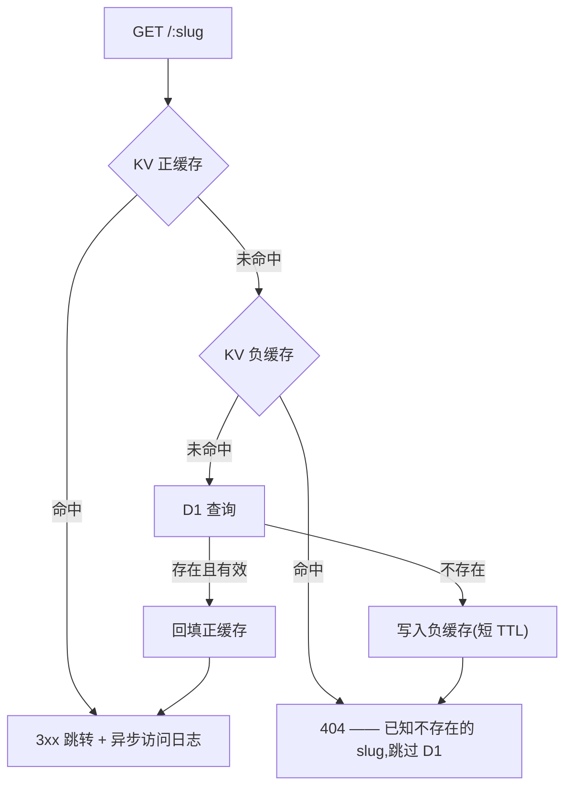

# flnk

[English](./README.md) · **简体中文**

隐私优先的短链服务,内建**地域 / 设备路由**、样式化二维码、密码与安全拦截、
link-in-bio 落地页,以及自托管分析——全部由一个跑在 **Cloudflare Workers**
上的 Next.js 应用承载。

```diff
- long.example.com/products/2026/summer-sale?utm_campaign=…   # 难分享、你也无法自主统计
+ flnk.sh/sale        308 · 按地域路由 · 点击可追踪 · 无第三方追踪器
```

预览:<https://flnk.cdlab.workers.dev/>


每次跳转都在边缘从 KV 缓存(D1 兜底)解析;每次点击都写入 **Cloudflare
Analytics Engine**,访客 IP 在入库前先做哈希——于是你得到按链接维度的
地域 / 设备 / 来源分析,却从不存储访客真实 IP,也不把数据交给任何分析厂商。

## 为什么

现成的短链服务逼你在「掌控」和「隐私」之间二选一:托管型替你追踪访客,
自托管型是一台需要你伺候的虚拟机。`flnk` 两者都不是——它是你部署到自己
Cloudflare 账户里的一个 Worker:

- **服务端权威跳转** —— 目标地址、路由规则、拦截配置都存在 D1,而非编码进
  URL。改变链接指向无需重新签发短链。
- **内建路由** —— 一条短链就能按**国家**(`request.cf.country`)或**设备**
  (iOS → App Store,Android → Play Store)把访客分流到不同目标,并支持
  UTM / query 透传。
- **数据归你所有** —— 点击落入*你自己*的 Analytics Engine 数据集。访客 IP
  在入库前用每日轮换的盐做 HMAC 哈希,既能算独立访客数,又永不持久化、
  无法还原出真实 IP。
- **拦截而非死路** —— 一条链接可以要求密码、显示安全提示页、以 OG 预览做
  斗篷(cloaking),或在 N 次点击后过期——全部在跳转发生前于边缘执行。
- **单一产物,无需服务器** —— Next.js 经
  [OpenNext](https://opennext.js.org/cloudflare) 编译为单个 Worker;D1 + KV +
  Analytics Engine 是仅有的组件,R2 可选。

## 功能

| 领域 | 你能得到 |
| --- | --- |
| **跳转** | 可配置 `308` / `307` / `302`,按 colo 限流,负缓存,大小写(不)敏感,`?query` 透传。 |
| **路由** | 按国家分目标、iOS / Android 覆盖——单行数据即在边缘评估完成。 |
| **拦截** | Argon2id 链接密码、「不安全链接」提示页、OG 斗篷、点击次数过期、时间过期、暂停开关。 |
| **二维码** | 按链接样式化二维码(颜色、Logo、点 / 角样式、纠错级别);扫码在分析里标记为 `source=qr`。 |
| **分析** | 国家 / 地区 / 城市 / 来源 / 设备 / 系统 / 浏览器 / 语言维度,实时流,地理地图,CSV 导出——全部来自你自己的数据集。 |
| **Launchpad** | 托管在 `/m/<slug>` 的 link-in-bio / 落地页,带可主题化的块编辑器;按钮引用短链,因此点击复用短链的统计。 |
| **AI** | 可选:通过 Workers AI 生成 slug 建议与 OG 标题 / 描述。 |
| **运维** | 每日 cron:R2 备份 + 软删除过期链接;链接健康检查(可达性 + 经 DoH 的 Safe Browsing);Sink 导入 / 导出。 |
| **认证** | better-auth 社交登录(Google / GitHub)+ 邮箱白名单;每个 `/api/*` 路由都在服务端做会话校验。 |
| **国际化** | 英文 + 中文(`next-intl`),基于 cookie 的语言选择,因此永不与根 `[slug]` 路由冲突。 |

## 快速开始

`flnk` 是 [`@cdlab/projects-monorepo`](../../README.md) 的一部分;所有命令在仓库
根目录执行。

```bash
pnpm install                          # 同时构建工作区内的包
pnpm --filter @cdlab/flnk cf:localdb  # 对本地库应用 D1 迁移
pnpm --filter @cdlab/flnk dev         # -> http://flnk.localhost:3355
```

开发 URL 由 [`@dotns/nsl`](https://github.com/dotns/nsl) 固定——无需找端口。
控制台在 `/dashboard`;短链在根路径解析(`/<slug>`),Launchpad 在 `/m/<slug>`。

登录前需在 `.dev.vars`(参见 `.dev.vars.example`)里设置认证密钥:
`BETTER_AUTH_SECRET`、至少一对 Google / GitHub 的 client id + secret,并
建议设置 `ALLOWED_EMAILS`,这样只有你能注册。

## 一次跳转如何解析

```
GET /<slug>
  1. 保留 slug + 限流 + slug 形状校验            尽早拒绝
  2. resolveLink:KV 缓存 → D1 兜底 → 回填缓存    未命中则写负缓存
  3. 过期 / 禁用 / 点击上限检查                   清缓存,返回 404
  4. 密码拦截?     → 发表单 / 校验(Argon2id)   按 IP 限次
  5. 斗篷 / 爬虫?  → 返回 OG HTML 而非 3xx
  6. 不安全链接?   → 返回确认提示页
  7. resolveDestination:地域 → 设备 → query 透传
  8. writeAccessLog(waitUntil,不阻塞主路径)     IP 哈希,永不存原文
  9. 308 Location: <目标地址>
```

第 1–3 步是大多数请求走的热路径;对一条已缓存、无拦截的链接,唯一 I/O
就是那次 KV 读取。



完整模型——每一道拦截、其顺序理由与安全考量——见 [`DESIGN.zh-CN.md`](DESIGN.zh-CN.md)。

## 配置

所有开关都是 [`wrangler.jsonc`](wrangler.jsonc) 里的 `vars`;读取统一走一个
经校验的配置(`src/lib/platform/env.ts`)。密钥**绝不**放 `vars`——在
`.dev.vars`(本地)或 `wrangler secret put`(生产)里设置。

| Var | 默认 | 含义 |
| --- | --- | --- |
| `DB_TYPE` | `d1` | 驱动:`d1`(`DB` 绑定)或 `libsql`(Turso,经 `LIBSQL_URL` + token)。 |
| `REDIRECT_STATUS_CODE` | `308` | 普通点击的跳转状态码。 |
| `LINK_CACHE_TTL` | `60` | KV 正缓存 TTL(秒;KV 下限 60)。 |
| `NEGATIVE_CACHE_TTL` | `60` | 缺失 slug 的墓碑 TTL(`0` 关闭;阻断缓存穿透扫描)。 |
| `REDIRECT_WITH_QUERY` | `false` | 把入站 `?query` 透传到目标(可按链接覆盖)。 |
| `CASE_SENSITIVE` | `false` | 将 `/AbC` 与 `/abc` 视为不同 slug。 |
| `SLUG_DEFAULT_LENGTH` | `6` | 自动生成 slug 的长度。 |
| `NOT_FOUND_REDIRECT` | *(空)* | 未知 slug 的去向(空 = 纯 `404`)。 |
| `HOME_URL` | *(空)* | 根路径的可选跳转。 |
| `RESOLVE_RATE_LIMIT_ENABLED` | `true` | 解析路径的按 IP 限流(绑定缺失时 fail open)。 |
| `DATASET` | `flnk_analytics` | Analytics Engine 数据集名。 |
| `DISABLE_BOT_ACCESS_LOG` | `false` | 跳过明显机器人流量的日志。 |
| `CLOUDFLARE_ACCOUNT_ID` | — | Analytics Engine SQL API 的账户 id(控制台读取用)。 |
| `SAFE_BROWSING_DOH` | *(空)* | 链接健康检查的 DoH 解析器(空 = 关闭)。 |
| `AI_MODEL` | `@cf/meta/llama-3.1-8b-instruct` | slug / OG 生成的 Workers AI 模型。 |

**密钥**(`.dev.vars` / `wrangler secret put`):`BETTER_AUTH_SECRET`、
`GOOGLE_CLIENT_ID` / `SECRET`、`GITHUB_CLIENT_ID` / `SECRET`、`ALLOWED_EMAILS`、
`CLOUDFLARE_API_TOKEN`(Analytics `Read`)、`LIBSQL_AUTH_TOKEN`、
`ANALYTICS_IP_SALT`。完整带注释清单见 [`wrangler.jsonc`](wrangler.jsonc)。

## 绑定

| 绑定 | 类型 | 用途 | 必需 |
| --- | --- | --- | --- |
| `DB` | D1 | 链接、Launchpad、标签、认证表——权威数据源。 | ✓(或 `libsql`) |
| `KV` | KV | 跳转缓存、负缓存、访问计数、密码尝试 + gate-token 桶。 | ✓ |
| `ANALYTICS` | Analytics Engine | 点击 / 浏览 / 块点击数据点。 | 统计所需 |
| `AI` | Workers AI | slug + OG 建议。 | 可选 |
| `RESOLVE_RATE_LIMIT` | Rate Limiting | `/<slug>` 的按 IP 限流。 | 可选 |
| `R2` | R2 | 二维码 / OG 资源上传 + 每日备份。 | 可选(默认注释掉) |
| `ASSETS` | 静态资源 | OpenNext 构建产物。 | ✓ |

## 端点

| 路由 | 用途 |
| --- | --- |
| `GET/POST /<slug>` | 公开跳转 + 拦截(跳转引擎)。 |
| `GET /<slug>/og` | 链接的 OG 预览图。 |
| `GET /m/<slug>` | 公开 Launchpad(link-in-bio)页。 |
| `/dashboard/*` | 会话拦截的控制台:links、analytics、realtime、launchpads、check、migrate、settings。 |
| `/api/auth/[...all]` | better-auth 处理器。 |
| `/api/link/*` | 链接 CRUD、列表 / 搜索、标签、导入 / 导出、AI slug / OG、健康检查。 |
| `/api/launchpad/*` | Launchpad CRUD、发布、查询、统计、浏览 / 点击追踪。 |
| `/api/stats/*`、`/api/logs/*` | Analytics Engine 查询:指标、计数、浏览、事件、位置、CSV 导出。 |
| `/api/upload/image`、`/api/asset/[...key]` | R2 资源上传 + 读取。 |
| `/api/backup`、`/api/config`、`/api/location` | 手动备份、公开配置、地理查询。 |

每个 `/api/*` 处理器都在服务端执行 `requireSession`;不存在仅前端的拦截。

## 项目结构

```
src/
  app/
    [slug]/route.ts          跳转引擎(GET + POST 拦截)
    m/[slug]/page.tsx        公开 Launchpad 渲染(force-dynamic)
    dashboard/               会话拦截的控制台(App Router)
    api/                     link / launchpad / stats / logs / auth / upload
  lib/
    redirect/                slug 规则、目标解析、拦截 HTML/token
    data/                    D1 仓储、KV 缓存、清理、R2 备份
    analytics/               Analytics Engine 写入 + SQL-API 查询 + 机器人特征
    platform/                env 配置、认证、api 包装、限流、日志
    ai/                      slug + OG 生成、链接健康检查、Safe Browsing
  database/schema.ts         Drizzle schema(links、launchpads、tags、认证表)
  worker/index.ts            自定义 Worker 入口(包裹 OpenNext + 添加 scheduled())
DESIGN.md                    架构 + 跳转 / 分析 / 安全规格
llms.txt                     面向 AI agent 的使用指南
```

## 构建、测试与部署

```bash
pnpm --filter @cdlab/flnk lint        # next lint
pnpm --filter @cdlab/flnk test        # vitest(跳转 / 分析 / 健康检查单测)
pnpm --filter @cdlab/flnk build       # next build(类型检查 + 打包)
```

部署走 `deploy-flnk.yml` GitHub workflow(手动 dispatch);它执行
`opennextjs-cloudflare build && deploy` 并同步 `FLNK_` 前缀的密钥。数据库迁移
单独应用:

```bash
pnpm --filter @cdlab/flnk db:gen        # 从 schema.ts 生成迁移
pnpm --filter @cdlab/flnk cf:remotedb   # 对远端 D1 应用迁移
```

> 迁移必须用 **sqlite** 方言生成(`DB_TYPE=d1`);默认的 `libsql` 方言会产出
> D1 拒绝的 `ALTER COLUMN` 语句。

## 性能

`scripts/bench.mjs` 以 `redirect: manual` 计时解析路径,隔离各缓存层——
`hit`(KV 正缓存)、`miss`(负缓存)、`cold`(每次新随机 slug → 每次都打 D1):

```bash
node scripts/bench.mjs --url http://flnk.localhost:3355 \
  --slug <一个已存在的 slug> --requests 2000 --concurrency 50 --scenario hit,miss,cold
```

对比 `miss` 与 `cold` 即可看到负缓存的作用。绝对数值取决于你的地域与 D1
位置——请对你自己的实例跑。

## 设计

[`DESIGN.zh-CN.md`](DESIGN.zh-CN.md) 是权威规格——跳转引擎及其缓存模型、各安全
拦截及其顺序理由、数据模型、隐私保护的分析管道、Launchpad 系统,以及认证 /
多租户设计。在改动解析顺序、缓存失效或分析 blob 布局前请先读它。

## 许可证

[MIT](../../LICENSE) © 2025-至今 [wudi](https://github.com/WuChenDi)
