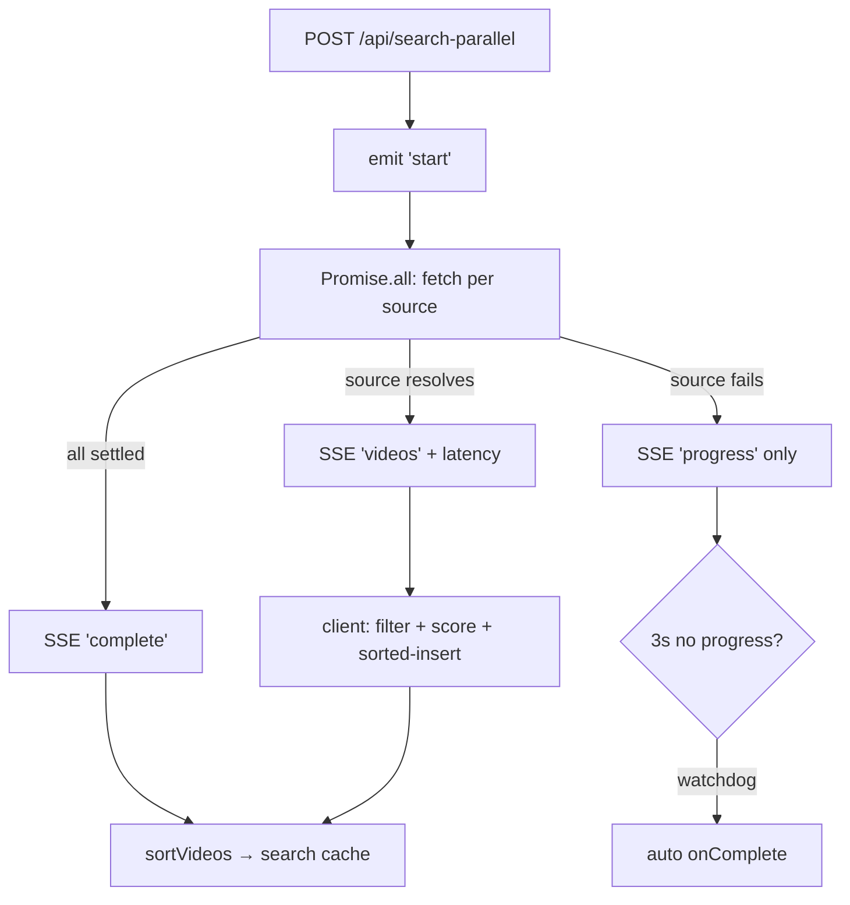

# flox

Multi-source video aggregator that searches dozens of upstream video APIs **in
parallel** and streams each result back the instant its source replies — a
Next.js 16 app with a fully custom HLS player, multi-layer ad filtering, and
**zero server-side state** (everything lives in the browser).

```diff
- search source 1 … wait … source 2 … wait … blocked by the slowest source
+ one query → every enabled source in parallel → results stream in as each replies
```

Preview: <https://floxx.pages.dev/>


Search is a Server-Sent-Events fan-out: a single Edge route fires one `fetch`
per source and forwards SSE frames to the client as each source resolves, so
the UI fills incrementally instead of waiting for the slowest source. Playback
runs through a custom `hls.js` engine that filters M3U8 ad segments client-side,
and every persisted thing — sources, favorites, history, settings — is
`localStorage` only. There is **no database and no Cloudflare binding**.

## Why

Aggregating third-party video APIs has three problems flox is built around:

- **The slowest source blocks the result set.** A naive `Promise.all` renders
  nothing until the last source answers. flox streams over SSE, merges each
  source's videos as they arrive (sorted-insert), and a client-side watchdog
  auto-completes a hung source so one bad host can't stall the page.
- **Upstream streams carry ads and break CORS.** Segments are injected into the
  M3U8 manifest and hosts reject cross-origin playback. flox proxies manifests
  through an Edge route (adding CORS, rewriting segment URLs) and runs a
  4-layer ad filter over the playlist before hls.js ever sees it.
- **A "video app" shouldn't need a backend.** No accounts, no server DB — all
  state is browser `localStorage` via Zustand persist, with one-file
  export / import for backup and a password gate for casual access control.

## Quick start

`flox` is part of the [`@cdlab/projects-monorepo`](../../README.md); run
everything from the repo root.

```bash
pnpm install                       # builds workspace packages too
pnpm --filter @cdlab/flox dev      # -> http://flox.localhost:3355
# or the repo-root shortcut:
pnpm dev:flox
```

The dev URL is fixed by [`@dotns/nsl`](https://github.com/dotns/nsl) — no port
hunting. **The source list ships empty**: open `/settings` and use the one-click
import (curated 38+ list) or add your own sources before searching — the app has
nothing to query until then (see [Non-goals](#non-goals)).

## Features

| Area | What you get |
| --- | --- |
| **Parallel search** | `POST /api/search-parallel` fans out one `fetch` per enabled source and streams SSE frames as each replies; per-source latency is measured and shown with each result. |
| **Source registry** | One-click import of the remote curated list (via `/api/proxy` to dodge CORS), plus user-added sources with drag-and-drop reorder (`@dnd-kit`), enable/disable, and JSON import/export. |
| **Custom player** | Two selectable engines — Volcengine VePlayer or a fully custom `hls.js` chain (`VideoPlayer` → `CustomVideoPlayer` → `DesktopVideoPlayer` + control layer). |
| **Ad filtering** | 4-layer M3U8 filter — keyword, heuristic block-scoring, SCTE-35 `#EXT-X-CUE-OUT/IN` state machine, and an aggressive `#EXT-X-DISCONTINUITY` strip. |
| **Playback UX** | Intro/outro auto-skip, auto-next episode, stall detection, resolution probing, and playback-position resume. |
| **Video proxy** | `GET /api/proxy` streams upstream video/manifests through the edge with CORS, forwarding only `cookie`/`range` and rewriting manifest segment URLs back through itself. |
| **Library** | Favorites, watch-later queue, and a bounded resume-position history — all `localStorage`. |
| **Discovery** | Douban-backed ranking / recommend / suggest / filter surface via `/api/douban/*` proxies. |
| **Premium mode** | Isolated routing, sources, history, and favorites, kept fully separate from the standard surface. |
| **Access gate** | Optional env / local password with session persistence, excluded from backup so an exported settings file can't replay-unlock it. |
| **Platform** | Responsive mobile player (touch gestures, orientation), light/dark/system theme via the View Transition API, and a Service Worker that caches M3U8 + segments. |

## How parallel search resolves

```
POST /api/search-parallel  { query, sources, page }
  1. validate query + sources                          → SSE 'error' + close on failure
  2. emit 'start' { totalSources }
  3. Promise.all: one fetch per source (searchVideos)  → MacCMS ?ac=detail JSON API
  4. per source resolves → SSE 'videos' (+ latency) ; fails → 'progress' only
  5. all settle → SSE 'complete'
client (useParallelSearch + search-stream):
  6. parse SSE line-by-line, filter + relevance-score each video
  7. binaryInsertVideos (sorted merge) as frames arrive
  8. 3s no-progress watchdog auto-fires onComplete (a hung source can't stall)
  9. on complete → sortVideos → push to search cache
```



The full mechanism — every SSE frame, the HLS engine, the ad filter, and the
storage/registry model — is in [`DESIGN.md`](DESIGN.md).

## Configuration

All config is environment variables (see `.env.example`); there are **no
Cloudflare bindings and no runtime secrets** — the app is stateless on the
server.

| Var | Default | Meaning |
| --- | --- | --- |
| `ACCESS_PASSWORD` | *(empty)* | Global password gate; empty = disabled. Verified server-side against a client-sent hash in `/api/config`. |
| `PERSIST_PASSWORD` | `true` | `true` persists the unlock to `localStorage`; `false` uses `sessionStorage` (cleared on tab close). |
| `NEXT_PUBLIC_SUBSCRIPTION_SOURCES` | *(empty)* | Comma-separated JSON source-list URLs auto-loaded as subscriptions (also read as `SUBSCRIPTION_SOURCES` in `/api/config`). |
| `AD_KEYWORDS` | *(empty)* | Comma-separated ad-filter keyword seed. |
| `AD_KEYWORDS_FILE` | *(empty)* | Path to a keyword file read at runtime by the Node layout (standalone/Docker path), injected to the client. |
| `NEXT_PUBLIC_SITE_NAME` / `_TITLE` / `_DESCRIPTION` | `Flox` / … | Branding / metadata. |

> The 38+ curated sources are **not bundled** — `DEFAULT_SOURCES` and
> `PREMIUM_SOURCES` are empty arrays. They live remotely at
> `BUILTIN_SOURCES_URL` (jsDelivr) and are fetched through `/api/proxy` on
> import; add sources before the app can search anything.

## Endpoints

Every route under `src/app/api/*` is **Edge Runtime** (`runtime = 'edge'`).

| Route | Purpose |
| --- | --- |
| `POST /api/search-parallel` | SSE parallel-search fan-out (the signature route). |
| `GET /api/proxy?url=` | Video/manifest proxy: CORS, `cookie`/`range` passthrough, M3U8 segment-URL rewrite. |
| `POST /api/probe-resolution` | SSE batch resolution prober (cap 100, 6-worker pool). |
| `GET`/`POST /api/detail` | Fetches episode list / M3U8 URLs for one video. |
| `POST /api/check-source` | Server-side source health probe. |
| `POST /api/ping` | Latency measurement. |
| `GET /api/config` | Exposes password **status** (never the password value) plus the subscription source URLs; `POST` verifies a password hash. |
| `/api/douban/{filter,image,ranking,recommend,suggest,tags}` | Douban metadata proxies for the discovery surface. |
| `/api/premium/{category,types}` | Premium content proxies. |

CORS for `/api/*` is applied by `src/middleware.ts` (allow-list:
`https://floxx.pages.dev`, `http://flox.localhost:3355`).

## Pages

| Route | Purpose |
| --- | --- |
| `/` | Home + search. |
| `/player` | Playback (custom HLS chain / VePlayer). `?premium=1` selects the premium history bucket. |
| `/ranking` | Douban-backed ranking / discovery. |
| `/settings` | Source manager, import/export, ad-filter, player, password. |
| `/premium`, `/premium/settings` | Isolated premium surface. |

## Project structure

```
src/
  app/
    api/                     15 Edge routes (search-parallel, proxy, probe-resolution, detail, …)
    player/ ranking/ settings/ premium/   App Router pages
    layout.tsx page.tsx      root layout (PasswordGate + ad-keyword injection) + home
  middleware.ts              CORS for /api/* (kept as middleware.ts, see DESIGN §10)
  components/
    player/                  VideoPlayer → CustomVideoPlayer → DesktopVideoPlayer + desktop/*
    PasswordGate.tsx         whole-app access gate
    {favorites,history,watch-later,search,settings,home,premium,ranking,…}/
  lib/
    api/                     source registry (search-api, detail-api, *-sources, builtin-sources)
    hooks/                   useParallelSearch, useResolutionProbe, usePremiumContent, … (+ mobile/)
    store/                   Zustand persist stores + registry + create-persisted-store
    utils/                   m3u8-utils (ad filter), proxy-utils, search-stream, search, sort, …
    player/                  resolution-probe-utils, resolution-cache
    types/index.ts           VideoSource / VideoItem / VideoDetail / history / favorite types
  public/sw.js               Service Worker (video-cache-v2; skips /api/proxy)
DESIGN.md                    architecture + search / player / ad-filter / storage spec
llms.txt                     agent-oriented usage guide
```

## Build, deploy & use

```bash
pnpm --filter @cdlab/flox lint         # next lint
pnpm --filter @cdlab/flox typecheck    # tsc --noEmit
pnpm --filter @cdlab/flox build        # next build --webpack (Turbopack NOT used here)
pnpm --filter @cdlab/flox build:cf     # next-on-pages (Cloudflare Pages build)
```

Deploy target is **Cloudflare Pages** via `@cloudflare/next-on-pages`
(`build:cf`). `next.config.ts` also sets `output: 'standalone'`, so the app runs
as a Node/Docker server too (that path is what reads `AD_KEYWORDS_FILE` from
disk). There is **no automated test suite**.

To use it: open `/settings`, import the curated source list (or add sources),
search from `/`, and click a result to play. Toggle the player engine and
ad-filter mode in `/settings`; export your settings for backup.

## Non-goals

- **Not a content host.** flox ships **no sources** and stores no video — it
  aggregates user-supplied third-party APIs. It does nothing until you import or
  add sources.
- **Not multi-device.** All state is browser `localStorage`; there is no server
  DB and no sync. Backup is a manual settings export/import.
- **Not a hard security boundary.** The password gate is casual access control
  (env hash check), not authentication — there are no accounts.

## Design

[`DESIGN.md`](DESIGN.md) is the authoritative spec — the SSE search pipeline and
its client merge/watchdog, the proxy + ad-filter engine, the custom HLS player
chain, the `localStorage` store/registry model, the password gate, and premium
isolation. Read it before changing SSE frame shapes, the ad-filter layers, or
the store registry.

## License

[MIT](../../LICENSE) © 2025-PRESENT [wudi](https://github.com/WuChenDi)
