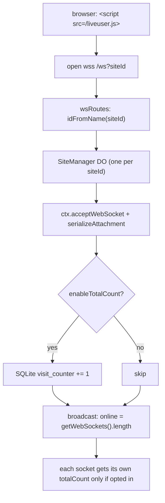

# live-user

Real-time online-visitor counter for any website — one `<script>` tag renders a
live "who's here" number (and an optional running visit total) into any element,
with **no server to run and no accounts**. A single Hono **Cloudflare Worker**
fronting a **Durable Object per site** (WebSocket Hibernation API + embedded
SQLite).

```diff
- analytics vendor account · tracking cookie · a snippet that phones home
+ <script src="…/liveuser.js"></script>   → 42 online · updates live · zero deps
```

Preview: <https://live-user.cdlab.workers.dev/>


The online count is never stored — it is the number of open WebSockets on the
site's Durable Object (`ctx.getWebSockets().length`), so it is always exact and
needs no cleanup. Only the opt-in **total visits** counter is persisted, in
SQLite embedded inside that same DO.

## Why

Showing "N people online" usually means signing up for an analytics vendor,
embedding a snippet that tracks your visitors, and trusting a third party with
your traffic. The self-hosted alternatives want a database and a long-lived
server holding every socket in memory.

`live-user` is neither — one Worker you deploy to your own Cloudflare account:

- **One embed, zero dependencies** — the SDK is a single inline IIFE served from
  `/liveuser.js`; there is nothing to `npm install` and nothing to bundle.
- **Accurate by construction** — "online" is derived live from the count of open
  sockets, not a counter you increment/decrement and hope stays balanced. A
  crashed tab can't leave a phantom in the count.
- **Cheap when idle** — the WebSocket **Hibernation API** evicts a site's DO from
  memory while no messages flow, yet each connection's state survives on the
  socket itself, so an idle site costs effectively nothing.
- **Multi-site from one deploy** — every `siteId` deterministically maps to its
  own DO instance (`idFromName`), so unlimited sites share one Worker with no
  cross-talk and no per-site config.
- **No accounts, no cookies** — the connection path sets nothing on the visitor;
  the only identity is a client-generated UUID that lives for the tab's lifetime.

## Quick start

`live-user` is part of the [`@cdlab/projects-monorepo`](../../README.md); run
everything from the repo root.

```bash
pnpm install                              # builds workspace packages too
pnpm --filter @cdlab/live-user dev        # -> http://live-user.localhost:3355
```

The dev URL is fixed by [`@dotns/nsl`](https://github.com/dotns/nsl) — no port
hunting. The homepage is a live self-demo (it embeds its own counter on
`siteId=official-website`).

Embed it on any page — drop a script tag and give it an element to write into:

```html
<div id="liveuser">0</div>
<script src="https://live-user.cdlab.workers.dev/liveuser.js"></script>
```

With a running visit total alongside the online count:

```html
<div>Online: <span id="liveuser">0</span></div>
<div>Total: <span id="liveuser_totalvisits">0</span></div>
<script src="https://live-user.cdlab.workers.dev/liveuser.js?siteId=my-site&enableTotalCount=true"></script>
```

## How a connection resolves

```
GET /liveuser.js?siteId=…                → SDK IIFE with config JSON-injected
  browser generates a UUID clientId, finds #displayElementId
  opens wss://host/ws?siteId=…&clientId=…[&enableTotalCount=true]

GET /ws?siteId=…                         (wsRoutes)
  1. idFromName(siteId) → one DO stub      deterministic site sharding
  2. forward the raw upgrade to the DO     stub.fetch(url, c.req.raw)

DO.fetch (SiteManager)
  3. ctx.acceptWebSocket(server)           Hibernation API — DO may evict when idle
  4. serializeAttachment(state)            per-socket {clientId,siteId,enableTotalCount,joinedAt}
  5. enableTotalCount? INSERT … ON CONFLICT DO UPDATE   atomic SQLite increment
  6. broadcast(siteId)                     push new online count to every socket
  7. 101 Switching Protocols               client socket returned

on message  heartbeat → reply live count (+ optional totalCount)
            join      → broadcast
on close/error        → re-broadcast so remaining clients see the new count
```



The full model — the Hibernation lifecycle, the per-client total-count fidelity
fix, and the sharding rationale — is in [`DESIGN.md`](DESIGN.md).

## SDK parameters

All config is read from the `/liveuser.js` query string (`parseConfig`,
`src/routes/sdk.ts`) and JSON-injected into the served IIFE.

| Parameter | Default | Meaning |
| --- | --- | --- |
| `siteId` | `default-site` | Site identifier — its own DO instance and total-visits row. |
| `displayElementId` | `liveuser` | DOM element id the online count is written into. |
| `totalCountElementId` | `liveuser_totalvisits` | DOM element id for the total-visits count. |
| `enableTotalCount` | `false` | Track + display total visits; also opts this connection into the persisted counter. |
| `reconnectDelay` | `3000` | Auto-reconnect delay in ms after a drop. |
| `debug` | `false` | Styled `console.log` tracing in the browser. |
| `serverUrl` | `ws(s)://<host>/` | WebSocket origin; `http→ws` / `https→wss` derived from the script's own host. |

The heartbeat interval (30s) and the K/M number-formatting thresholds are
hard-coded in the SDK.

## Bindings & config

| Binding | Type | Purpose | Required |
| --- | --- | --- | --- |
| `SITE_MANAGER` | Durable Object → `SiteManager` | One instance per `siteId`; owns the WebSockets + the `visit_counter` SQLite table. | ✓ |

No KV / R2 / D1 / queues, no secrets, and no runtime env vars. `wrangler.jsonc`
carries an empty `account_id` — set it before deploying. Migration tag `v1`
registers `SiteManager` as a SQLite-backed DO class (`new_sqlite_classes`).

## Endpoints

| Route | Purpose |
| --- | --- |
| `GET /` | Hono-JSX demo page (a live self-demo on `siteId=official-website`). |
| `GET /liveuser.js` | The embeddable SDK — config parsed from query, served as `application/javascript`, `no-cache`, `Access-Control-Allow-Origin: *`. |
| `GET /ws` | WebSocket upgrade; resolves the site's DO via `idFromName(siteId)` and forwards the raw request. |
| `*` | `404 → { "statusCode": 404, "message": "Not Found" }`. |

## Project structure

```
src/
  index.ts             Worker entry — Hono app, middleware, routes, DO re-export
  site-manager.ts      SiteManager Durable Object — the entire stateful core
  routes/
    index.ts           barrel re-export of the three route modules
    home.tsx           GET / — renders <HomePage> via Hono JSX
    sdk.ts             GET /liveuser.js — config parsing + the SDK IIFE string
    ws.ts              GET /ws — DO resolution + upgrade forwarding
  pages/
    Layout.tsx         JSX HTML shell (SEO / OG / JSON-LD, inline CSS)
    HomePage.tsx       demo page markup
  types/index.ts       AppEnv, ConnectionState, SDKConfig
DESIGN.md              architecture + Hibernation / broadcast / sharding spec
llms.txt              agent-oriented usage guide
```

## Build, deploy & typegen

```bash
pnpm --filter @cdlab/live-user cf-typegen  # regenerate CloudflareBindings types
pnpm --filter @cdlab/live-user deploy       # wrangler deploy --minify
```

There is **no test script and no test suite**. The `build` script
(`bun build … --target browser`) exists but the real deploy path is
`wrangler deploy`. Deploying requires the `SITE_MANAGER` DO binding and a
non-empty `account_id` in `wrangler.jsonc`.

## Non-goals

- **Not unique-visitor analytics.** The persisted total counts *opted-in
  connections*, not distinct people — a reload or a second tab increments it, and
  sites that embed without `enableTotalCount` never accrue a total at all.
- **Not authenticated.** The `/liveuser.js` and `/ws` endpoints are fully open
  (`Access-Control-Allow-Origin: *`); anyone can connect to any `siteId`. There
  is no rate limiting and no per-site secret.
- **Not durable session history.** The online count is ephemeral by design — it
  reflects the *now*, not a time series. There is no dashboard, export, or
  retention.

## Design

[`DESIGN.md`](DESIGN.md) is the authoritative spec — the two-tier
Worker/Durable-Object split, the WebSocket Hibernation lifecycle and its
load-bearing `webSocketClose` fix, the per-client total-count broadcast, the
SQLite model, and the SDK. Read it before changing the broadcast logic, the
attachment schema, or the DO handlers.

## License

[MIT](../../LICENSE) © 2025-PRESENT [wudi](https://github.com/WuChenDi)
