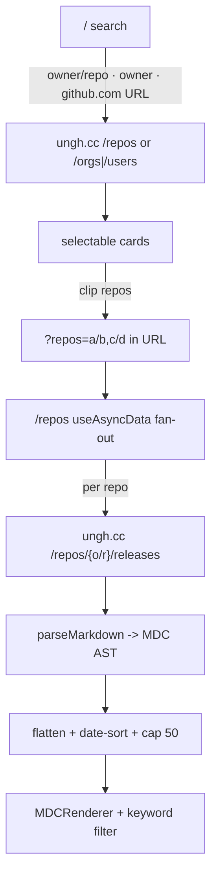

# repo-changelog

Track releases and changelogs from many GitHub repositories in one chronological
dashboard — a **Nuxt 4** app with no backend of its own, sourcing every byte
from [ungh.cc](https://ungh.cc) and keeping your selections in the URL and
`localStorage`, never on a server.

```diff
- open github.com/a/b/releases, then c/d/releases, then e/f/releases …   # N tabs, no merge
+ /repos?repos=a/b,c/d,e/f   one timeline · date-sorted · shareable link
```

Preview: <https://repo-changelog.vercel.app/>


You search on `/`, "clip" the repos you care about, and land on
`/repos?repos=<csv>` — a single feed that fans out to `ungh.cc`, parses each
release's markdown to an AST, sorts everything by date, and renders it inline.
The set of repos lives entirely in the query string, so a curated dashboard is
just a link you can bookmark or share.

## Why

Watching releases across many repositories means opening one releases page per
repo and mentally interleaving them by date. Hosted "release tracker" services
want an account and store your watchlist for you.

`repo-changelog` is neither — it is a static-friendly Nuxt app with **no server
of its own**:

- **No backend, no database.** Every request goes to `ungh.cc` (an
  unauthenticated GitHub proxy). There is nothing to run, no API key to hold, no
  row to store.
- **Your selection is a URL.** Selected repos live in `?repos=a/b,c/d`; that
  query string is the only cross-session "save" besides browser `localStorage`
  (recent history + favorite groups).
- **One merged timeline.** All releases from all selected repos are flattened,
  sorted newest-first, and rendered together with full markdown — code blocks
  highlighted for the common release-note languages.
- **Client-side everything.** Search, sort, and keyword filtering are pure
  computed props in the browser; the server does no search logic.

## Quick start

`repo-changelog` is part of the
[`@cdlab/projects-monorepo`](../../README.md); run everything from the repo root.

```bash
pnpm install                                   # installs + prepares the workspace
pnpm --filter @cdlab/repo-changelog dev        # -> http://repo-changelog.localhost:3355
```

The dev URL is fixed by [`@dotns/nsl`](https://github.com/dotns/nsl) — no port
hunting. Search on `/`, clip a few repos, hit view → `/repos?repos=…`.

## How a merged changelog resolves

```
/  (search & selection)                         /repos?repos=a/b,c/d  (dashboard)
  1. type owner/repo, bare owner, or a            1. read ?repos= → split on comma
     github.com/... URL (regex-extracted)         2. filter to valid owner/repo
  2. single repo → GET /repos/{o/r}                  → Promise.all fan-out
     owner      → GET /orgs/{o}/repos,            3. per repo: GET /repos/{o/r}/releases
                  fallback GET /users/{o}/repos      → keep non-draft releases
  3. render cards; sort by stars/forks/name/         → parseMarkdown(release.markdown)
     updated (client-side); clip into selection       into an MDC AST
  4. viewReleases → save history →                4. flatten, sort by date desc,
     navigate /repos?repos=<csv>                     cap at 50 → MDCRenderer + filter
```



Every `useFetch` / `useAsyncData` call carries a stable `key` and reuses the SSR
payload (`getCachedData: k => useNuxtApp().payload.data[k] || …static.data[k]`),
so hydration and navigation dedupe `ungh.cc` calls. Combined with 60s ISR on `/`,
this keeps upstream traffic low — at the cost of data being up to ~60s stale on
the landing route.

## Routes

| Route | File | Purpose |
| --- | --- | --- |
| `/` | `app/pages/index.vue` | Search + repo selection; recent history + favorite groups. ISR (60s). |
| `/repos?repos=<csv>` | `app/pages/repos.vue` | Merged, date-sorted changelog timeline for the selected repos. Dynamic. |

## Data source (ungh.cc)

There is no own backend; `runtimeConfig.public.apiUrl` (`https://ungh.cc`,
overridable via `API_URL`) is the sole data source.

| Endpoint | Used for |
| --- | --- |
| `GET /repos/{owner}/{repo}` | Validate / fetch a single repo. |
| `GET /orgs/{owner}/repos` | List an organization's repos (tried first for a bare owner). |
| `GET /users/{owner}/repos` | Fallback when the owner isn't an org. |
| `GET /repos/{owner}/{repo}/releases` | Release list for the changelog timeline. |

`ungh.cc` is unauthenticated — there are no API keys or secrets anywhere in this
app.

## Configuration

| Env var | Default | Meaning |
| --- | --- | --- |
| `API_URL` | `https://ungh.cc` | Overrides the data source (`nuxt.config.ts`). |
| `VITE_ALLOWED_HOSTS` | *(empty)* | Comma-separated Vite dev-server allowed hosts. |

Both are optional. UI theme colors (`primary: red`, `neutral: stone`) and prose
overrides live in `app/app.config.ts`; MDC syntax highlighting is limited to
`diff, ts, tsx, vue, css, sh, js, json` (`nuxt.config.ts`).

## Storage (browser only)

No database, no server storage. All persistence is `localStorage` via VueUse
`useStorage`:

| Key | Shape | Purpose |
| --- | --- | --- |
| `repo-history` | `string[]` (max 10) | Recently opened repos. |
| `repo-favorite-groups` | `FavoriteGroup[]` (`{id,name,repos,createdAt}`) | Named, reusable repo sets. |

Shareable state lives in the `?repos=` query string — the only cross-session save
besides `localStorage`.

## Project structure

```
app/
  pages/
    index.vue          search + selection (ISR), history + favorite groups
    repos.vue          merged changelog dashboard (fetch, parse, sort, render)
  components/
    ThemedBackground.vue  page shell + grain/ink-wash background (color-mode gated)
    IKHeader.vue          masthead; app version + client-computed date
    Footer.vue            credits ungh.cc as the "wire service"
    RepoList.vue          reusable Selected/Recent list (props-driven)
    FavoriteGroups.vue    CRUD UI over the favorite-groups composable
    EmptyState.vue        onboarding placeholder on /
  composables/
    useRepository.ts      getRepoUrl(owner/repo) -> GitHub URL
    useFavoriteGroups.ts  named repo sets in localStorage
  plugins/
    analytics.client.ts   Vercel Analytics (client-only, manual pageview)
  assets/css/main.css     Tailwind v4 + @nuxt/ui; "Release Gazette" editorial theme
  app.config.ts           Nuxt UI theme colors + prose overrides
  app.vue                 root: SEO/OG/Twitter meta + JSON-LD, layout shell
shared/types/releases.ts  ungh.cc wire types + Release (body: MDCRoot)
public/logo.svg           favicon / apple-touch-icon
DESIGN.md                 architecture + data-flow spec
llms.txt                  agent-oriented usage guide
```

## Tech stack

| Layer | Choice |
| --- | --- |
| Framework | Nuxt 4, Vue 3 |
| UI | `@nuxt/ui` (Tailwind v4) |
| Markdown | `@nuxtjs/mdc` — `parseMarkdown` → AST, rendered with `MDCRenderer` |
| Composables | `@vueuse/nuxt` (`useStorage`, `formatTimeAgo`) |
| Analytics | `@vercel/analytics` (client plugin) |
| Rendering | ISR on `/` (60s revalidate); `/repos` dynamic |
| Deploy | Vercel (Nitro node serverless preset, auto-detected) |

## Build & deploy

```bash
pnpm --filter @cdlab/repo-changelog build       # nuxt build (production Nitro -> Vercel)
pnpm --filter @cdlab/repo-changelog generate    # nuxt generate (static prerender)
pnpm --filter @cdlab/repo-changelog preview      # nuxt preview
pnpm --filter @cdlab/repo-changelog typecheck    # nuxt typecheck (vue-tsc)
```

This app is **excluded from the root Biome config** and has no `lint` or `test`
script of its own. `postinstall` runs `nuxt prepare` to generate `.nuxt/` type
stubs. Deploys target Vercel; Nuxt/Nitro auto-detects the Vercel preset.

## Non-goals

- **Not a GitHub client.** It reads public release data through `ungh.cc` only —
  no auth, no issues/PRs, no private repos.
- **Not exhaustive history.** The merged timeline is **capped at 50 releases**
  across all selected repos; older releases are silently dropped after the
  date-sort. Track fewer repos to see deeper history.
- **Not a syntax-highlighting universal.** Release notes using a language outside
  the 8 whitelisted MDC langs render unhighlighted.
- **No error recovery per repo.** A failed repo fetch returns `[]` and is silently
  skipped; only a total failure surfaces an error state.

## Design

[`DESIGN.md`](DESIGN.md) is the authoritative spec — the two-route data flow, the
fetch/cache/parse pipeline, the browser-only storage model, and the
hydration-safety and configuration decisions. Read it before changing the search
resolution order, the 50-release cap, or the cache-key scheme.

## License

[MIT](../../LICENSE) © 2025-PRESENT [wudi](https://github.com/WuChenDi)
