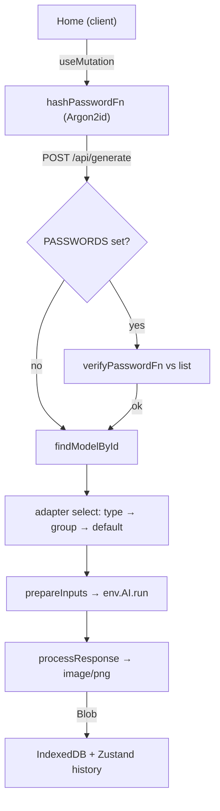

# text2img

Free, no-registration AI **text-to-image** tool — type a prompt, pick a model,
get a PNG — one Next.js app running entirely on **Cloudflare Workers AI**.

```diff
- sign up → buy credits → upload your prompt to someone else's server
+ text2img.cdlab.workers.dev   type prompt · pick model · download PNG · no account, no upload
```

Preview: <https://text2img.cdlab.workers.dev/>


The browser POSTs a prompt to a single Worker; the Worker calls the Cloudflare
Workers AI binding (`env.AI.run`) and streams a PNG back. There is **no
server-side database** — your generation history (image blobs + params) lives in
*your* browser's IndexedDB / localStorage, and the optional access password is
Argon2id-hashed client-side so the plaintext never crosses the wire.

## Why

Most hosted text-to-image tools want an account, meter you by credits, and keep
your prompts and results on their servers. `text2img` is a single Cloudflare
Worker you deploy to your own account:

- **No account, no meter** — the only cost is your Cloudflare Workers AI usage;
  nothing is gated behind a sign-up.
- **Many models, one request shape** — FLUX.2 / FLUX.1, SDXL, DreamShaper and
  more are reachable through the same UI. A per-model **adapter** normalizes the
  differently-shaped Workers AI inputs and outputs so the client never has to
  care which model it picked.
- **Your history stays yours** — completed images are stored as blobs in
  IndexedDB and their metadata in localStorage; nothing is uploaded or persisted
  server-side.
- **Optional gate, done right** — set `PASSWORDS` and the client Argon2id-hashes
  before POSTing; the server verifies the hash against its configured list, so
  the plaintext is never transmitted, logged, or persisted.
- **One binary, no servers** — Next.js compiled through
  [OpenNext](https://opennext.js.org/cloudflare) to a single Worker; the Workers
  AI binding is the only hard dependency.

## Quick start

`text2img` is part of the [`@cdlab/projects-monorepo`](../../README.md); run
everything from the repo root.

```bash
pnpm install                              # builds workspace packages too
pnpm --filter @cdlab/text2img dev         # -> http://text2img.localhost:3355
```

The dev URL is fixed by [`@dotns/nsl`](https://github.com/dotns/nsl) — no port
hunting. `next dev` gets **real** Cloudflare bindings (so `env.AI.run` works
locally) because `next.config.ts` calls `initOpenNextCloudflareForDev()`.

To gate the generate endpoint locally, copy `.env.example` to `.env` and set a
comma-separated `PASSWORDS` list (empty = open access).

## How a generation resolves

```
POST /api/generate  { prompt, model, params, password? }
  1. client: Argon2id-hash the password (if any)             plaintext never sent
  2. server: getCloudflareContext() → env.AI               inside the Worker
  3. password gate: PASSWORDS set? verify hash vs each       401 missing / 403 no match
  4. findModelById(model)                                    400 unknown / 400 disabled
  5. pick adapter: MODEL_TYPE_CONFIGS[type]                  img2img / inpainting
                   ?? MODEL_GROUP_CONFIGS[group]             flux / sdxl / …
                   ?? defaultModelConfig
  6. adapter.prepareInputs(data)  → env.AI.run(model.key)    Workers AI call
  7. adapter.processResponse(res) → PNG Response             normalize output
  8. client: Blob → IndexedDB + object URL, history updated  timed, toasted
```



The per-model adapter (step 5–7) is the core design; every divergence between
model families lives there. The full model is in [`DESIGN.md`](DESIGN.md).

## Supported models

Catalog and status live in [`src/lib/data.ts`](src/lib/data.ts); the model key is
the full `@cf/...` Workers AI id passed to `env.AI.run`.

| Provider | Model | Group | Type | Status |
| --- | --- | --- | --- | --- |
| Black Forest Labs | FLUX.2 [klein] 9B | `black-forest-labs` | text2img | enabled |
| Black Forest Labs | FLUX.2 [klein] 4B | `black-forest-labs` | text2img | enabled |
| Black Forest Labs | FLUX.2 [dev] | `black-forest-labs` | text2img | enabled |
| Black Forest Labs | FLUX.1 [schnell] | `black-forest-labs` | text2img | enabled |
| ByteDance | Stable Diffusion XL Lightning | `bytedance` | text2img | enabled |
| Lykon | DreamShaper 8 LCM | `lykon` | text2img | enabled |
| Stability AI | Stable Diffusion XL Base 1.0 | `stabilityai` | text2img | enabled |
| Leonardo AI | Lucid Origin | `leonardo` | text2img | disabled |
| Leonardo AI | Phoenix 1.0 | `leonardo` | text2img | disabled |
| Runway ML | Stable Diffusion v1.5 img2img | `runwayml` | img2img | enabled |
| Runway ML | Stable Diffusion v1.5 Inpainting | `runwayml` | inpainting | enabled |

Disabled models stay in the catalog (so `/api/models` still lists them) but are
rejected by `/api/generate` at request time with a `400`.

## Adapters

`src/app/api/generate/route.ts` selects a `{ prepareInputs, processResponse }`
adapter — **type config takes precedence over group config**, so an `img2img` /
`inpainting` model always uses the image adapter regardless of its group.

| Adapter | Used by | `prepareInputs` | `processResponse` |
| --- | --- | --- | --- |
| `defaultModelConfig` | `bytedance`, `lykon`, `stabilityai`, `runwayml` groups | plain JSON (`prompt`, `negative_prompt`, `width`/`height` 1024, `num_steps` 20, `guidance` 7.5, `seed`) | raw response bytes → `image/png` |
| `blackForestLabsConfig` | `black-forest-labs` group | `flux-1-schnell`: `{ prompt, steps }` with **steps clamped 4–8**; other FLUX: **`multipart` FormData** body wrapper | base64 `image` field → decode → PNG |
| `leonardoConfig` | `leonardo` group (disabled) | `steps` 25, `guidance` 4 | base64 string **or** binary → PNG |
| `img2imgConfig` | `img2img` type | decodes `image_b64` → number-array `image`; 512×512, `strength` 0.75 | base64 or binary → PNG |
| `inpaintingConfig` | `inpainting` type | adds `mask` from `mask_b64`, `strength` 1 | reuses `img2img` |

## Endpoints

| Route | Method | Purpose |
| --- | --- | --- |
| `/api/generate` | POST | Password gate → model resolve → adapter → `env.AI.run` → PNG. JSON `{ error }` + status on failure. |
| `/api/models` | GET | `AVAILABLE_MODELS` catalog (provider / group metadata), served from `src/lib/data.ts`. |
| `/api/prompts` | GET | `RANDOM_PROMPTS` library for the one-click random-prompt button. |

The single UI page is `/[locale]` (`en` / `zh`); the root `/` and `not-found`
pages exist only to satisfy Next's static-export / not-found requirements.

## Configuration

There is no `wrangler` `var` for runtime tuning. The only runtime knob is a
**secret-valued env var**, deliberately kept out of `wrangler.jsonc`.

| Env | Where read | Meaning |
| --- | --- | --- |
| `PASSWORDS` | `process.env.PASSWORDS` (`api/generate/route.ts`) | Comma-separated access passwords for `/api/generate`. Empty = open access. |
| `BUILD_TIME` | `process.env.BUILD_TIME` (`client-providers.tsx`) | Optional; shown in the version badge. |

> `PASSWORDS` is **not** a `wrangler` var — as a var it would shadow the Worker
> secret on every deploy (`wrangler.jsonc` explains this inline). Set it via
> `.env` locally, or the `deploy-text2img.yml` workflow's secret sync in prod
> (GitHub secret `TEXT2IMG_PASSWORDS`).

## Bindings

Declared in [`wrangler.jsonc`](wrangler.jsonc):

| Binding | Type | Purpose | Required |
| --- | --- | --- | --- |
| `AI` | Workers AI | `env.AI.run(model.key, inputs)` — the core dependency. | ✓ |
| `ASSETS` | Static assets | OpenNext build output (`.open-next/assets`). | ✓ |
| `IMAGES` | Cloudflare Images | Declared; not referenced in app code. | — |
| `WORKER_SELF_REFERENCE` | Service | Self-service binding → `text2img`. | — |

`compatibility_flags`: `nodejs_compat`, `global_fetch_strictly_public`.
Observability is on (head sampling 1.0).

## Project structure

```
src/
  app/
    [locale]/page.tsx        the single app UI (client component)
    [locale]/layout.tsx      metadata + 4 JSON-LD blocks (bilingual SEO)
    api/generate/route.ts    password gate + model adapters + env.AI.run
    api/models/route.ts      AVAILABLE_MODELS catalog (GET)
    api/prompts/route.ts     RANDOM_PROMPTS library (GET)
    page.tsx, layout.tsx     static-export / not-found shims only
  lib/
    data.ts                  model catalog + random-prompt library
    utils.ts                 findModelById
    api.ts                   frontend fetch client (models / prompts)
    genid.ts                 GenidOptimized (ids + random seeds)
    storage.ts               IndexedDB blob store (createIDBStore)
    hooks/useGeneration.ts   TanStack mutation: hash → POST → store
  store/useImageStore.ts     Zustand + persist history (blobs in IDB)
  components/page/           BasicSettings, AdvancedOptions, ImageUpload, ImageResult
  components/layout/         providers, theme, language selector
  i18n/                      next-intl routing / request / navigation
  types/index.ts             Model, ModelGroup, GenerateParams, GenerationResult
DESIGN.md                    architecture + adapter / storage / security spec
llms.txt                     agent-oriented usage guide
```

## Build, test & deploy

```bash
pnpm --filter @cdlab/text2img lint        # next lint
pnpm --filter @cdlab/text2img build       # next build (type-check + bundle; NOT the deploy path)
pnpm --filter @cdlab/text2img preview      # local Workers preview (OpenNext build + preview)
```

There are **no tests** in this app (no test script, no test files).

Deploys go through the `deploy-text2img.yml` GitHub workflow (manual dispatch):
it runs `opennextjs-cloudflare build && deploy`, then syncs the
`TEXT2IMG_PASSWORDS` Worker secret **after** the deploy (the deploy replaces the
binding set, so the secret is (re)created last). The local
`pnpm --filter @cdlab/text2img deploy` works but skips the secret sync — prefer
the workflow. Deploying requires a Workers AI (`AI`) binding.

## Non-goals

- **No server-side storage** — no database, no accounts; history is browser-local
  and does not sync across devices.
- **Not an image editor** — img2img / inpainting are model inputs (client-side
  canvas resize to ≤512px), not a canvas-editing surface.
- **Not a queue / batch runner** — one generation per request; there is no job
  persistence or server-side retry.

## Design

[`DESIGN.md`](DESIGN.md) is the authoritative spec — the model-adapter subsystem
and its precedence rules, the client/server password split, the IndexedDB +
localStorage history model and its rehydration, and the OpenNext deployment
shape. Read it before changing adapter selection, the persisted-store shape, or
the password flow.

## License

[MIT](../../LICENSE) © 2025-PRESENT [wudi](https://github.com/WuChenDi)
