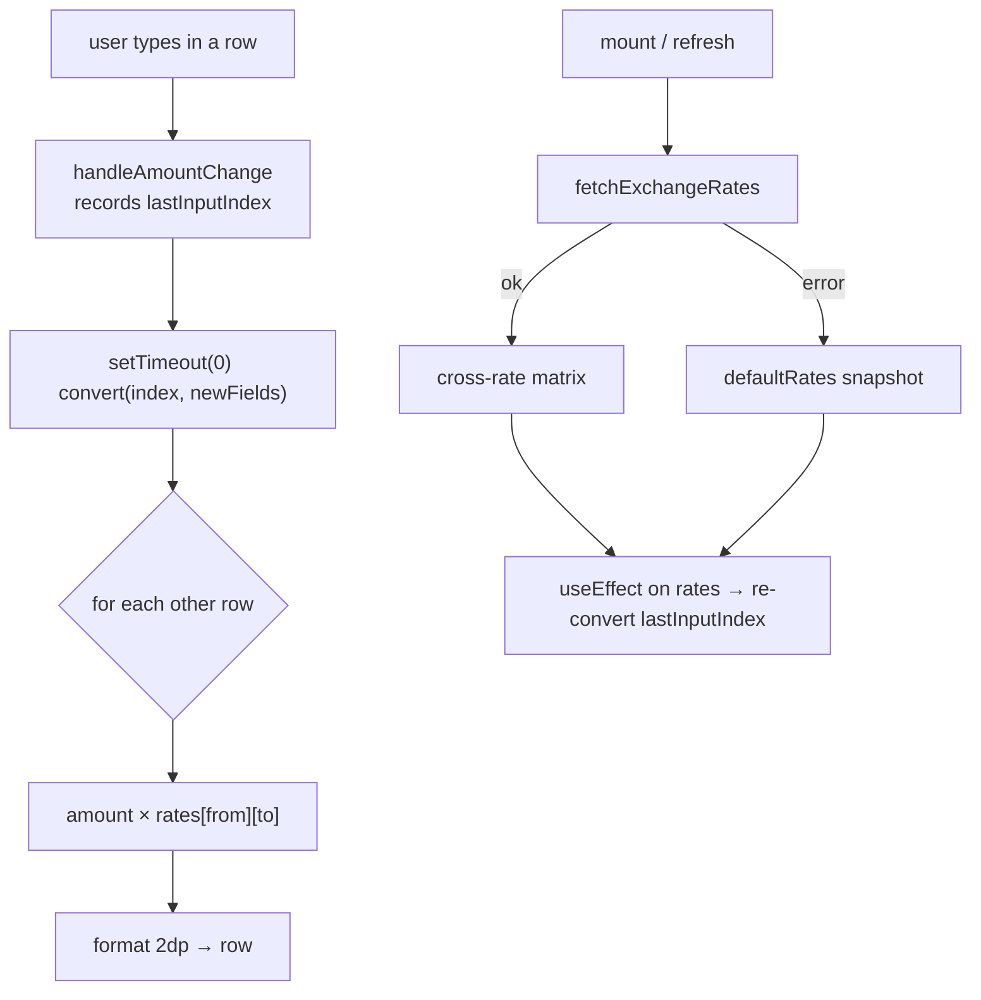

# values

A no-signup **purchasing-power converter**: drop an amount into any field —
crypto, fiat, or a real-world product — and every other field re-prices to
match, so a Bitcoin balance, a salary, and a MacBook all sit on one scale. A
single statically-exported Next.js page, no backend, no accounts.

Preview: <https://values.pages.dev/>


Rates are fetched **in the browser** — crypto USD prices from CoinGecko, fiat
rates from exchangerate-api.com — and cross-rated through USD into a full N×N
matrix. If either fetch is blocked or rate-limited, the board silently falls
back to a bundled snapshot so it still converts.

## Why

Numbers in different units don't compare in your head. "Is 0.5 BTC a lot?"
depends on what a fiat salary, a car, or a phone costs — and each lives in its
own currency. Off-the-shelf converters do one pair at a time (USD → EUR) and
never mix in a physical good.

`values` puts everything on one board:

- **Everything is a "currency."** Crypto, fiat, and fixed-price products share
  one converter — a product is just an asset with a hardcoded home-currency
  price, normalized to USD like anything else.
- **Multi-way, not one-pair.** Type into any row; all other rows recompute at
  once. No "swap" button, no source/target dropdown pair.
- **No backend, no signup, no keys.** The whole app is a static bundle on
  Cloudflare Pages; the two rate APIs are keyless and called straight from the
  browser. Nothing is stored — reload and the board resets.
- **Degrades, never dies.** A CORS block or rate-limit falls back to a bundled
  `defaultRates` snapshot instead of erroring.

## Quick start

`values` is part of the [`@cdlab/projects-monorepo`](../../README.md); run
everything from the repo root.

```bash
pnpm install                          # builds workspace packages too
pnpm --filter @cdlab/values dev       # -> http://values.localhost:3355
```

The dev URL is fixed by [`@dotns/nsl`](https://github.com/dotns/nsl) — no port
hunting. There is one page: pick a currency per row, type an amount, watch the
rest re-price. The refresh icon (top-right of the card) re-fetches live rates.

## Assets it converts

All catalog entries live in `src/lib/currencies.ts` (`CURRENCY_CONFIG`).

| Category | Members | Priced by |
| --- | --- | --- |
| **Crypto** | BTC, ETH, SOL, BNB, OKB | CoinGecko `id` (`bitcoin`, `ethereum`, …), USD price |
| **Fiat** | USD, CNY, JPY, KRW, SGD, AED, HKD, MYR | exchangerate-api.com, USD-based |
| **Products** | iPhone 17 ($799), MacBook Pro ($1599), Xiaomi SU7 (¥215900), Porsche 718 (¥550000), Ferrari Roma (¥1750000) | fixed price in a home currency, normalized to USD |

The board seeds six rows (`DEFAULT_FIELDS`): BTC / ETH / SOL / USD / CNY / HKD.
Each row must pick a **distinct** currency — one already in use elsewhere is
disabled in the selector (`excludeCurrencies`).

## How a conversion resolves

```
on mount / refresh
  1. fetchExchangeRates()  → Promise.all(CoinGecko crypto, exchangerate-api fiat)
  2. getProductPrices()    → each product's fixed price ÷ its home fiat rate = USD
  3. calculateCrossRates() → build N×N matrix, every pair routed through USD
  4. on any fetch error    → catch, fall back to bundled defaultRates

user types into a row
  5. handleAmountChange(index, value) → record lastInputIndex, defer convert()
  6. convert(index)        → for every OTHER row: amount × rates[from][to]
  7. format to 2 decimals via toLocaleString; missing rate ⇒ 0 (blank/zero row)
```

Cross-rates always go **through USD** (`calculateRate`): a product is divided by
its home-currency fiat rate to get a USD price, then cross-rated against crypto
and other fiat. Any pair the function doesn't handle returns `0`, and `convert`
treats a missing rate as `0` — so an unresolved cell shows blank/zero rather
than erroring.



The design, cross-rate math, and every gotcha are in [`DESIGN.md`](DESIGN.md).

## Configuration

There is **no runtime config and no secrets** — the app ships as static HTML/JS.
The only build-time input:

| Var | Where | Meaning |
| --- | --- | --- |
| `BUILD_TIME` | `next.config.ts` (`env`) → `client-providers.tsx` | Build timestamp shown in the footer version badge (`IKVersionInfo`). |

The two rate APIs are keyless and hardcoded (`src/lib/exchangeRate.ts`);
Google Analytics (`G-FPHG7CDDVQ`) and the OG/site-verification tokens are
hardcoded in `src/app/layout.tsx`. Remote image hosts are whitelisted in
`next.config.ts` (`res.cloudinary.com`, `wcd.pages.dev`).

## External services

| Service | Endpoint | Auth | Used for |
| --- | --- | --- | --- |
| CoinGecko | `api.coingecko.com/api/v3/simple/price?ids=…&vs_currencies=usd` | none | crypto USD prices |
| exchangerate-api.com | `api.exchangerate-api.com/v4/latest/USD` | none | fiat rates (USD base) |
| Google Analytics | `@next/third-parties` `G-FPHG7CDDVQ` | — | page analytics |

CoinGecko's public endpoint is rate-limited; there is no caching, retry, or
debounce — a manual refresh re-fetches everything, and any failure degrades to
`defaultRates`.

## Project structure

```
src/
  app/
    layout.tsx           root layout: metadata, JSON-LD, Plasma + Particles bg, GA
    page.tsx             the single converter page ('use client')
    error.tsx            error boundary
  hooks/
    useExchangeRates.ts  fetch + parallel APIs + defaultRates fallback + refresh
    useCurrencyConverter.ts  field state + multi-way conversion
  lib/
    currencies.ts        CURRENCY_CONFIG catalog + DEFAULT_FIELDS
    exchangeRate.ts      ExchangeRate class: live fetch + all cross-rate math
    rates.ts             defaultRates — bundled offline fallback matrix
  components/
    AmountInput.tsx      text input + trailing currency symbol
    CurrencySelector.tsx grouped select; disables in-use currencies
    layout/              ClientProviders (theme + tooltip + version), theme toggle
  types/currency.ts      all interfaces (ExchangeRates, ConverterField, …)
DESIGN.md                architecture + cross-rate spec
llms.txt                 agent-oriented usage guide
```

## Build, deploy & lint

```bash
pnpm --filter @cdlab/values build      # next build → static export in out/
pnpm --filter @cdlab/values build:cf   # @cloudflare/next-on-pages (Pages bundle)
pnpm --filter @cdlab/values typecheck  # tsc --noEmit
pnpm --filter @cdlab/values lint       # next lint
```

`next.config.ts` sets `output: 'export'`, so `build` emits a fully static site
(`out/`) with no server runtime; `build:cf` produces the Cloudflare Pages
bundle. There is **no test suite**. Deploys go to Cloudflare Pages
(<https://values.pages.dev/>).

## Non-goals

- **Not a trading tool.** Rates are indicative, refreshed only on load / manual
  refresh, and fall back to a stale snapshot — never wire it to a decision.
- **Not persistent.** No database, no localStorage; field state is ephemeral and
  resets on reload.
- **Not extensible at runtime.** Products and their prices are hardcoded in the
  catalog; adding an asset is a code change.

## Design

[`DESIGN.md`](DESIGN.md) is the source-of-truth spec — the two-hook
architecture, the USD-pivot cross-rate model, the fallback-matrix drift trap,
and the static-export constraints. Read it before touching the rate math or the
conversion flow.

## License

[MIT](../../LICENSE) © 2025-PRESENT [wudi](https://github.com/WuChenDi)
