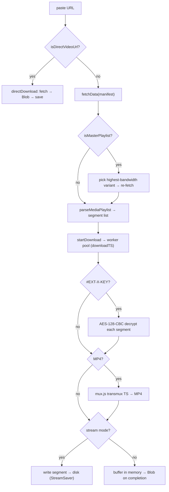

# vidl

Pure-browser video downloader — it parses **M3U8/HLS** playlists (and direct
`.mp4`/`.ts`/… links), decrypts AES-128 segments, transmuxes to MP4, and streams
the result straight to disk, all client-side, with **no upload and no server**.

Preview: <https://vidl.pages.dev/>


The whole pipeline — fetch, AES-128-CBC decrypt, TS→MP4 transmux, and the write
to disk — runs in the page. A `DownloadEngine` class drives a concurrent
segment worker pool and, in **stream mode**, pipes each finished segment through
`StreamSaver.js` into a `WritableStream` so a multi-GB video never has to sit in
memory.

## Why

Every "online M3U8 downloader" is a server that fetches the video *for* you: it
sees the URL, proxies the bytes, and often rate-limits or injects ads. The
browser-native alternatives make you install an extension. `vidl` is neither —
it's a **static site** (`output: 'export'`) that does the work locally:

- **Nothing is uploaded.** The URL you paste, the encryption key, and the video
  bytes stay in your tab. There is no API layer, no backend, no logging.
- **Encrypted HLS just works.** `#EXT-X-KEY` is auto-detected; the key is
  fetched and each segment is AES-128-CBC decrypted in a hand-rolled decryptor
  before muxing — no plugins.
- **Big files don't OOM the tab.** Stream mode writes segments to disk as they
  arrive (Streams API via `StreamSaver.js`), so peak memory is one segment, not
  the whole file. Safari falls back to in-memory automatically.
- **Batch + range.** Queue many URLs, or grab a slice of segments — each with
  its own quality / format / filename.
- **Resilient.** Per-segment retry with exponential backoff, a background
  watchdog that re-queues stalled segments, pause/resume, and manual retry.

## Non-goals

- **Not a proxy.** Every fetch is a browser request to the third-party host, so
  downloads only work for **CORS-permissive** origins. There is no server to
  bypass CORS — this is the one real-world limitation.
- **Not a player.** Use the one-click jump to
  [byplay](https://byplay.pages.dev/) to preview a stream.
- **No DRM.** It decrypts standard HLS AES-128; it does not touch Widevine /
  FairPlay / clearkey-EME content.
- **Mixed content.** The app is served over HTTPS, so `applyURL` upgrades
  segment URLs `http:`→`https:`; http-only segment hosts may fail.

## Quick start

`vidl` is part of the [`@cdlab/projects-monorepo`](../../README.md); run
everything from the repo root.

```bash
pnpm install                       # builds workspace packages too
pnpm --filter @cdlab/vidl dev      # -> http://vidl.localhost:3355
```

The dev URL is fixed by [`@dotns/nsl`](https://github.com/dotns/nsl) — no port
hunting. Paste an M3U8 or direct-video URL, press Enter to parse, pick a
variant / format / range, and download. A default Mux test stream is pre-filled
so you can try it immediately.

You can also deep-link a URL to auto-parse on load:
`http://vidl.localhost:3355/en?url=<m3u8-url>` (`url` or `source` query param).

## How a download resolves

```
paste URL → parse → configure → download
  1. isDirectVideoUrl?  → HEAD for size, done (direct download path)
  2. must contain "m3u8"; fetchData() gets the manifest text
  3. isMasterPlaylist?  → parse variants (BANDWIDTH/RESOLUTION/NAME),
                          sort by bandwidth desc, auto-select highest, re-fetch
  4. parseMediaPlaylist → segment URLs (applyURL: relative→absolute, http→https),
                          default range [1..N], sampled file-size estimate (HEAD × 3)
  5. startDownload(isGetMP4): clamp range, sum #EXTINF durations for the muxer
  6. #EXT-X-KEY?        → fetch key, expandKey → AESDecryptor
  7. downloadTS         → shared-cursor worker pool (concurrency segments in flight),
                          per-attempt retry with exponential backoff
  8. per segment dealTS → AES-CBC decrypt → conversionMp4 (dynamic import mux.js)
  9. checkCompletion    → in-memory: assemble Blob & download
                          stream:    write sequential segments to disk, close writer
```



The full model — the two retry mechanisms, the stream vs. in-memory paths, the
AES IV fallback, and the CORS constraint — is in [`DESIGN.md`](DESIGN.md).

## Settings

Runtime download tuning lives in `useSettingsStore`, **persisted to
`localStorage`** under `vidl-download-settings`, and edited from the settings
dialog. The engine reads these through an injected `getSettings()`.

| Setting | Key | Default | Meaning |
| --- | --- | --- | --- |
| Concurrency | `concurrency` | `6` | Segments fetched in parallel (worker-pool size, capped at pending count). |
| Timeout | `timeoutMs` | `30000` | Per-segment fetch timeout (`AbortController`). |
| Max retries | `maxRetries` | `3` | Attempts per segment before it is marked `error`. |
| Retry base delay | `retryBaseDelayMs` | `1000` | Backoff base; attempt *n* waits `base · 2ⁿ`. |

There is **no `.env`, no binding, and no secret** — the app is a static export.
The only build-time value is `BUILD_TIME` (`next.config.ts`), surfaced in the
version footer.

## Formats

| Kind | Handling |
| --- | --- |
| M3U8 / HLS (media) | Parsed into segment URLs; downloaded as `.ts` or transmuxed to `.mp4`. |
| M3U8 / HLS (master) | Variants parsed (BANDWIDTH / RESOLUTION / NAME), sorted desc, highest auto-selected. |
| AES-128 HLS | `#EXT-X-KEY` auto-detected; key fetched, each segment AES-128-CBC decrypted. |
| Direct video | `mp4`, `webm`, `mkv`, `avi`, `mov`, `flv`, `wmv`, `mpg`, `mpeg`, `ts` (`VIDEO_MIME_MAP`) — fetched whole and saved. |

## Modules

| Path | Responsibility |
| --- | --- |
| `src/lib/download-engine.ts` | `DownloadEngine` — parse / download / pause / resume / retry / cancel / reset / destroy; the shared-cursor worker pool; in-memory + stream completion paths; MP4 transmux; a 2s `retryAll` watchdog. |
| `src/lib/m3u8-parser.ts` | Master-vs-media detection + `#EXT-X-STREAM-INF` variant parsing. |
| `src/lib/aes-decryptor.ts` | `AESDecryptor` — standalone AES-128-CBC (S-box, key expansion, block decrypt, PKCS7 unpad). |
| `src/lib/video-utils.ts` | Shared types + constants, `VIDEO_MIME_MAP`, `fetchData` (timeout + external abort signal), `applyURL`, `estimateFileSize`, `triggerBrowserDownload`. |
| `src/lib/batch-utils.ts` | `fetchUrlMetadata` — resolves a URL to `{isDirectVideo, variants, segmentCount, estimatedSize, resolvedUrl}` for the batch queue. |
| `src/stores/` | Zustand: `download-store` (single), `batch-store` (queue), `settings-store` (persisted tuning). |
| `src/hooks/` | `use-download-actions` (single engine + auto-parse from `?url=`) and `use-batch-actions` (a second, silent engine for the queue). |
| `src/components/downloader/` | `SourceCard`, `ProgressCard`, `SettingsDialog`, `BatchInputCard`, `BatchQueueCard`, `BatchItemRow`. |
| `public/static/` | Vendored `StreamSaver.js`, `mitm.html`, `serviceWorker.js` for stream-to-disk writes. |

## Project structure

```
src/
  app/
    page.tsx                  root → redirect('/en') (static export)
    [locale]/layout.tsx       HTML shell: fonts, next-intl, providers, JSON-LD SEO
    [locale]/page.tsx         the app: single/batch tabs, loads StreamSaver.js
  lib/                        download engine + parsers + AES + utils (framework-agnostic)
  stores/                     Zustand: download / batch / settings
  hooks/                      engine wiring (single + batch)
  components/downloader/      the UI cards
  components/layout/          theme, language, providers
  i18n/                       next-intl routing / request / navigation
  middleware.ts              next-intl locale middleware
messages/{en,zh}.json         UI strings
public/static/                StreamSaver.js + mitm.html + serviceWorker.js
DESIGN.md                     architecture + engine / stream / AES spec
llms.txt                      agent-oriented usage guide
```

## Build, deploy & lint

```bash
pnpm --filter @cdlab/vidl build       # next build → static export (output: 'export')
pnpm --filter @cdlab/vidl build:cf    # @cloudflare/next-on-pages (Pages build wrapper)
pnpm --filter @cdlab/vidl typecheck   # tsc --noEmit
pnpm --filter @cdlab/vidl lint        # next lint
```

`vidl` is a **static site** — `next.config.ts` sets `output: 'export'`, so there
is no server, edge function, or Cloudflare binding. It deploys to **Cloudflare
Pages** as static assets (`https://vidl.pages.dev/`); `build:cf` is only the
Pages build wrapper. There are **no tests** in this app.

## Design

[`DESIGN.md`](DESIGN.md) is the authoritative spec — the engine's state model,
the worker pool and the two independent retry mechanisms, the stream vs.
in-memory paths, the AES decryption + IV fallback, the batch subsystem, and the
CORS / mixed-content constraints. Read it before changing download orchestration,
completion detection, or the stream writer.

## License

[MIT](../../LICENSE) © 2025-PRESENT [wudi](https://github.com/WuChenDi)
