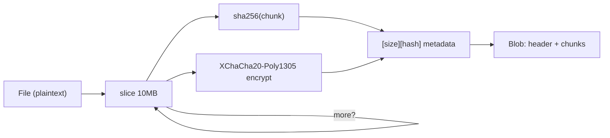

# @cdlab/cipher

Client-side stream cipher — **XChaCha20-Poly1305** with an **Argon2id** password
key or an **ECIES** public key, chunked for arbitrarily large files and streamed
so the browser never holds the whole plaintext in memory. Encrypt files and text
in the tab (or a Web Worker) and hand the server only ciphertext.

```diff
- upload plaintext → server encrypts at rest → server (and its logs, backups, ops) can read it
+ encrypt in the browser (@cdlab/cipher) → upload a Blob → the server only ever sees ciphertext
```

A build-only library (`workspace:*`, no dev server, no network, no secrets of its
own) consumed by [`SecureC`](../../apps/SecureC) (file/text encryption UI, in a
Web Worker) and [`dropply-web`](../../apps/dropply-web) (end-to-end encrypted file
sharing). All primitives are pure-JS [`@noble/*`](https://github.com/paulmillr/noble-hashes)
+ [`eciesjs`](https://github.com/ecies/js), so it runs in a browser, a Web
Worker, and Node alike.

## Why

Encryption that "protects your data" is worthless if the plaintext still reaches
a server. To keep the server zero-knowledge the crypto has to run on the client —
and doing that well in a browser is where naive implementations fall over:

- **Big files blow the heap.** `crypto.subtle.encrypt(wholeFile)` buffers the
  entire plaintext *and* ciphertext at once. `@cdlab/cipher` reads the `File` in
  10 MB slices, encrypts each independently, and streams the results into a
  `Blob` — so a multi-GB file never fully materializes in memory.
- **The UI freezes.** A long synchronous crypto loop locks the event loop. This
  library yields (`setTimeout(0)`) between chunks and reports `onProgress` /
  `onStage`, so the tab (or worker) stays responsive.
- **Password vs. key exchange are different problems.** Password mode derives the
  key with Argon2id (memory-hard, tuned params); public-key mode wraps a random
  key with ECIES and can add a secp256k1 signature — both share one wire format
  and one chunk pipeline.
- **A self-describing format.** Every ciphertext begins with a 3-byte magic
  prefix, so `detect()` can tell password / public-key / signed / unencrypted
  apart before you pick a decrypt path.
- **Integrity per chunk.** Each chunk carries a SHA-256 hash verified in
  constant time on decrypt, on top of the AEAD tag — tampering fails loudly.

## Quick start

Part of the [`@cdlab/projects-monorepo`](../../README.md); add it with the
workspace protocol and run scripts through pnpm from the repo root.

```json
{ "dependencies": { "@cdlab/cipher": "workspace:*" } }
```

```ts
import { streamCrypto } from '@cdlab/cipher'

// Encrypt a File in the browser → a Blob you can upload or download
const blob = await streamCrypto.encrypt.withPassword({
  file,                                   // File
  password: 'correct horse battery staple',
  onProgress: (pct) => console.log(pct),  // 0..100
  onStage: (stage) => console.log(stage), // 'Encrypting file...'
})

// …later, decrypt it back
const { file: plaintext } = await streamCrypto.decrypt.withPassword({
  file: encryptedFile,                    // File wrapping the ciphertext
  password: 'correct horse battery staple',
})
```

The package ships from `dist/` (ESM + CJS + `.d.ts`); **rebuild after editing
source** so consumers resolve the new output — `pnpm --filter @cdlab/cipher build`
(`pnpm prepare` at the repo root does this in topo order).

## Modes

### Password mode (Argon2id-derived key)

```ts
const blob = await streamCrypto.encrypt.withPassword({ file, password })
const { file } = await streamCrypto.decrypt.withPassword({ file: enc, password })
```

### Public-key mode (ECIES, optional signature)

```ts
const blob = await streamCrypto.encrypt.withPublicKey({
  file,
  receiver: receiverPublicKeyBytes,               // Uint8Array — required
  sender: { privKeyBytes: senderPrivateKeyBytes }, // optional — signs the file
})

const { file, signatureValid } = await streamCrypto.decrypt.withPrivateKey({
  file: enc,
  receiver: receiverPrivateKeyBytes,              // Uint8Array — required
  sender: senderPublicKeyBytes,                   // optional — verifies signature
})
```

> `signatureValid` is a **returned flag, not a gate** — a bad or missing
> signature does not throw; decryption still completes. Callers must check it.

### Text mode

```ts
import { textCrypto } from '@cdlab/cipher'

const { base64 } = await textCrypto.encrypt('secret', 'my-password')
const { text, signatureValid } = await textCrypto.decrypt(base64, 'my-password')
```

Text mode wraps the string in a `File` and reuses the stream pipeline, returning
a magic-prefixed base64 string (`{ blob, base64 }` on encrypt).

## Exports

Single barrel (`src/index.ts`). Two grouped facades plus the low-level pieces.

| Export | Kind | Description |
| --- | --- | --- |
| `streamCrypto.encrypt.withPassword` | fn | Encrypt a `File` in chunks under an Argon2id-derived key → `Blob`. |
| `streamCrypto.encrypt.withPublicKey` | fn | Encrypt a `File` for a receiver ECIES public key; optional secp256k1 signature → `Blob`. |
| `streamCrypto.decrypt.withPassword` | fn | Decrypt a password-encrypted `File` → `{ file: Blob, signatureValid: undefined }`. |
| `streamCrypto.decrypt.withPrivateKey` | fn | Decrypt a public-key-encrypted `File`; optional signature verify → `{ file, signatureValid }`. |
| `textCrypto.encrypt` | fn | Encrypt a string (password or public-key) → `{ blob, base64 }` (magic-prefixed). |
| `textCrypto.decrypt` | fn | Decrypt a `textCrypto.encrypt` base64 string → `{ text, signatureValid }`. |
| `StreamCipher` | class | Per-chunk XChaCha20-Poly1305 + SHA-256 integrity (`encryptChunk`, `decryptChunk`, `destroy`). |
| `parseStreamHeader` | fn | Parse & decrypt the magic-prefixed header → `{ header, headerLength, key, signature? }`. |
| `detect` | fn | Read the first 3 bytes of a `File`/base64 → `{ encryptionType: 'pwd'\|'pubk'\|'signed'\|'unencrypted', isText }`. |
| `CryptoError`, `InvalidDataError`, `DecryptionError`, `EncryptionError` | classes | Error hierarchy; `CryptoError` base carries a `code`. |
| `ERROR_MESSAGES` | const | Canonical error-message strings. |
| `CONFIG`, `MAGIC_BYTES` | const | The frozen format contract (chunk/Argon2/size params + magic prefixes). |
| `StreamEncryptOptions`, `StreamDecryptOptions`, `StreamBaseOptions`, `StreamHeader`, `HeaderData`, `ChunkMetadata`, `ProgressCallback`, `StageCallback` | types | Public option / header / callback shapes. |

## How a stream is built

Password encrypt — `src/password.ts` (public-key mode is the same loop with an
ECIES-wrapped key and an optional signature, `src/publickey.ts`):

```
encrypt.withPassword(file, password)
  1. totalChunks = ceil(file.size / 10MB); ext = file extension
  2. salt = random(16); key = argon2id(password, salt)            onStage 'Generating key'
  3. header = magic('ns1') + len + salt + AEAD(JSON{e:ext,c:chunks})   pushed as chunk 0
  4. for each 10MB slice:  read → onProgress → yield(setTimeout 0)
       → encryptChunk: [uint32 size][sha256 32B] + XChaCha20-Poly1305(chunk)
  5. cipher.destroy() wipes the key; return Blob([header, ...chunks])
  6. finally: secureClear(key)                                    random-fill then zero
```



Decrypt reads the first `HEADER_MAX` (2048) bytes, checks the magic, re-derives
the key (Argon2id from the stored salt, or ECIES-unwraps the symmetric key),
recovers the chunk count from the encrypted header JSON, then walks each chunk —
reading its 36-byte `[size][hash]` metadata, decrypting, and verifying the
SHA-256 in constant time before reassembling the plaintext `Blob`.

## Wire format

Every value below lives in `src/constants.ts` and is part of the on-disk
contract — see [Non-goals](#non-goals).

| Element | Layout |
| --- | --- |
| Header — password (`ns1`) | `magic(3)` + `len(2, LE)` + `salt(16)` + AEAD(header JSON `{e,c}`) |
| Header — public-key (`ns0` / signed `ns2`) | `magic(3)` + `len(2, LE)` + `keyLen(2, LE)` + `eciesEncryptedSymKey` + AEAD(header JSON `{e,c,s?}`) |
| Per chunk (both modes) | `[size uint32 LE][sha256 32B]` + XChaCha20-Poly1305 ciphertext (24-byte nonce prepended by `managedNonce`) |

| Constant | Value | Meaning |
| --- | --- | --- |
| `CONFIG.CHUNK.SIZE` | 10 MB | Plaintext slice size per chunk. |
| `CONFIG.CHUNK.BUFFER` | 20 MB | Streaming buffer hint. |
| `CONFIG.CHUNK.MAX_MEMORY` | 100 MB | `waitForMemory` backpressure threshold. |
| `CONFIG.ARGON2` | `t=3, m=1280 KiB, p=4` | Argon2id key-derivation cost. |
| `CONFIG.SIZES` | `SALT=16, NONCE=12, SYM_KEY=32, SIGNATURE=64, HEADER_MAX=2048` | Byte sizes. |
| `MAGIC_BYTES` | `PASSWORD='ns1'`, `PUBLIC_KEY='ns0'`, `SIGNED='ns2'` | 3-byte mode prefixes. |

## Dependencies

No network, no env, no bindings, no secrets — all crypto is local and in-memory;
keys/passwords are passed in by the caller. The real external surface is the
primitive set (`@noble/*`, `@scure/base`, `eciesjs` from `catalog:prod`;
`@cdlab/uncrypto` is a `workspace:*` sibling):

| Package | Used for |
| --- | --- |
| `@noble/ciphers` | XChaCha20-Poly1305 (`managedNonce`), byte utils. |
| `@noble/hashes` | Argon2id key derivation, SHA-256 integrity + file hash. |
| `@noble/curves` | secp256k1 sign / verify (public-key signatures). |
| `eciesjs` | ECIES wrap / unwrap of the random symmetric key. |
| `@scure/base` | base64 for text mode. |
| `@cdlab/uncrypto` | Cross-runtime `getRandomValues` shim (browser / Node). |

## Build & test

```bash
pnpm --filter @cdlab/cipher build       # tsdown → dist/ (ESM + CJS + .d.mts)
pnpm --filter @cdlab/cipher dev         # tsdown --watch
pnpm --filter @cdlab/cipher test        # vitest --run (happy-dom env)
pnpm --filter @cdlab/cipher typecheck   # tsc --noEmit
```

There is **no deploy** — it's consumed as a `workspace:*` package, so a consumer
picks up changes only after `dist/` is rebuilt (`build`, `dev --watch`, or the
repo-root `pnpm prepare`). Tests run under happy-dom for the `File` / `Blob` /
`FileReader` APIs; each source module has a matching `test/*.test.ts`, and
`test/polyfill.ts` shims `globalThis.crypto` with Node's webcrypto (imported by
the test files that need it — it is not a global vitest setup file).

## Non-goals

- **Not a format-versioning scheme.** The magic bytes, chunk sizes, and Argon2id
  params in `src/constants.ts` are a fixed contract. Changing any of them makes
  every existing ciphertext unreadable — you must bump the magic byte / header
  version, not edit a constant in place.
- **Not a key manager.** It never generates, stores, or transports keys; the
  caller supplies passwords and key bytes. (`SecureC` has a `gk` script for
  generating ECIES pairs.)
- **Not a general AEAD wrapper.** The API is deliberately `File`-centric —
  string inputs are wrapped into `File` objects — because its consumers are
  browser / Web-Worker file tools.

## Design

[`DESIGN.md`](DESIGN.md) is the authoritative spec: the wire format, the chunk
pipeline, both key-establishment modes, the integrity / key-hygiene reasoning,
and the format-versioning contract. Read it before touching `constants.ts`,
`header.ts`, or `stream-cipher.ts` — those three files *are* the on-disk format.

## License

[MIT](../../LICENSE) © 2025-PRESENT [wudi](https://github.com/WuChenDi)
