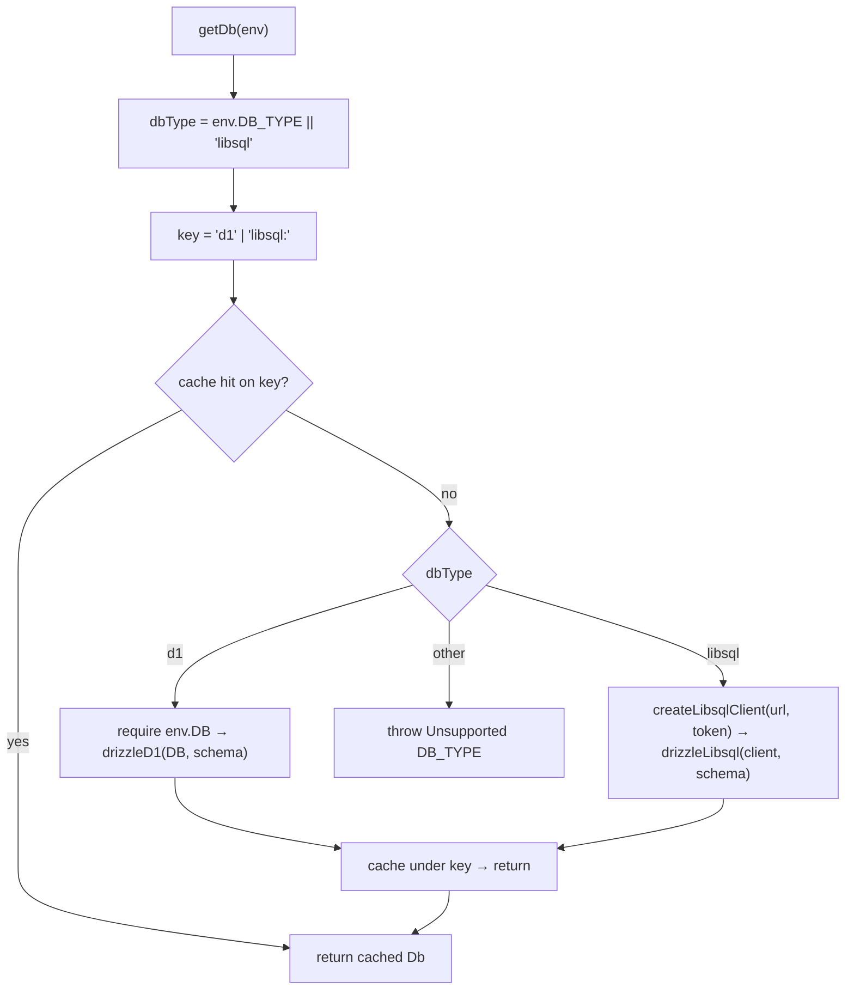

# @cdlab/db

Shared Drizzle DB factory (**D1 / libSQL, dual-driver**) plus soft-delete /
expiry query helpers — the single source of truth for database wiring across
`dropply-api`, `flnk`, and `wepush`.

```diff
- // every app: its own DatabaseManager, its own getDb, its own driver switch
- const db = drizzle(new Client(...))   // copy-pasted per app, drifts over time
+ import { defineDb } from '@cdlab/db/web'
+ const getDb = defineDb(schema)         // one factory, closure-cached, driver by DB_TYPE
```

A build-only TypeScript library (tsdown → ESM + CJS + `.d.mts`). It has **no
server, no routes, and no runtime of its own** — it is imported by the consuming
apps, and *which entry the consumer imports* decides whether it runs on Node or
the Workers edge.

## Why

The monorepo has three apps that talk to SQLite over two drivers — Cloudflare
D1 and libSQL/Turso — chosen per deploy by a `DB_TYPE` env var. Before this
package, each app hand-rolled its own `DatabaseManager` / `getDb`, its own
driver switch, and its own per-request client cache. Those copies drifted, and
the OpenNext bundler quirks (which libsql entry to import, which packages to
externalize) had to be re-solved in every app.

`@cdlab/db` collapses that into one factory:

- **Bind once, call per request.** `defineDb(schema)` captures the app's Drizzle
  schema and returns a `getDb(env)` closure with its own client cache — one
  cache per app, not a global.
- **Driver picked at request time.** `DB_TYPE` selects D1 (the `DB` binding) or
  libSQL (`LIBSQL_URL` + token). Both run in production on Workers.
- **Bundler boundary made explicit.** `@cdlab/db/node` (native `@libsql/client`,
  supports `file:` local SQLite) vs `@cdlab/db/web` (`@libsql/client/web`, pure
  fetch/ws, bundles under OpenNext esbuild). The consumer picks — it is **not**
  auto-selected, because a wrong pick breaks the edge/native boundary.
- **Shared query helpers.** `@cdlab/db/utils` centralizes the `isDeleted` /
  `expiresAt` / `updatedAt` predicates so every app's soft-delete and expiry
  filters read the same.

## Quick start

`@cdlab/db` is part of the [`@cdlab/projects-monorepo`](../../README.md); it is a
workspace package with **no dev server** — you consume it, you don't run it.

```jsonc
// consumer package.json
{ "dependencies": { "@cdlab/db": "workspace:*" } }
```

```bash
pnpm install                        # builds workspace packages (this one included)
pnpm --filter @cdlab/db build       # or rebuild it on demand -> dist/
```

Bind the factory to your schema once at module scope, then call `getDb(env)` per
request:

```ts
import type { Db } from '@cdlab/db/web'
import { defineDb } from '@cdlab/db/web'
import * as schema from '@/database/schema'

export type DB = Db<typeof schema>

const getDbFromEnv = defineDb(schema)

export async function getDb(env: CloudflareEnv): Promise<DB> {
  return getDbFromEnv({
    DB_TYPE: env.DB_TYPE,
    DB: env.DB,
    LIBSQL_URL: env.LIBSQL_URL,
    LIBSQL_AUTH_TOKEN: env.LIBSQL_AUTH_TOKEN,
  })
}
```

## Entries

Pick the entry by the app's **bundler** — it is not auto-selected.

| Entry | Source | Client | Use for |
| --- | --- | --- | --- |
| `@cdlab/db/node` | `src/node.ts` | `@libsql/client` (native) — supports `file:` local SQLite | Plain-wrangler Hono workers (`dropply-api`), Node test runners |
| `@cdlab/db/web` | `src/web.ts` | `@libsql/client/web` — pure fetch/ws, bundles under OpenNext esbuild | Next.js / OpenNext apps (`flnk`, `wepush`); remote Turso only, no `file:` |
| `@cdlab/db/utils` | `src/utils.ts` | — | Query helpers (also re-exported from `/node` and `/web`) |

Both `/node` and `/web` re-export `./core` and `./utils`, so a single import
gives you `defineDb`, the `Db` / `DbEnv` types, and every helper.

## API

| Export | Signature | Notes |
| --- | --- | --- |
| `defineDb(schema)` | `(schema) => (env: DbEnv) => Db<TSchema>` | Binds the schema to the entry's libsql client; returns a **closure-cached** `getDb`. |
| `Db<TSchema>` | `BaseSQLiteDatabase<'async', unknown, TSchema>` | Driver-agnostic supertype of both `DrizzleD1Database` and `LibSQLDatabase`. Driver-specific extras (e.g. `.batch`) are **not** on this type — narrow at the call site. |
| `DbEnv` | `{ DB_TYPE?, DB?, LIBSQL_URL?, LIBSQL_AUTH_TOKEN? }` | The entire env surface (see below). |
| `CreateLibsqlClient` | `(config: Config) => Client` | The injection type the entries use; you rarely reference it directly. |

### `DbEnv`

| Field | Type | Meaning |
| --- | --- | --- |
| `DB_TYPE` | `string?` | `'libsql'` (default) or `'d1'` — selects the driver. |
| `DB` | `AnyD1Database?` | Cloudflare D1 binding; **required only** when `DB_TYPE='d1'` (throws `D1 binding "DB" not found in env` if missing). |
| `LIBSQL_URL` | `string?` | libSQL / Turso URL; falls back to `file:./src/database/data.db`. |
| `LIBSQL_AUTH_TOKEN` | `string?` | Turso auth token for remote libSQL. |

An unrecognized `DB_TYPE` throws `Unsupported DB_TYPE: <value>`.

### `./utils`

Query helpers built around the shared `isDeleted` / `expiresAt` / `updatedAt`
columns (the same `trackingFields` block every business table carries).

| Helper | Signature | What it does |
| --- | --- | --- |
| `notDeleted(table)` | `(table) => SQL` | `eq(table.isDeleted, 0)` |
| `withNotDeleted(table, condition?)` | `(table, condition?) => SQL` | `notDeleted(table)` `and` an optional extra condition |
| `softDelete()` | `() => { isDeleted: 1, updatedAt: Date }` | Update payload for a soft delete |
| `isNotExpired(table)` | `(table) => SQL` | Rows where `expiresAt` is `NULL` or `> unixepoch()` (seconds) |
| `withNotDeletedAndNotExpired(table, condition?)` | `(table, condition?) => SQL` | `notDeleted` + `isNotExpired` with an optional extra condition |
| `withUpdatedTimestamp(data)` | `(data) => data & { updatedAt: Date }` | Spreads `data` with a fresh `updatedAt` |
| `isExpired(expiresAt)` | `(expiresAt: number \| null) => boolean` | Manual check `Date.now() > expiresAt`; `false` when falsy |

> **Unit gotcha.** The SQL-side `isNotExpired` compares against `unixepoch()`
> (**seconds**), while the JS-side `isExpired` compares against `Date.now()`
> (**milliseconds**). They are not interchangeable — pick the one that matches
> where the comparison runs.

## How `getDb` resolves a driver



1. `defineDb(schema)` is called once at module scope and captures a **per-app**
   cache slot (one `cached` per factory, not global).
2. Each request calls `getDb(env)` with a normalized `DbEnv`.
3. `dbType = env.DB_TYPE || 'libsql'` (libSQL is the default).
4. The cache key is `'d1'` (fixed) for D1, or `libsql:<url>` for libSQL — so a
   changed `LIBSQL_URL` rebuilds the client, but a stable one is reused.
5. Cache hit → return the cached `Db`. Miss → build the driver, cache it, return.

## Non-goals

- **No schema of its own.** The package is schema-agnostic; the consumer supplies
  its Drizzle schema to `defineDb(schema)`. The `./utils` helpers only *assume*
  `isDeleted` / `expiresAt` / `updatedAt` columns exist.
- **No migrations, no drizzle-kit config.** Those live in the consuming apps
  (`db:gen`, `cf:remotedb`, …).
- **No runtime auto-detection.** The `/node` vs `/web` split is a deliberate,
  bundler-driven choice the consumer makes — the package will not guess.
- **No global connection pool.** Caching is per-`defineDb` closure by design.

## Build

There is no test, lint, or deploy script — it is a build-only library.

| Command | Effect |
| --- | --- |
| `pnpm --filter @cdlab/db build` | `tsdown` → `dist/{node,web,utils}.{mjs,cjs}` + `.d.mts` |
| `pnpm --filter @cdlab/db dev` | `tsdown --watch` (incremental rebuild) |
| `pnpm --filter @cdlab/db typecheck` | `tsc --noEmit` against `tsconfig.json` |

`pnpm install` (via `prepare`) and `prepack` both trigger a build in topological
order, so consumers resolve fresh output after an install.

> After editing this package, **consumers won't see the change until it's
> rebuilt** — run `pnpm --filter @cdlab/db build` (or `dev --watch`), or let
> `pnpm install` rebuild it.

## Design

[`DESIGN.md`](DESIGN.md) is the authoritative spec — the driver-selection and
caching model, the entry/bundler split and why `@libsql/client` + `drizzle-orm`
stay external in the build, the `Db` supertype rationale, and the query-helper
unit contract. Read it before changing the cache key, the externalized deps, or
the `Db` type.

## License

[MIT](../../LICENSE) © 2026-PRESENT [wudi](https://github.com/WuChenDi)
