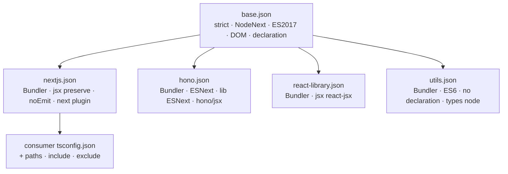

# @cdlab/tsconfig

Shared `tsconfig.json` presets for the [`@cdlab/projects-monorepo`](../../README.md) —
one strict `base.json` plus four framework overlays, so every app and package
extends a preset instead of hand-rolling compiler options.

```diff
- // apps/<name>/tsconfig.json — 20+ hand-copied compilerOptions, drifting per app
+ { "extends": "@cdlab/tsconfig/nextjs.json" }   // one line; strictness is centralized
```

This is a config-only package: raw JSON files, no build step, no entry point, no
runtime code. `tsc` and each app's bundler read the merged options; nothing here
executes.

## Why

Every TypeScript project in the workspace needs `strict`, a module/resolution
mode, a JSX runtime, and emit settings. Copy-pasting those into 22 `tsconfig.json`
files means they drift: one app loosens `strict`, another forgets
`skipLibCheck`, a third targets the wrong ES version. Centralizing them here means:

- **One source of strictness** — `base.json` sets `strict: true` and the common
  flags once; tightening a rule updates every consumer on the next type-check.
- **Overlays, not forks** — each framework preset `extends` `base.json` and
  patches only the knobs that genuinely differ (module system, JSX runtime,
  emit), so the shared baseline stays shared.
- **Zero install cost** — it's a `devDependency` of raw JSON; there's nothing to
  build, no `dist/`, no version skew.

## Quick start

Add it as a workspace dev dependency, then extend the preset that matches the
project type:

```json
// package.json
{ "devDependencies": { "@cdlab/tsconfig": "workspace:*" } }
```

```json
// tsconfig.json — a Next.js consumer
{
  "extends": "@cdlab/tsconfig/nextjs.json",
  "compilerOptions": { "paths": { "@/*": ["./src/*"] } },
  "include": ["next-env.d.ts", "**/*.ts", "**/*.tsx", ".next/types/**/*.ts"],
  "exclude": ["node_modules"]
}
```

The package has **no `exports` field**, so the subpath resolves directly to the
raw JSON at the package root (`@cdlab/tsconfig/nextjs.json` →
`node_modules/@cdlab/tsconfig/nextjs.json`). The consumer layers its own `paths`,
`include`, and `exclude` on top.

## Presets

| File | Extends | Used by | What it changes vs `base.json` |
| --- | --- | --- | --- |
| `base.json` | — | Everything (directly or transitively) | The root: `strict`, `NodeNext` module + resolution, `ES2017` target, `declaration` + `declarationMap` on, DOM libs, `moduleDetection: force`, `resolveJsonModule`, `skipLibCheck`. |
| `nextjs.json` | `./base.json` | `bycut`, `byplay`, `byshot`, `bytts`, `clearify`, `dropply-web`, `flnk`, `flox`, `SecureC`, `text2img`, `values`, `vidl`, `wepush` | `module: ESNext`, `moduleResolution: Bundler`, `jsx: preserve`, `noEmit: true`, `allowJs: true`, `plugins: [{ name: "next" }]`. |
| `hono.json` | `./base.json` | `baccarat`, `byplay-log`, `dropply-api`, `live-user` | `target/module: ESNext`, `moduleResolution: Bundler`, `lib: ["ESNext"]` (drops DOM), `jsx: react-jsx` + `jsxImportSource: hono/jsx`. |
| `react-library.json` | `./base.json` | `packages/ui` | `module: ESNext`, `moduleResolution: Bundler`, `jsx: react-jsx`. No framework plugin. |
| `utils.json` | `./base.json` | `packages/utils`, `packages/cipher`, `packages/uncrypto`, `packages/db` | `module: ESNext`, `moduleResolution: Bundler`, `target: ES6`, `types: ["node"]`, and emit flipped: `noEmit: false`, `declaration: false`, `declarationMap: false` (the bundler emits types). |

## `base.json` reference

| Option | Value | Why |
| --- | --- | --- |
| `strict` | `true` | The whole point — full strict suite for every consumer. |
| `module` / `moduleResolution` | `NodeNext` | Correct for anything extending `base` directly; every overlay switches it to `Bundler`. |
| `target` | `ES2017` | Broad baseline; `utils.json` lowers it to `ES6`. |
| `lib` | `["dom", "dom.iterable", "esnext"]` | Browser + latest JS; `hono.json` narrows to `["ESNext"]`. |
| `moduleDetection` | `force` | Treat every file as a module — no accidental global scripts. |
| `declaration` / `declarationMap` | `true` | Emit `.d.ts` + maps by default; `utils.json` turns both off. |
| `incremental` | `false` | No `.tsbuildinfo`; consumers opt in if they want it. |
| `resolveJsonModule` | `true` | Import `.json` directly. |
| `skipLibCheck` | `true` | Skip type-checking `.d.ts` deps — faster, avoids third-party type noise. |
| `noUncheckedIndexedAccess` | `false` | Left off deliberately; enabling it is a per-consumer choice. |

## How extension resolves

TypeScript merges `extends` shallowly: the child's `compilerOptions` override the
parent's key-by-key (arrays like `lib` are replaced wholesale, not concatenated).



1. The consumer's `tsconfig.json` sets `extends: "@cdlab/tsconfig/<preset>.json"`.
2. That preset sets `extends: "./base.json"` — so `base.json` loads first.
3. The overlay's `compilerOptions` override `base`'s (module system, JSX, emit).
4. The consumer's own `compilerOptions` override the overlay (`paths`, etc.).
5. `include` / `exclude` come from the consumer only — presets never set them.

The single differentiator across the four overlays is the **JSX runtime**:
`preserve` (Next hands JSX to its own compiler), `react-jsx` (ui library), and
`react-jsx` with `jsxImportSource: hono/jsx` (Workers JSX). Everything else is
module/resolution/emit bookkeeping.

## Non-goals

- **Not a linter or formatter.** Style is Biome's job (single quotes, no
  semicolons, 2-space); these presets only govern `tsc`'s type-checking and emit.
- **Not published to npm.** `private: true` makes it workspace-internal; the
  `publishConfig.access: public` field is vestigial — nothing publishes it.
- **No overlay extends another overlay.** The tree is exactly one level deep
  (`base` → overlay). Don't chain presets; add a new overlay off `base` instead.
- **No per-consumer `paths` / `include`.** Those stay in each consumer — a preset
  can't know a consumer's source layout.

## Editing safely

There is no build or test step; the presets are consumed as-is. To validate a
change, type-check the consumers that extend the file you touched:

```bash
pnpm --filter @cdlab/wepush build        # exercises nextjs.json
pnpm --filter @cdlab/dropply-api build   # exercises hono.json
pnpm --filter @cdlab/utils build         # exercises utils.json
```

Because arrays replace rather than merge, changing `base.json`'s `lib` affects
every consumer that doesn't re-declare `lib` (only `hono.json` does). Prefer
adding a knob to `base` (all consumers inherit) or to a single overlay (scoped);
avoid duplicating a value across overlays.

## Design

[`DESIGN.md`](DESIGN.md) is the authoritative spec — the preset hierarchy, the
per-overlay rationale (why `hono.json` drops DOM, why `utils.json` targets ES6),
the extension-merge mechanics, and the consumer inventory. Read it before adding
a preset or changing `base.json`.

## License

[MIT](../../LICENSE) © 2025-PRESENT [wudi](https://github.com/WuChenDi)
