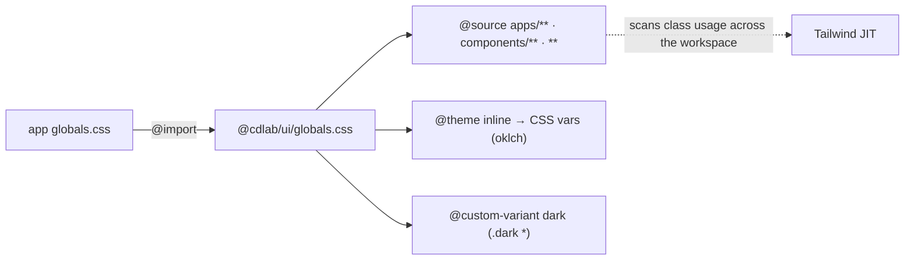

# @cdlab/ui

Shared React 19 + Tailwind v4 component library for the monorepo — shadcn/ui
primitives, an app-shell "asset kit", brand icons, hooks, and WebGL effects,
consumed **directly from source** by every app with **zero build step**.

```diff
- component-lib/            build → tsc → dist/ → publish → bump → reinstall
+ @cdlab/ui                 import '@cdlab/ui/components/button'   # straight to .tsx, edit-and-reload
```

Author / live hub: <https://wcd.pages.dev/projects/> ·
<https://github.com/WuChenDi>

Every subpath in the `exports` map points **straight at a `.ts`/`.tsx` file** —
there is no `dist/`, no type emit, no compile step to keep in sync. Consumers add
it as `"@cdlab/ui": "workspace:*"` and their own bundler (Next.js, Vite, …)
compiles the source in-tree. Editing a component is instantly visible on the next
reload of any app that imports it.

## Why

A shared component library usually means a publish loop: build to `dist/`, emit
types, bump the version, reinstall in each consumer. In a single Turborepo where
every consumer already compiles TypeScript + Tailwind, that loop is pure
overhead.

`@cdlab/ui` drops it entirely:

- **No build step** — subpath exports resolve to raw source. Nothing to run after
  an edit; there is literally no `build`/`dev`/`test` script (`"scripts": {}`).
  Type-checking and linting happen inside the consuming apps and root tooling.
- **One CSS entry** — `@cdlab/ui/globals.css` is the single Tailwind v4 theme;
  its `@source` globs scan the whole workspace so class usage in `apps/**` is
  picked up automatically.
- **RSC-aware** — components that touch browser APIs carry `'use client'`;
  server-safe primitives omit it, so they work under the App Router with no
  wrapper.
- **Add via CLI** — `components.json` wires the `shadcn` CLI (plus custom
  registries) so primitives and effects are added/updated with one command, not
  hand-copied.

## Quick start

Part of the [`@cdlab/projects-monorepo`](../../README.md); everything installs
from the repo root.

```bash
pnpm install        # resolves the workspace:* link; nothing to build for this package
```

Add the dependency and import the Tailwind entry from your app's global stylesheet:

```jsonc
// apps/<app>/package.json
"@cdlab/ui": "workspace:*"
```

```css
/* apps/<app>/src/app/globals.css */
@import '@cdlab/ui/globals.css';
```

Then import primitives, hooks, and helpers by leaf subpath:

```ts
import { Button } from '@cdlab/ui/components/button'
import { IKHeader } from '@cdlab/ui/IK/IKHeader'
import { useIsMobile } from '@cdlab/ui/hooks/use-mobile'
import { cn } from '@cdlab/ui/lib/utils'
```

There is **no dev server, no Storybook, no demo site** — you exercise the
components inside a consuming app (`pnpm --filter @cdlab/<app> dev`).

## Exports

`package.json` `exports` is the entire public API — no barrel `index`; every
subpath maps directly to one file (`/*` wildcards, so `./components/button` →
`src/components/button.tsx`).

| Subpath | Resolves to | Contents |
| --- | --- | --- |
| `./globals.css` | `src/styles/globals.css` | Tailwind v4 theme entry (the one CSS file consumers `@import`) |
| `./postcss.config` | `postcss.config.mjs` | Shared PostCSS config (`@tailwindcss/postcss`) |
| `./components/<name>` | `src/components/<name>.tsx` | 56 shadcn/ui primitives (`button`, `dialog`, `sidebar`, `table`, `chart`, `qr-code`, …) |
| `./IK/<name>` | `src/IK/<name>.tsx` | App-shell "asset kit" — headers, footers, empty/loading/failed states, confirm dialog, version banner |
| `./icon/<name>` | `src/icon/<name>.tsx` | Brand icon SVGs (`GitHubIcon`, `XIcon`) |
| `./reactbits/<name>` | `src/reactbits/<name>.tsx` | 10 animated visual effects (`Aurora`, `Particles`, `Plasma`, `Threads`, `SpotlightCard`, …) |
| `./hooks/<name>` | `src/hooks/<name>.ts` | React hooks (`use-mobile` → `useIsMobile`) |
| `./lib/<name>` | `src/lib/<name>.ts` | Utilities (`utils` → `cn`) |

`IK/index.ts` and `icon/index.ts` exist as internal barrels but are **not** in
the exports map — import by leaf subpath.

## What's inside

| Group | Count | Base | Notes |
| --- | --- | --- | --- |
| `components/` | 56 | mostly `radix-ui` (unified pkg, 27 files); `@base-ui/react` in exactly one (`combobox`) | shadcn/ui `style: radix-nova`. Driver wrappers: `chart`→`recharts`, `qr-code`→`qrcode`, `sonner`→`sonner`, `drawer`→`vaul`, `command`→`cmdk`, `calendar`→`react-day-picker`, `resizable`→`react-resizable-panels`, `input-otp`→`input-otp`. Non-stock extras: `cascader`, `color-picker`, `copy-button`, `heatmap-calendar`, `image-compare`, `password-input`, `input-with-back`, `audio-waveform`, `waveform-player`, `spark-chart`. |
| `IK/` | 10 | composed from the primitives | Layout chrome (`IKHeader`, `IKFooter`, `IKPageContainer`), state screens (`IKEmpty`, `IKAssetLoading`, `IKAssetFailed`), `IKAssetRenderer` (status-switch render-prop), `IKConfirmDialog`, `IKAudioAssetPlayer` (hover-preview), `IKVersionInfo` (console banner, renders `null`). |
| `reactbits/` | 10 | reactbits.dev | `Aurora`/`Particles`/`Plasma`/`Threads` embed inline GLSL via `ogl`; `SplashCursor` is a raw-WebGL fluid effect; `BlurText`/`CountUp`/`GradientText`/`ShinyText`/`SpotlightCard` are DOM/`motion`. All `'use client'`, browser-only. |
| `icon/` | 2 | inline SVG | `GitHubIcon`, `XIcon`. |
| `hooks/` | 1 | — | `useIsMobile()` — `matchMedia`, 768px breakpoint. |
| `lib/` | 1 | `clsx` + `tailwind-merge` | `cn()` — the universal className merger imported by nearly every component. |

## RSC boundary

Components that use browser APIs / state carry `'use client'` (44 of 56
primitives, plus `IKAudioAssetPlayer`, `IKVersionInfo`, and all 10 reactbits).
Server-safe primitives (`button`, `badge`, `card`, `alert`, `input`, `textarea`,
`skeleton`, `spinner`, `breadcrumb`, `button-group`, `color-picker`, `empty`) and
most `IK/*` chrome omit it, so App Router consumers can render them in a server
component with no client wrapper.

## Styling architecture

`src/styles/globals.css` is the single theme entry. It is Tailwind **v4**
(`@import "tailwindcss"`), plus `tw-animate-css` and `shadcn/tailwind.css`:



- **`@source` globs** reach up into `../../../apps/**`, `../../../components/**`,
  and `../**` so Tailwind's JIT sees class usage across the entire monorepo — a
  deliberate cross-package coupling (see Non-goals).
- **`@theme inline`** maps color / radius tokens to CSS vars; `:root` (light) and
  `.dark` define `oklch` values + a `--radius` scale. Dark mode is class-based
  (`@custom-variant dark (&:is(.dark *))`); consumers toggle it via `next-themes`
  (which `sonner.tsx` also reads).
- **Fonts are external** — `--font-sans` and `--font-mono: var(--font-geist-mono)`
  are *referenced*, not defined; the consuming app must supply them.

## Adding / updating primitives

`components.json` configures the `shadcn` CLI: `style: radix-nova`, `rsc: true`,
`baseColor: neutral`, `iconLibrary: lucide`, aliases pointing at `@cdlab/ui/*`,
and two custom registries:

| Registry | URL |
| --- | --- |
| `@react-bits` | `https://reactbits.dev/r/{name}.json` |
| `@ikui` | `https://ik-ui.pages.dev/r/{name}.json` |

Run the `shadcn` CLI from this package to pull a primitive/effect into
`src/components` (or a custom-registry item). New files under `components/` and
`reactbits/` are 3rd-party-derived and are **not linted** by root Biome.

## Lint & type-check

There is nothing to build or test in this package. Validation is external:

- **Root Biome** lints `IK/`, `hooks/`, `lib/`, `icon/`, `styles/`. It
  **excludes** `packages/ui/src/reactbits/**/*.tsx` and
  `packages/ui/src/components/**/*.tsx` (both 3rd-party-derived) — which is why
  the linted dirs use single quotes while the generated components use double.
- **Type-check** happens in the consuming apps; `tsconfig.lint.json` exists for
  editor/CI type-checking (`include: ["src","turbo"]`) but its `dist` `outDir` is
  a phantom — nothing emits.

```bash
pnpm lint:biome        # from repo root — Biome over the linted dirs
```

## Non-goals

- **Not a published package** — `"private": true`, no `dist/`, no versioned
  release. It only ever runs inside this monorepo's bundlers.
- **Not runtime-portable in isolation** — the `@source` globs assume the
  `packages/ui` ↔ `apps/**` layout; moving the package or the apps breaks
  Tailwind class detection.
- **Not tree-shaken for you** — reactbits `ogl`/WebGL effects run inline GLSL
  shaders on the client and are heavy; import them only where needed.
- **No demo site / Storybook** — components are exercised inside consuming apps.

See [`DESIGN.md`](DESIGN.md) for the full architecture, the two-primitive-ecosystem
rationale, the RSC boundary, and the styling model. Agent-oriented notes are in
[`llms.txt`](llms.txt).

## License

[MIT](../../LICENSE) © 2025-PRESENT [wudi](https://github.com/WuChenDi)
