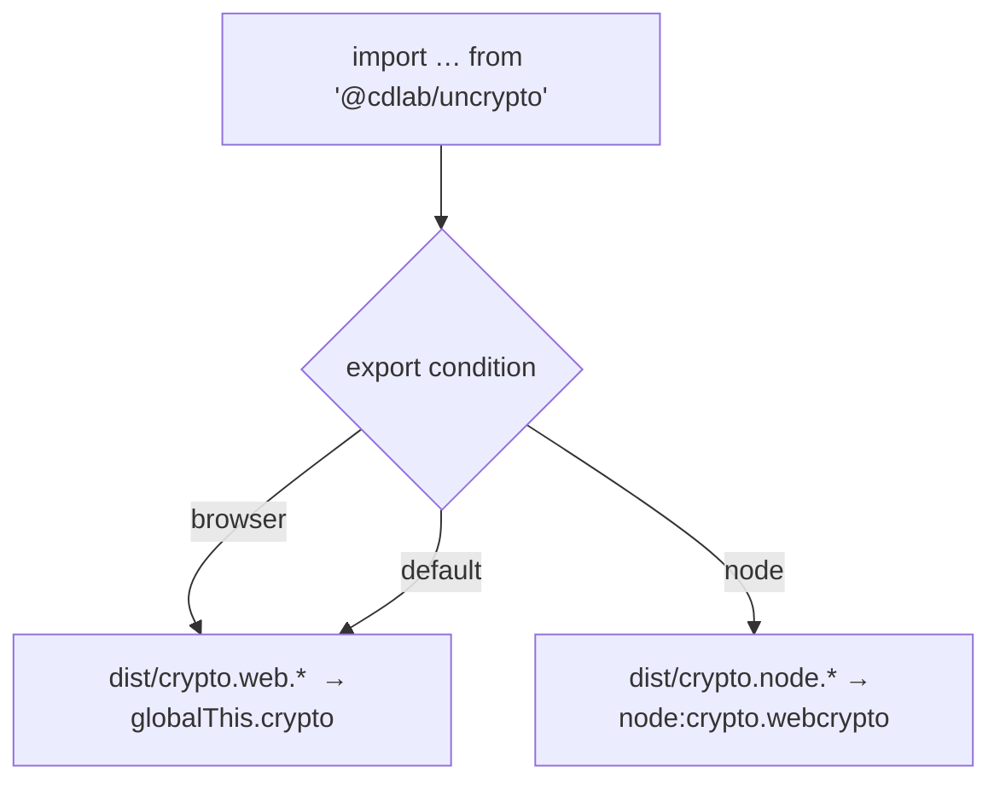

# @cdlab/uncrypto

A cross-runtime Web Crypto shim — one import that exposes the same
`Crypto`-shaped surface (`subtle`, `randomUUID`, `getRandomValues`) whether the
consuming code runs on Node (`node:crypto`'s `webcrypto`) or in a
browser / Cloudflare Worker (`globalThis.crypto`).

```diff
- import nodeCrypto from 'node:crypto'          // breaks in the browser / Workers bundle
- const uuid = globalThis.crypto.randomUUID()   // breaks in older Node test runners
+ import { randomUUID } from '@cdlab/uncrypto'  // same call, both worlds — zero runtime `if`
```

The right implementation is chosen **at bundle time** by conditional exports, not
by a runtime environment check — so there is no branch to mis-detect, and no
`node:crypto` reference left dangling in an edge bundle.

## Why

Code that has to run in both a browser / Worker and a Node test runner keeps
tripping over the same wall: `node:crypto` isn't available on the edge, and
`globalThis.crypto` used to be absent (or a read-only getter) on Node. The usual
fixes are worse than the problem:

- **`typeof window`-style runtime branches** ship both code paths into every
  bundle and still leave a bare `node:crypto` import that an edge bundler can't
  resolve.
- **Depending on the platform global directly** works until you run the same
  file under Vitest on Node, where the global may not exist.

`@cdlab/uncrypto` is a two-file shim over the platform Web Crypto API: each file
targets one runtime, and `package.json#exports` hands the bundler the correct one
via the `browser` / `node` / `default` export conditions. The caller writes one
import and never sees the split.

## Quick start

Part of the [`@cdlab/projects-monorepo`](../../README.md). Add it as a workspace
dependency:

```json
{
  "dependencies": {
    "@cdlab/uncrypto": "workspace:*"
  }
}
```

Import from the package root and use it exactly like the platform `crypto`:

```ts
import { getRandomValues, randomUUID, subtle } from '@cdlab/uncrypto'

const id = randomUUID()
const salt = getRandomValues(new Uint8Array(16))
const key = await subtle.importKey(/* … */)
```

There is no dev server and no runtime config — it is a build-only library
consumed by other packages.

## API

Both entries export the identical shape — three named exports plus a `default`
object that bundles them:

| Export | Type | Node (`crypto.node.ts`) | Web (`crypto.web.ts`) |
| --- | --- | --- | --- |
| `subtle` | `Crypto['subtle']` | `nodeCrypto.webcrypto?.subtle` (falls back to `{}`) | `globalThis.crypto.subtle` |
| `randomUUID` | `() => string` | `nodeCrypto.randomUUID()` | `globalThis.crypto.randomUUID()` |
| `getRandomValues` | `(array) => TypedArray` | `nodeCrypto.webcrypto.getRandomValues(array)` | `globalThis.crypto.getRandomValues(array)` |
| `default` | `Crypto` | `{ randomUUID, getRandomValues, subtle }` | `{ randomUUID, getRandomValues, subtle }` |

## How resolution works

There is **no runtime dispatch** — the bundler resolves one file and inlines it:



1. A consumer imports from the package root.
2. The bundler matches an export condition in `package.json#exports`:
   `browser` → `crypto.web.*`, `node` → `crypto.node.*`, else `default` →
   `crypto.web.*` (the safe fallback for edge / unknown targets).
3. Only that file lands in the bundle; the other runtime's crypto reference is
   never present.

Legacy top-level fields point older resolvers the same way: `main` →
`crypto.node.cjs`, `module` / `browser` → `crypto.web.mjs`, `types` →
`crypto.web.d.mts`.

## Non-goals

- **Not an encryption library.** Despite the inherited `package.json` description,
  it implements no ciphers, KDFs, or key management — it is a thin pass-through to
  the platform Web Crypto. For actual encryption use
  [`@cdlab/cipher`](../cipher/README.md).
- **No polyfill for missing APIs.** On a runtime where `globalThis.crypto` is
  absent, the web entry throws at import — it forwards to the platform, it does not
  supply one. Only `subtle` on legacy Node degrades gracefully (see
  [`DESIGN.md`](DESIGN.md#5-gotchas--edge-cases)).

## Build & test

```bash
pnpm --filter @cdlab/uncrypto build      # tsdown → ESM + CJS + .d.mts for both entries
pnpm --filter @cdlab/uncrypto dev        # tsdown --watch
pnpm --filter @cdlab/uncrypto test       # vitest --run (one suite against both entries)
pnpm --filter @cdlab/uncrypto typecheck  # tsc --noEmit
```

> Consumers import from `dist/`, not `src/`. After editing `src/`, rebuild (or run
> `dev` for watch mode) or downstream packages won't see the change. `pnpm
> prepare` at the repo root builds it in topological order after install.

Used wherever the same code path has to run in both Workers / browser and Node
test runners — e.g. [`@cdlab/cipher`](../cipher/README.md), `dropply-api`,
`bytts`.

## Design

[`DESIGN.md`](DESIGN.md) is the source-of-truth spec: the dual-file /
condition-resolved architecture, the asymmetry between the two files, the test
harness and its polyfill, and the build config. Read it before touching the
export map or either entry.

## License

[MIT](../../LICENSE) © 2025-PRESENT [wudi](https://github.com/WuChenDi)
